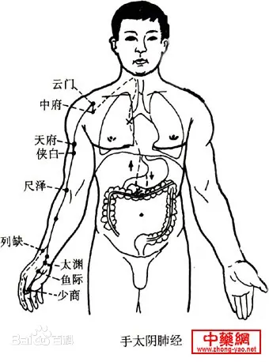
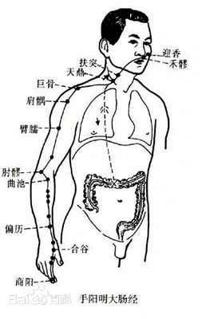
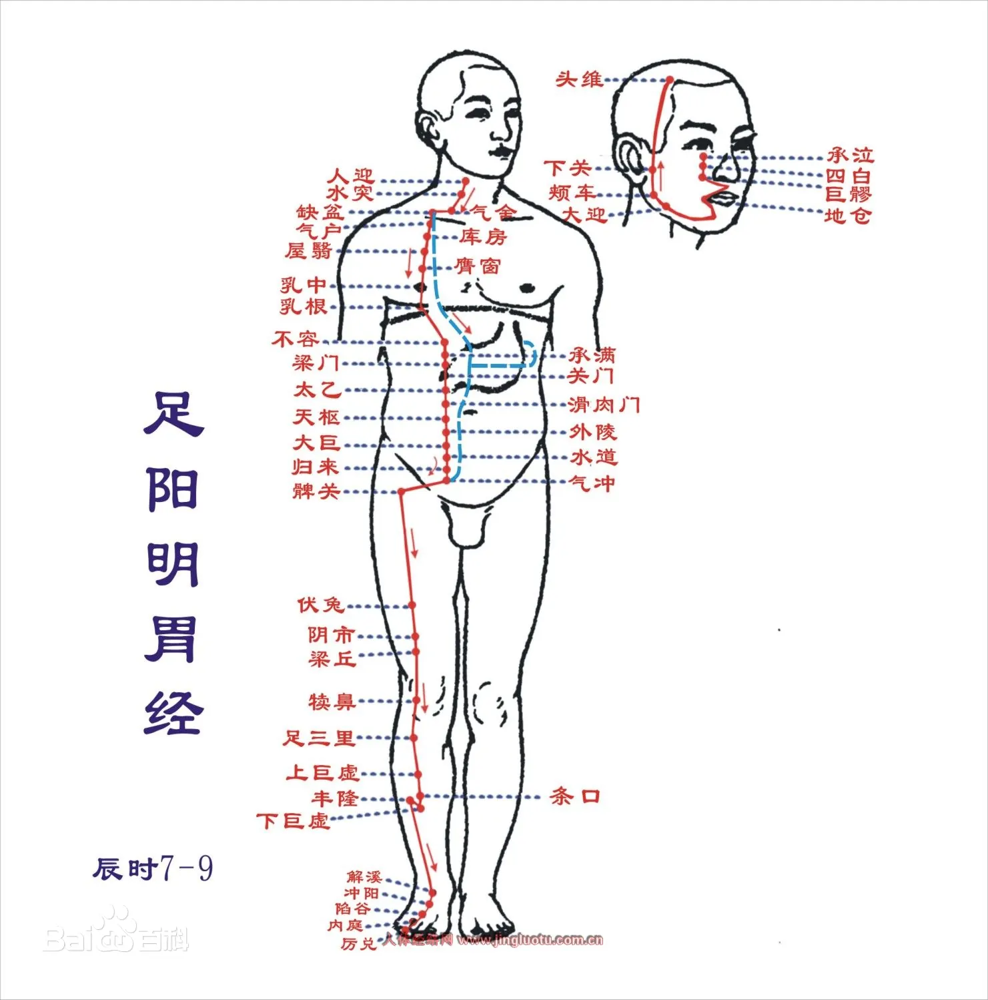
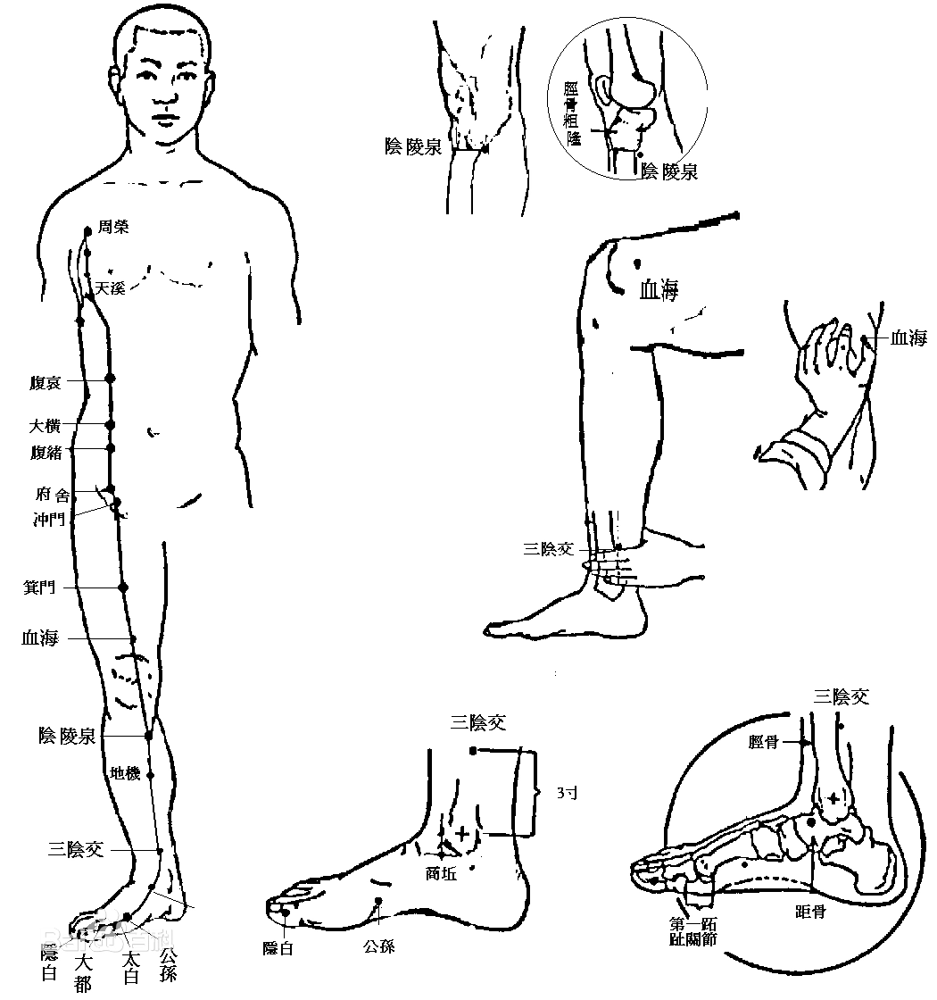
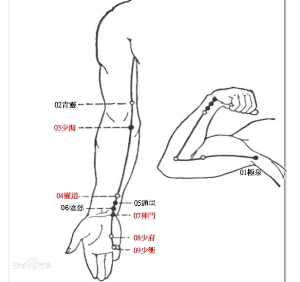
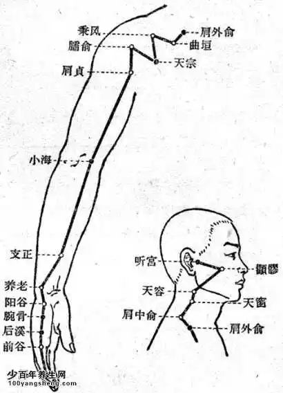
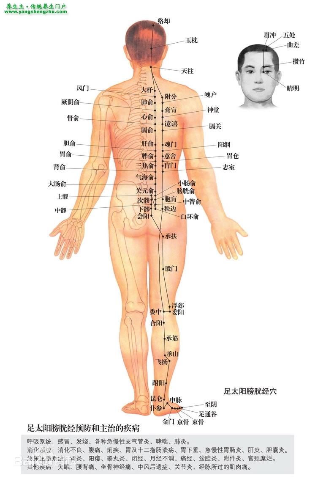

# 任脉，主降，诸阴之海
> 腹部距离不宜用同身寸
* 承浆
* 廉泉：颌下
* <strong>天突：最上一根肋骨交汇处</strong>
* 璇玑：天突与华盖中点
* <strong>华盖：天突与玉堂中点</strong>
* 紫宫：华盖与玉堂中点
* <strong>玉堂：天突与鸠尾中点</strong>
* 膻(dàn)中：玉堂下一寸半，两乳连线中点，气会于此。禁针，可灸
* 中庭：膻中与鸠尾中点
* <strong>鸠尾：下肋骨交汇点，脐上七寸</strong>，禁灸，可针
* 巨阙：鸠尾与中脘中点，心募于此，对于心脏疾病效果极佳。
* <strong>上脘：巨阙与中脘中点</strong>
* <strong>中脘：鸠尾与肚脐中点</strong>，(六)腑会于此穴；梅花灸主穴，统治一切胃病，吐(出)血时禁用。
* 建里：中脘与下脘中点
* <strong>下脘：中脘与肚脐中点</strong>，解刨学上，此位置正好位于胃的下(出)口，小肠的上(入)口
* 水分：下脘与与肚脐中点，常用于治水肿
* <strong>神阙：肚脐</strong>，禁针，可灸
* 石门：关元上一寸，妇人慎之，犯之绝子
* 绝孕：奇穴，石门下半寸
* <strong>关元：脐(神阙)下三寸</strong>，丹田穴
* 中极
* 曲骨

> 任脉三八起会阴，曲骨中极关元锐。  
> 石门气海阴交仍，神阙水分下脘配。  
> 建里中上脘相连，巨阙鸠尾蔽骨下。  
> 中庭膻中慕玉堂，紫宫华盖璇玑夜。  
> 天突结喉是廉泉，唇下宛宛承浆舍。  

# 督脉，主升，诸阳之海
* 龈交：俩门牙上正中间牙龈，治牙龈肿溃烂、牙周病、鼻窦(近取穴)，仅放血。
* 兑端：上嘴唇(红白)正中间。很少用，米粒灸。
* 水沟：(人中)治消渴、饮水无度、饮饮、口歪眼斜、面部中风等的近取穴。
* 素髎：鼻头正中间。与女人会阴相对(处女素髎穴骨头为一整片，非处女两片骨)。不针不灸。点刺放血治酒糟鼻。 
* 神庭：上星前五分，不针可灸
* <strong>上星：额头中线沿督脉往上摸，在头顶的前半部遇到的第一个凹洞即为上星</strong>。囟会前一寸半。米粒灸，可治疗鼻窦炎
* 囟会: 前顶前一寸半，少用。又名聪会
* 前顶：百汇前一寸半，百汇辅穴
* <strong>百汇：正上方视角，双耳耳尖连线中点后五分处，此处有一凹洞</strong>。诸阳之汇，治头痛，百病皆治。中风大穴。下针时百汇前五分处斜刺百汇。
    > 梅花灸：四神聪穴
* 后顶：百汇下一寸半，百汇辅穴
* 强间：枕骨上边缘，禁灸
* 脑户：枕骨下边缘，禁灸
* <strong>风府：后脑脑骨下</strong>，禁灸。卧姿，下针时方向指向舌根，到位时，病人会吐舌头。中风、头项强痛可取此穴。
* 哑门：风府下半寸，禁灸。下针同风府。
* <strong>大椎：第 1 椎上，转脖子颈椎动胸椎不动，动骨与不动骨之间即为大椎穴。</strong>发烧感冒，三菱针刺破挤点血出来，烧即退。是手三阳足三阳督脉之会。太阳少阳并病时项强，小柴胡汤症
* <strong>陶道：第 1 椎下</strong>，大椎穴辅助之穴
* 身柱：第 3 椎下，若此骨碎，则终身瘫痪。灸此可长个子
* 神道：第 5 椎下，若心脏上有病，按压此穴会有痛感
* 灵台：第 6 椎下，辅助诊断用，禁针，若血液上有病，按压此穴会有痛感(主)
* <strong>至阳：第 7 椎下</strong>，辅助诊断用，血汇于此，若血液上有病，按压此穴会有痛感(副)
    > 人平趴于床上， 两肩胛骨最下端连线与脊柱交点即为第 7 椎
* 筋缩：第 9 椎下，肝脏正后方，针/灸均可。癫、痫、狂、抽筋、抖动、吐白沫都可以用此穴
    > 眼诊：
    > * 只有眼上白有血丝，且血丝像鸡脚贯穿至眼珠，此一，易治疗；
    > * 眼上下白均有血丝，此一，难治；
    > * 眼下白有血丝，此一，不治；
* 中枢：第 10 椎下
* 脊中：第 11 椎下，可针，不灸。脾脏后方，治黄疸、便血
* 悬枢：第 13 椎下
* <strong>命门：第 14 椎下，肚脐正对面</strong>，针/灸均可，可治疗剧烈头疼、角弓反张(脑膜炎)、下腰部病
* 腰阳关：命门下两椎，第 16 椎，针/灸均可，治腰痛，较少使用
* 腰俞：尾椎三角形上面第 21 椎，较少使用
* <strong>长强：尾椎骨与肛门中间</strong>。下针为斜刺一寸左右，无补泄，引气即可，主治痔疮。
    > * 内痔：先血后便，不痛
    > * 外痔：先便后血，痛。先用放血针刺破，后用小一点的火罐吸出淤血即愈  

> 督脉行于脊中央，二十八穴始长强。  
> 腰俞阳关入命门，悬枢脊中中枢防。  
> 筋缩至阳上灵台，神道身柱陶道乡。  
> 大椎哑门进风府，脑户强间后顶扬。  
> 百会前顶通囟会，上星神庭素髎量。  
> 水沟兑端唇沟点，龈交上牙唇缝藏。  

# 手太阴肺经
* 肺，气之本；传导之官；藏魄；主皮毛；属金主忧，忧过伤肺，喜(火)能胜之。在五音属商
* 此一经起于中府，终始少商，取少商、鱼际、太渊、经渠、尺泽与井荣俞经合也。
* 肺流注在寅时，3.00 起于左肺底部，5.00 结束于右肺底部，路线呈倒 U 型。
* 吸气肾管吐气肺管。  

* 中府：云门下约一寸半（云门下隔一根肋骨）
* <strong>云门：锁骨外边缘与肌肉的凹洞处</strong>，肺之募穴
    > 云门下即肺，若垂直下针，则必伤肺，故此处下针手法是一针透两穴，从中府平入，逆上云门，不入肋骨
* 天府：手肘内侧至腋下中间，禁灸，可治疗流鼻血，左流右扎，14 岁以下儿童流鼻血时一定不会发烧
* 侠白：天府下一寸，此穴可作为天府的辅助加强穴
* 尺泽：手肘弯曲的地方，大筋外侧。
    > * 肺经属金，尺泽在肺经五穴中属水，故此穴又称肺经子穴  
    > * 若病初发于此经，为实症，故可用针泄于此穴，因‘实则泄其子’也
* 孔最：尺泽下三寸，肺经郄穴（一般用于炎症）
* 列缺：经渠后 5 分
    > * 主任脉，任脉有问题下列缺。虚症小便多，实症手掌过热。手太阴肺经的络穴（联络表里经）。  
    > * 尺脉摸不到，跑到络脉阳溪穴上，称为反关脉，大于寸口三倍。（反关脉相：其人非富即贵）
* <strong>经渠：腕部高骨之下</strong>，属金，故为肺经本穴，可补可泄，不灸
* 太渊：经渠前 5 分（手横纹处），属土，手太阴肺的母穴(补)
* 鱼际：位于拇指掌部关节中间，骨头与肉之间。荣穴属火。乳痈（乳癌）
* 少商：拇指盖掌内侧下角。放血，主治小儿扁桃体发炎、退烧。大椎和少商放血退烧。

> 中府云门天府诀，侠白尺泽孔最存  
> 列缺经渠太渊涉，鱼际少商如韭叶。

# 手阳明大肠经
* 传道之官，变化出嫣
* 大肠流注在卯时，此时可顺时针揉按此部位。
* 此一经起于商阳，终于迎香，取商阳、二间、三间、阳溪、曲池，与井荣俞经合也，合谷为本经原穴。  

* 商阳：左(右)手食指右(左)下角(外侧)，放血用。大肠经井穴，属本穴(金)。
    > 商阳，少商，大椎三穴放血可消退大部分发烧
* 二间：食指跪之，位于指根关节纹络尽头略上一点，大肠经荣穴，并为子穴，实证可泄之。
* 三间：二间关节后骨头缝处，大肠经俞穴，属木
    > 三间透劳宫，可治疗手部痛风；三间亦可透合谷
* 合谷：大肠经原穴
    > * 合谷为大肠经原穴，可联合里经列缺一起下针，虚实皆可治之；
    > * 油性皮肤/青春痘/美白可灸合谷；
    > * 有麻醉之效，可缓解牙痛；"面口合谷收" - 面部、口部的病症可以在合谷下针以减轻其他穴位的痛感；
    > * 合谷至商阳一脉可用于诊断孕妇是否快生：手握这一脉，若感觉到脉动则要生，无之则只有阵痛;
    > * 孕妇可泄不可补，补之则堕；
    > * 牙痛合谷穴，合谷后，拇指食指骨关节交汇处略前一点；
    > * 在小儿，食指至指尖三节，分为风、气、命三关，若有黑线至风，病轻；至气，病重；至命，危矣；
    > * 四关穴 - 双合谷双太冲，病人全身痛，开此四关，则患处现；
    > * 气满此穴饱满丰隆，气亏此穴亦亏
* 阳溪：手张开，拇指靠腕部两骨凹陷处。用的较少。
* 偏历：手阳明络穴，左右手虎口相合，中指端即偏历。肩痛喉痛，大肠经实症牙痛耳鸣，虚症补之(齿怕冷)
* 温溜：偏历上两寸。大肠经郄穴。治大肠经炎症。
* 下廉：上廉下一寸
* 上廉：手三里下一寸。治乳痈(乳房硬块)，手臂的病
* 手三里：曲池下两寸，又称扭伤穴
* <strong>曲池：小臂弯曲，弯处有一纹络，肘部骨头与纹络尽头连线中点</strong>。大肠经合穴，属土，故而为母穴，大肠经虚证可补之。
    > * 此穴可作为肚脐以上的消炎穴；
    > * 皮肤止痒穴：合谷 + 曲池；
    > * 落枕：躺回床上，头置于床外自然下垂，约 3 - 4 分钟，此间慢慢回正头部，3 - 4 分钟后慢慢将头拖回床上，拖回后慢慢坐起，即愈
* 肘髎：曲尺绕过大骨即是。可下针可放血。
* 五里：肘髎上三寸，禁针，此处有大动脉
* 臂臑：肩髃下两寸/手肘上七寸。主肩不得举。
* <strong>肩髃：手臂侧面抬起，肩部凹洞</strong>。主中风、半身不遂。肩髃透极泉治狐臭(无补泄)。肩膀问题近取穴好，治症对侧下针效果好。
* 巨骨：禁针，易扎到肺
* 天鼎：脖子大筋和锁骨处，只下五分
* 扶突：喉结平移至大筋外侧，很少下针。
* 禾髎：鼻孔下与嘴唇中间，主鼻窦炎，鼻子不通。五分针或一寸针下很浅；
* 迎香：鼻翼开五分，主嗅觉。针下至皮层，透至鼻根与眼中间(內迎香)，鼻孔不通下同侧迎香对侧合谷。
    > 脸上只针不灸。  

> 手阳明穴起商阳，二间三间合谷藏，  
> 阳溪偏历温溜长，下廉上廉手三里，  
> 曲池肘髎五里近，臂臑肩髃巨骨当，  
> 天鼎扶突禾髎接，鼻旁五分号迎香。

# 足阳明胃经
* 仓廪之官，五味出焉；
* 此经流注在辰时；
* 此一经起于头维，终于厉兑，取厉兑、内庭、陷谷、解溪、三里，与井荣俞原经合也，冲阳为本经原穴。  

  

* 头维：神庭外开四寸半，很少下针，讲话是有脉动，禁灸，足阳明和足少阳二脉之会；
* 下关：鬓角处，下巴脱臼可针，主治中耳炎。不灸，下关痛，先下患处下关，下对侧合谷；
* 颊车：咬牙肌肉起来的位置，面部中风针患侧合谷+对侧地仓透颊车。牙关不开、口歪眼斜、面部中风；
* 承泣：眼中下方骨头上方，一般不针。足阳明和任脉的会穴；
* 四白：眼中下骨一寸；
* 巨髎：与人中(水沟)在同线与眼中线汇聚点，颧骨下，可针不可深。麻痛，拔牙后。多用于牙痛，附近肌肉麻痹；
* 地仓：嘴角外开 5 分处，手阳明与阳跷脉之会穴。地仓鼓，有地产；
    > 天仓：眉毛外，天仓凹，无主业或者身体差
* 大迎：地仓与颊车中间(骨头之下)；
* 人迎：大迎之下，人迎脉有则胃气有，病人不会死，很少针；
* 水突：可治疗甲状腺肿大，下针时指甲拨开大筋，针顺指甲入 5 分；
* 气舍
    > 大迎至气舍均很少用，只需了解其位置即可
* 缺盆：不针，易扎到肺；
* 气户
* 库房
* 屋翳
* 膺(yīng)窗： 此穴 + 乳根穴下针可治疗乳房肿块；此穴 + 乳根 + 丰隆穴可丰胸；
* 乳中：此穴禁针禁灸。足厥阴肝经络穴。女人喂奶期间因吵架导致奶水不出(情志郁结)，日久则结块，结硬块约十数年(平均 14 年)后亡.
* 乳根：女人乳房下为乳根；奶水月事也，归心管；
    > * 气户至乳根皆是每隔一根肋骨是一穴，下针需斜刺入穴；穴位距离任脉均为 4 寸， 乳根之下的穴位距离任脉均为 2 寸
    > * 乳房硬块：1.慢慢按揉；2.隔姜灸；3.若正好在胃经上，按症状虚实在子母穴上泄补。
* 不容：巨阙外开 2 寸，吃食物不消化或者呕吐，不分虚实寒热，可近取穴而治；
* 承满：上脘外开 2 寸，吃一点即饱，可近取此穴而治；
* 梁门：中脘外开 2 寸；
* 关门
* 太乙
* 滑肉门
    > 此三穴为任脉辅助穴，滑肉门 + 身柱 + 太乙可增高
* 天枢：神阙外开 2 寸，大肠募穴，按此穴若病人大叫，则有燥矢(积便)。此穴若灸则需要隔姜灸。
    > 腹四针：双天枢 + 中脘 + 关元治：胃口不好、便秘、肚子痛、小便淡白则灸天枢，尿深则小针，左右捻转即可，不可同转
* 外陵：阴交外开 2 寸；
* 大巨：石门外开 2 寸；
* 水道：关元外开 2 寸，常和任脉水分一起用，可治水肿；
* 归来：中极外开 2 寸，可治睾丸缩回；
* 气冲：曲骨外开 2 寸，孕妇肚脐一下禁针。平常用灸，中极、归来、关元、气冲等在卵巢附近的穴位，有助孕效果；
* 髀关：伏兔上 6 寸，几乎不用；
* 伏兔：膝盖上 6 寸，可治手脚痉挛，抽筋，脚心冷等；
* 阴市：膝盖头上三寸外开一寸，膝盖冰冷可近取此穴，可缓膝痛脚痛；
* 梁丘：阴市下一寸，足阳明胃经的郄穴；
    > 膝盖外侧直角骨头上一寸，有奇穴解穴，不小心针到动脉很痛时，下此穴可恢复。
* 犊鼻：膝盖下韧带中间，很少下针，有油馕。韧带两侧凹洞为奇穴 - 膝眼 ；
    > 五穴四针：治风湿关节炎、膝盖伤痛、肿痛、风湿痛。 膝盖头上鹤顶+双膝眼+阳陵泉+阴陵泉。在膝眼下针，直进直出不捻针(称雀啄术)，两处非垂直入针，而是呈八字型(故而从低头的视角，两针成直角)。阳陵泉透阴陵泉，故曰五穴四针。
* 足三里：(常用的大穴)主治一切胃病，手指顺胫骨往上至即将突起处，外开一指。手指按足三里，冲阳穴脉就没了。胃经合穴、本穴。虚症实症皆可治。能使燥气下行，火气往下导。顺补逆泄，快转慢回，补单数拔针绿豆大小高度，气很快到。
    > * 血压上升脸红，可在足三里下五分刺斜45度，即可。
    > * 有胃气则生，无胃气则死。经过治疗后有胃口，证明病快恢复。常灸足三里生胃气。
    > * 足三里下约一寸，奇穴：阑尾穴 病人腹痛(男左女右)，有压痛为盲肠炎，针下压痛点。引到气就好，不需补泄。为了让大便清出来，可下大肠幕穴(天枢)小肠幕穴(关元)，如果盲肠破裂变成腹膜炎，变之前会很痛然后痛感消失(手摸肚子身上凉，此处热的)，可针天府中脘关元阑尾。
* 上巨虚：足三里下三寸。治乳房硬块乳癌。(上面巨大的东西虚掉，硬块需要在胃经上)
* 条口：上巨虚下一寸，治脚麻。治糖尿病，用处方把水补足，把陈旧的糖导引回身上，初期会有一段时间血糖升高。不渴时说明病好了。
    > * 从中医的角度，糖尿病起因是原本身体内的水分亏掉，故而糖浓度提升。
    > * 条口透承山可治肩膀抬不起来
* 下巨虚：上巨虚下三寸。治肚脐一下腹部肿块、子宫瘤、卵巢瘤。(硬块需要在胃经上)
* 丰隆：小腿外侧胫骨突起到外踝骨突起中间，即丰隆，可用于丰胸(补)，直针下，可祛痰。导痰方式很特殊，针至酸麻，提针至皮层，下倒45度对身体方向下针捻针至酸麻，再提针至皮层上倒45度下针捻针至酸麻。
* 解溪：系鞋带的地方，两根大筋之间下针。胃经母穴。虚症治之。
* 冲阳：解溪下摸到动脉，动脉下即冲阳，胃经原穴。冲阳脉在则胃气在，虚实症都可针，以前针粗禁针。
* 陷谷：内庭上两寸，足阳明胃经俞穴。
    > 晚上宵夜吃多，水喝多，导致脸浮肿可下此穴。（因为胃经走脸上，水汽排不掉所以会脸肿）
* 内庭：脚趾食指中指交缝处上 5 分，胃经荣穴；
* 历兑：脚食趾趾甲外侧下角，胃经井穴，同时是子穴，可治心脏病
    > * 此穴是胃经子穴，若遇胃部实证，当用针泄于此穴。但是此穴位于四肢末端较为敏感，不太好补泄，故而有“补井当补合，泄井当泄荣”，因荣穴在五行上又是井穴的子穴，从而达到泄荣以泄井的目的。
    > * 下牙痛，下对侧足阳明胃经内廷，上牙痛，下对侧手阳明大肠经合谷等
    > * 井主心下满，故而心脏之下的阻碍不通，肿胀等都可尝试远取脚上胃经穴位，如：
        >   * 动脉血管阻塞，下历兑穴； 
        >   * 十宣放血的原理是因为指/趾头末端大多是井穴； 
        >   * 涨奶可下内廷，陷谷或者上巨虚均可； 

> 四十五穴足阳明，头维下关颊车停,  
> 承泣四白巨髎经，地仓大迎对人迎,  
> 水突气舍连缺盆，气户库房屋翳屯,  
> 膺窗乳中延乳根，不容承满梁门起,    
> 关门太乙滑肉门。天枢外陵大巨存,  
> 水道归来气冲次，髀关伏兔走阴市,  
> 梁丘犊鼻足三里，上巨虚连条口位,  
> 下巨虚跳上丰隆，解溪冲阳陷谷中,  
> 内庭厉兑经穴终。

# 足太阴脾经
* 谏议之官，智周出焉；
* 此经流注在巳时；
* 此一经起于隐白，终于大包，取隐白、大都、太白、商丘、阴陵泉与井荣俞经合也
* 中央生湿，湿生土，土生甘，甘生脾，脾生肉，肉生肺，脾主口。思伤脾，怒胜之；湿伤肉，风胜之；甘伤肉，酸胜之。
    > 天然甜味入脾胃，天然酸味入肝胆；人工的糖实质上属于酸味  

  

* 隐白：脚大趾内侧下角，井。可治尸厥昏迷，疝气，井穴，脾主少腹。妇人的白带，经漏不止，阴道的问题，皆可针隐白。隐白上面有毛区域为奇穴：三毛，灸三毛治失眠。
* 大都：脚趾头跟脚掌交接横纹的侧面，荣，母穴。侧面直插入针。扎下去很痛，要扎的话把脚趾头弯起来，肉就比较多。
    > 脾虚时，除了四肢无力以外，唇会比较白(脾开窍于唇)。因为是虚症，白色是金，土生金，所以整个颜色会出现，嘴唇会比较白，极虚的话，会容易产生蛔虫，治虫需实脾。多运动，少胡思乱想可强脾。
* 太白：大都穴绕过骨头的凹陷处即为太白，下针应直入。俞穴治按时间发的病。属性相同，在俞穴上做补泻，虚实都可以。
* 公孙：脚背凸骨下方跟肌肉交接的地方，主冲脉（任脉旁开半寸的地方），脾经络穴。
    > * 公孙、内关治三病(任何的胃病 、心脏病 、胸部的问题：气喘 、咳嗽 、肺病 、心脏肥大 ，公孙通通可以治。)足三里、公孙都可以治妊娠呕吐。
    > * 公孙作为脾经络穴，可与足阳明胃经的原穴冲阳联合进行原络治疗。列缺管任脉，公孙管冲脉。实则肠中切痛，泻之。虚则鼓胀，补之。”因为它是络穴，原穴、络穴虚实都可以在这下针。
* 商丘：脚尖向内弯，翘脚趾足部内侧凹陷处。直刺入针。
    > 此穴有助孕的效果
* 三阴交：内踝裸，沿胫骨上三寸的地方(脚后跟方向)，骨头的后侧，不要贴在骨头旁边下针。
    > * 足部三条阴经汇聚于此。
    > * 手阳明大肠合谷是气聚之穴，故而一人之气可探合谷以观之。同理，三阴交是血聚之穴。一人之穴可探三阴交以观之。因此，如果内有积块或瘀血，按三阴交均能感受到压痛。在治疗过程中，此穴也是一个辅助诊断的穴位，一段疗程后，如果按住三阴交仍有痛感，则需要继续治疗。
    > * 脾主少腹，腹部寒冷的时候，瘀血容易堆积在里面。判断一个人腹部是否有寒，看其脚部是否冰冷。正常人小肠是受胜盛之官，与心相表里，为火，其将食物的营养吸收后经脾脏运致其他脏器(脾主运化)，如红色的营养交给心脏，青色的交给肝脏，黄色的自己吸收，白色的交给肺脏，黑色的给肾脏，故而有云脾统血。如有一天脚上冰凉，说明血脉有寒，进一步说明源头的火不及。故而只有两处地方，一心脏，一小肠。小肠温度不够，则小腹必然冷(小肠在少腹部位)，所以说当发现腿上尤其脾经一线上都是冷的，那么腹部大概率有积寒。(三阴汇三阴交一穴，故而一经冷，余二经也好不到哪儿去，所以会感觉整条腿是冷的)
    > * 月经痛，针此可缓解。诊断痛经可按三阴交，叫声越大，痛经越厉害。
    > * 奶水与月经的关系：初奶是黄的，因为产自于脾，其后为白，因土生金之故。小肠与心脏互为表里(人体结构上小肠位于子卵巢的前面)，故而小肠之热，实际来源于心脏。奶水顺着心脏的火气下行至卵巢，受小肠之热熏蒸，故而其色鲜红。所以月经鲜红是对的。若月经色淡，说明小肠热不及；如果月经黑、深，说明热过。 - 本质上还是脾统血(营养)，在不同的部位有不同的名称，从脾至乳房再至宫内是其循行路线。
    > * 小肠的寒热，可以在关元上灸，因为这是近取穴。而远取穴就在三阴交上面。有人脚没有了，三阴交不能治，那就灸中极、关元。若不方便，可远取灸三阴交。
    > * 三阴交是妇科的大穴，更年期会用到一些穴道，像三阴交、隐白、中极、巨阙都可以用。
    > * 腹部的问题，男女都可以用。男人遗精 、梦遗，灸三阴交，灸不管用就下针也可以。阴茎痛，少腹痛都可以。这个少腹痛除了月经痛以外，像肠子打结，也可以用三阴交。公孙穴也很好。因为冲脉直接从下腹往上冲经过腹部，效果会更好。
    > * 孕妇的问题。一个正常的孕妇有两种情况，血旺气衰跟气旺血衰。因为怀孕的时候。婴儿都是靠血在滋养，所以我们要让孕妇血旺气衰，小孩子会长的好。如果孕妇平时是血旺气衰，但在怀孕的时候生气啊，婆媳不和，变成气旺血衰，就会落胎，这是情志上的反应。因此很多气穴、血穴，孕妇是禁止下针的，原因就在与补泄容易搞错，初手禁针。
    > * 水肿、脚积水，也可以用三阴交来消导。小便不利 ，也可以用三阴交。因为三条阴经经过，同时又主少腹。小便不出来，也可以用中极，因为中极是膀胱之募。三阴交中极都下针效果更好!小便不出来，是因为膀胱太冷了，而膀胱太冷是因为小肠的温度不够。不够以后，这小便在膀胱里面是冷水而不是热水，冷水在里面会造成频尿，这时再灸关元。
    > 中医认为血无止法，生病时没有止血的药，只有消导的药，让血自然停，不要让本来要排出的血流在身体里面，这血要是留在里面，以后会做乱的。
* 漏骨：三阴交上三寸，禁灸，脾经络穴；
* 地机：阴陵泉下三寸就是地机。脾经郗穴。郗穴就是消炎、镇痛穴。水肿腹坚、肚子胀满，女子癥瘕(zhengxia) ，女生腹部有肿瘤、硬块，都可以用。
* 阴陵泉：膝盖下来，小腿内侧胫骨转弯的地方就是阴陵泉。下针不要贴到骨边下，会很痛。脾经合穴。
    > * 天地人三皇穴：三阴交为人皇穴；地机为地皇穴；阴陵泉为天皇穴；
    > * 治疗水肿，可针灸三皇穴，强土以治水；脾主四肢，腿没有力，也可以用三皇穴，这是强土的动作。
    * 血海：手掌按膝盖，拇指朝内侧，拇指方向肌肉最高处即血海
    > * 全身最大的穴位，有压痛。是妇科的名穴。女人痛经，不管是滴漏不止或是月经不来，都可以在血海上下针。血海后，三阴交、中极，几乎可治理一切情况引起的痛经。病人痛时治疗效果最好，立竿见影。无虚实补泄。不深针，一寸针下即可。  
    > * 血海平移(直立时平移，坐姿为拇指向下)一寸为奇穴百虫窝。可诊断有没有虫，按到百虫窝，小朋友有痛拒按，就是有虫，治到无痛即愈。
* 箕门：血海穴直上五寸。很少用。近取穴对阴部的病有帮助。
* 冲门：从耻骨往上，正中间是任脉的曲骨穴。从曲骨外开四寸即冲门。
* 府舍：中级外开四寸，即府舍；
* 腹结：石门外开四寸。很少在腹结上治疗，但要知道经络的走向。
* 大横：大横就是神阙外开四寸，外开二寸就是足阳明经的天枢穴，再外开二寸是大横。大部分都是治肠胃方面，常看到这个病人泻利 、拉肚子，都可以在这附近取穴。
* 腹哀：建里外开四寸。腹部、肠胃的问题、大便不顺、胃不消化，都可以用这个穴道。
* 食窦：天溪穴下跳一个肋间就是食窦。
* 天溪：乳中穴外开二寸。
    > * 乳房硬块在哪个位置，它代表的经络是不一样的，我们选择的角度就不一样，所以没有乳癌特效穴，而是看经络走向，顺着经络选取它的穴道。
    > * 穴道除了了解穴性以外，要了解经络的走向，同时要了解井荣俞经合，原穴、络穴、郄穴你怎么选择，诸如此类等。如虚实寒热搞不清楚，原穴、络穴都可以治疗。
* 胸乡：周荣下跳一个肋骨。
* 周荣：中府下跳一个肋骨。云门、中府、周荣，胸乡是一条线下来的。
* 大包：胳肢窝(极泉)正下六寸。
    > * 大包管理全身的络(经与经之间、脉与脉之间、腑脏与腑脏之间的联系)。如果攻击此穴，则容易致人瘫痪。

> 二十一穴脾中州，隐白在足大趾头.  
> 大都太白公孙盛，商丘三阴交可求.  
> 漏谷地机阴陵穴，血海箕门冲门开.  
> 府舍腹结大横排，腹哀食窦连天溪.
> 胸乡周荣大包随。

# 手少阴心经
* 君主之官，神明出焉；
* 此经流注在午时；
* 此一经起于极泉，终于少冲，取少冲、少府、神门、灵道、少海与井荣俞经合也；
* 南方生热，热生火，火生苦，苦生心，心生血，血生脾，心主舌。喜伤心，恐胜之；热伤气，寒胜热；苦亦伤气，咸胜苦；

  

* 极泉：腋下，一般不针不灸；
* 青灵：少海上三寸；
* 少海：手臂弯曲，外侧曲池，翻到另外一面的地方即少海。合穴，属水。“补井当补合，泄井当泄荣”；
    > * 心经属火，其母穴当为木，根据阴经穴性排布，正好母穴是少冲，而少冲又为井穴，不容易补泄，故而需要另取穴进行。
* 灵道：通里上半寸，心经经穴，属金；
* 通里：阴郄上半寸，心经络穴；
* 阴郄(xì): 神门上半寸，心经郄穴；
* 神门：手腕部分小拇指方向的筋的内侧，跟手掌横纹交接的地方，心经俞穴，又为子穴，心经实证可泄之；
    > * 神门可定心。常用在治疗失眠，惊悸，心脏动悸。对心脏方面，情志方面，情绪不稳，心神不守的，均可以下此穴。
* 少府：握拳小拇指和无名指指甲中间。中指和无名指中间为劳宫，心经荣穴，属火，本穴；
    > * 心脏病的急救大穴。心脏急停时，下关元、巨阙、少府。如少府下针后仍无心跳，回天乏术。涌泉、公孙均可用于急救。
    > * 少府又名手解穴。足解穴是在膝盖外侧直角骨上一寸的地方。过去点穴名家，若被打到了，丢到墙上，或打到大包，他们就躺下去。可下少府穴解回来了。
* 少冲：此穴很罕见的不在手心侧，而在手背侧的手小指内侧(小指指甲另一侧为小肠经少泽)。心经井穴，属木，母穴。  

> 九穴午时手少阴，极泉青灵少海深，  
> 灵道通里阴郄邃，神门少府少冲寻。  

# 手太阳小肠经
* 受盛之官，化物出焉；
* 此经流注在未时；
* 此一经起于少泽，终于听宫，取少泽、前谷、后溪、阳谷、少商与井荣俞经合也，腕骨为本经原穴；

  

* 少泽：小指指甲外侧，少冲另一侧。本经井穴，属金。
* 前谷：握拳的时候，小拇指靠近手掌的横纹头处，本经荣穴，属水，直针下。
* 后溪：手掌横纹头的穴道。本经俞穴，属木，故而为母穴，小肠虚证可补此穴。此穴亦管督脉。
    > * 如果肩、项有问题时，亦可针此穴
* 腕骨：手外侧腕前起骨下陷中。本经原穴，虚实皆治。
* 阳谷：握拳，骨头跟掌骨的中间有个大筋，从这个筋的下方下针，在关节和筋的中间。本经经穴，属火，本穴。
* 养老：前臂后区，腕背横纹上 1 寸，尺骨头桡侧凹陷中，针半寸，本经郄穴。
    > * 可治视物不明
    > * 养老透间使，治手肘扭伤、手不能拧毛巾。不留针
* 支正：在阳谷穴上五寸的地方。本经络穴。虚实都可以用，实则节弛肘废，手肘没有力气，泻之。虚则生疣，生了很多疣在皮肤表面上，都可用支正。
* 小海：本经合穴，子穴。压到会感觉到麻。入针一寸即可。
* 肩贞：臑腧往下三寸；肩胛区，肩关节后下方，腋后纹头直上1寸。
* 臑(nào)俞：腋后纹头直上，肩胛冈下缘凹陷中。
    > 与巨骨同在一骨，巨骨在上侧边缘，此穴在下侧边缘。
    > * 臑腧是手太阳、阳维脉、阳蹻脉的会穴。
* 天宗：肩胛骨中间。
    > 肩胛骨旁边的痛，都属于小肠经
* 秉风：肩胛冈中点上方冈上窝中，天宗上三寸。
* 曲垣：肩井下三寸，肩胛冈内侧端上缘凹陷中。
* 肩外俞：督脉陶道穴外开四寸的地方。
* 肩中俞：大椎外开二寸。
* 天窗：人迎横开三寸。
* 天容：在耳朵正下方。伸长脖子时，耳朵下方的颈部粗肌肉，与下颌角之间的凹陷处。
* 颧(quán)髎(liáo)：太阳穴下三寸就是颧髎，很少下针。
> 颧髎偶尔会用到治上牙痛
* 听宫：耳屏前有个骨缝，要张口才能找到。以前面这个骨缝为主，分上中下，上面叫耳门，中间是听宫，下面是听会。耳鸣耳脓中耳炎用到的机会多。

# 足太阳膀胱经
* 州都之官，津液藏焉；
* 此经流注在申时；
* 此一经起于晴明，终于至阴，取至阴、通谷、束骨、昆仑、委中与井荣俞经合也，京骨为本经原穴；

   

* 睛明：下针的时候，要把眼珠子拨开，下针在骨和眼球中间。可针不可灸。
> 起针时要直进直出。眼睛视力不好、视力模糊 、青光眼 、白内障 ，我们都可以在睛明上下针。
* 攒竹：穴正在眉头，我们的眉头平常有几根毛翘起来的点就叫攒竹。
* 眉冲：从攒竹直上进入发际五分，在曲差和神庭的正中间就是眉冲。
* 曲差：神庭督脉旁开一寸半。
* 五处：上星旁开一寸半。都是治疗眼科的问题。
* 承光：五处往后一寸半。眼看不到光，或对光很敏感，所以叫承光。
* 通天：承光往后一寸半。像鼻窦炎 ，鼻塞，下通天也可以。
> 所以可以先下合谷，再来迎香，再通天。下通天时像扎百会，用一样的方向。
* 络却：在通天后一寸半。治头眩、耳鸣等。
* 玉枕：络却往后一寸半.
* 天柱：后脑有两个大筋，可以摸到，两个大筋跟后脑骨交接的地方叫天柱。
* 大杼：督脉陶道外开一寸半。骨会于此。故此穴可治疗骨头上疾病。
* 风门：第二椎下方外开一寸半。脑后的穴道多用风来命名，通常这里没有多少肉，而周边又是神经密布，各经络密集于此，易感风邪。
> * 脖子的地方相当于身体的一个散热处，下方热气流经此处进行适当降温，避免过度的热量入脑。
> * 男女不一样。女人正面是阳，背面是阴，男人背面是阳，正面是阴。
> * 风门是很好的治疗痈疽的穴道。背发的肿块、褥疮，中风的病人躺在床上，屁股后面都会长疮，都是痈，都可以烧。褥疮，不要在褥疮上面烧，要在风门上面烧(灸)。
* 肺俞：第三椎下，外开一寸半。肺有问题时，压此处会痛。
* 厥阴俞：第四椎下旁开一寸半。厥阴俞又称为心包，心包经就落在心包上面。针、灸都可以。可治疗心脏病。心脏本身正常应该不受病，有病都在心包上面。
* 心俞：第五椎下旁开一寸半。当用手指头压的时候，如果有心脏病，压此处会痛。灸、针都可以。
> * 痛点压下去有闷痛是虚症，是刺痛，剧烈的痛时，就是实症，堵到了。心脏有问题，可能是有瘀血在那边。扎心的募穴巨阙，背后就下心俞，这就是俞募治疗。先扎正面或先扎背面无所谓。
> * 心脏一有问题，第一个会影响到肺(病情影响直接关系为相克)。如果心脏火能去生土，就代表没有病。但如果克到金，那我们在下第五椎心俞时，也要同时扎第三椎的肺俞，因为要强金，可以让病不再移转。
> * 健忘，是因为心藏神，神不守。记忆不好，在心脏上治疗会有帮助的。
> 见案例红斑狼疮。
* 督俞：第六椎下旁开一寸半。专管督脉，督脉是诸阳之会。可针可灸。
> * 临床上，看血癌的时候，在第六椎可以找到压痛点。也就是说是督脉受到伤害，得到了不正常的营养所致。
* 膈俞：第七椎下旁开一寸半。有压痛。血会膈俞，血病治此。这里讲的血病，不是西医讲的血癌，是贫血，瘀血，内伤打击造成内脏出血；大便是血，小便是血，那小便出血可能是肾脏癌，大便可能是大肠癌或是痔疮。膈俞下面有肝，上面有心，它夹在中间。心生血，肝藏血，所以它统领全身的血。
> * 遇到血症的时候，不管是用灸，用针都可以。血症有很多很特定的现象。如果病人说很渴但是不想喝水，这是身体里面有瘀血的缘故。
> * 唐容川写了一本书叫《血证论》，提出久病必瘀的道理。很久的病一定有瘀血在，所以要用活血化瘀来治疗。膈俞就是活血化瘀的穴道。
* 肝俞：第九椎下旁开一寸半。肝脏的后方。肝病治此，可用俞募治疗，下肝经的募穴，再下肝经的俞穴，任何的脏腑都有募穴与俞穴。俞穴可灸可针，在左、右两侧外开一寸半。下针的时候或灸的时候，都是两边一起灸，一起下。四肢上取穴的时候，才有左病右治，右病左治。
> * 全身只有肝经会经过男人的阴器睾丸，或经过女人的阴部。所以阴部有病，可以在肝俞下针。
> *  “积聚痞痛”，就是讲肝里面有肿瘤，有硬块。治症都可以在肝俞上面治疗。
* 胆俞：在第十椎外开一寸半。按时间的时症，晚上十一点到半夜一点，可以在胆俞穴上下针。
> 见案例肺结核
* 脾俞：第十一椎下外开一寸半。脾主四肢，四肢上的问题，不管是肌肉，还是关节痛、风湿痛都可以在脾俞下针。这个土是治水的，脾主少腹（肚脐以下），腹部这边的水肿胀通通都可以用脾俞，用强土来治水，就可以解决水的问题。灸、针皆可。
> * 由于脾主肌肉，主四肢。所以脾脏有问题的时候，很明显的表症就是身重，身体会非常沉重。正常人，我们站立成这样子，人的气是往上升的，气就是全身的水液，气是往上升的。所以站在那边，不会感觉到体重。
> * 脚是身上最底层的地方。当你全身都在气化的时候，脚虽在最底下但却是温热的，这个热气一直往上来，全身都是在气化的状态。当全身充满气的时候，是没有癌症的，像个热水瓶一样。所以常常讲，脚是热的就没有癌症。
> * 脾主开胃，小孩子不吃东西，可以灸脾俞，再灸身柱，小孩会长得又高又大，肌肉又发达，骨头又大，人又高大。
* 胃俞：第十二椎下外开一寸半。胃病治此。
> * 如果胃有病，不管是西医讲的胃溃疡、胃出血、胃下垂都没关系。扎胃俞，用俞募治疗，胃的募穴中脘穴。扎正面的中脘，再扎胃俞就是俞募治疗。比如，有胃痛，足三里、梁丘，郄穴可以止痛。足三里也可以止呕。俞募治疗、会郄治疗都可以。腑会中脘，胃的会穴是中脘，用会郄法治病时，就再下胃经的郄穴梁丘，这是会郄治疗。
* 三焦俞：第十三椎外开一寸半。
> * 三焦的地方是水道，三焦有问题时，可以用俞募治疗。我们用三焦俞跟正面的石门穴。三焦有专门三焦的病，心包有心包的病。像水的问题，下利、大便带水、排水，水肿，吃东西不消化都可以用三焦。治肚子胀满，三焦俞也用得很多。用了俞穴，就会用到募穴，脐以下二寸的石门穴。
* 肾俞：第十四椎外开一寸半是肾俞。第十四椎命门。正面是肚脐，背后是命门穴。
> * 肾主骨，骨头要长的好，是肾脏在管。肾又藏志。
> * 肾其华在发，头发光亮说明肾气好。肝主的是生发，是让头发往上长，这两个不太一样。化疗伤肝。
> * 肾脏管耳朵。所以耳鸣、耳聋、听力不好，通通是肾脏在管。肾又管记忆，所以在治疗记忆有问题的时候，或脑部有问题的时候，头发有问题的时候，听力有问题的时候，骨头有问题的时候，通通是在肾脏上治疗。胸无大志，也在肾脏上治疗。
> * 糖尿病下消就是在肾脏着手。肾管大小便，不单单是管小便，而且管大便。所以肾脏功能衰落的时候，一天上好几次厕所，拉出来是稀的。中医认为，肾阳不够的话，就阳不举了。因为肾主水是水脏，所以如果下半身积水的话，也是肾在管。
> * 如果是两个脚平均的肿起来是肾脏有问题。如果腿没有肿，就只是脚踝裸关节肿是心脏有问题。
> * 治症非常多。是腰痛的近取穴，很多人肾俞这里痛，怕针的话，可以用灸。

。
# 注意：
* 指/趾头内外：同一指/趾头，靠近任督的一侧为内，另一侧为外

