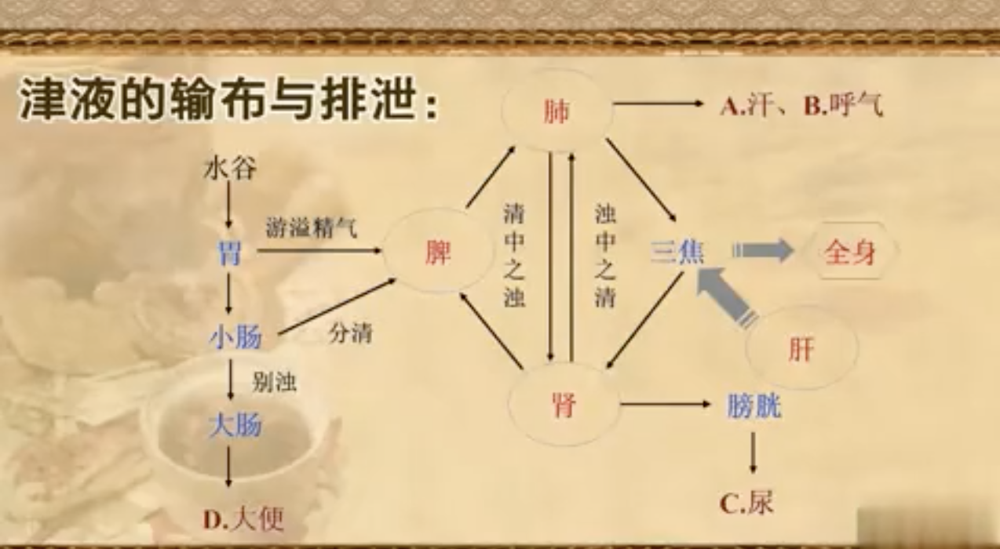

# 精气血津液神

## 概念
### 精
* 人体之精：禀受父母的生命物质与后天水谷精微相互融合而形成的一种精华物质，是生命的本源，是构成人体和维持人体生命活动的最基本物质
> 这个概念中既包括了先天之精也包括了后天之精
* 多种含义：最原始的是指生殖之精；广义上指一切一切精微物质，约等于气(广义)的含义
    * 先天之精，生殖之精的物质基础，强调来源于父母的物质
    * 水谷之精，脾胃化生，通过脾的运化、肺的生发肃降至各个脏腑
    * 生殖之精，强调本人的那部分物质
    * 脏腑之精，水谷之精进入各个脏腑之后成此，具体功能是促生气血、运行气血，多余的部分则进入肾脏存储
* 贮存与施泄
    * 贮藏：五脏、肾
    * 施泄：分藏于脏腑，濡养、化生气血津液；生殖之精有度排泄以繁衍生命
* 功能
    * 繁衍生命
    * 濡养脏腑
    * 化生气、血
    * 化神：
        * 肾藏精，精生髓；
        * 精化气，气化神；

### 气
* 人体之气：活力很强运行不息的精微物质，是构成人体和维持人体生命活动的基本物质
* 来源：
    * 最直接的来源：肺主呼吸；
    * 水谷之精化生而来，水谷之精化生水谷之气，故而脾胃可谓生气之源；
* 运动
    * 气机：气的运动
        * 自然：升降聚散
        * 人体：升降出入
    * 腑脏之气的运动
        * 脏：在上者宜降，在下者宜升，在中为升降之枢纽
        * 腑：以通为用，以降为顺，降中寓升
    * 若失常：气机失调
        * 气滞：气在局部发生阻滞不通，胀，用行气药，若有气虚表现，另加补气药
* 功能：
    * 第一暂无
    * 第二暂无
    * 防御作用：护卫肌表，抵御外邪及驱邪外出的作用
        > 皮肤是物质屏障，气是功能屏障
    * 固摄作用：固摄、统摄和控制体内的液态物质，如血、津液等
    * 中介作用：各腑脏借助气相互联系
* 分类
    * 组成：见哲学基础之精气学说（元、营、卫、宗气）
    * 分布
    * 功能：
        * 元气：元精化元气，人体最重要最根本的气，与生俱来，是人体生命活动的原动力
            * 推动人体的生长发育和生殖
            * 激发和调节各个脏腑、经络等组织器官生理功能
        * 宗气：
            * 走息道以行呼吸
            * 贯心脉以行气血
            * 循三焦而资元气
            * 与人体视听言动等机能相关
        * 卫气：行于脉外具有保护作用的气
            * 温养脏腑组织
            * 调节腠理开合，汗液排泄，维持体温恒定
            * 抵御外邪
        * 营气：行于(血)脉内富有营养之气
            * 化生血液
            * 营养全身
* 哲学之气和医学之气的关系
    * 共通性：承认并强调气的物质性、运动性和时空弥漫性；
    * 区别：
        * 哲学之气：
            * 在目的，探讨天地万物的生成和发展变化；
            * 在侧重，着重于物质性；
            * 在运动，多论聚散，偶论升降；
        * 医学之气：
            * 在目的，探讨人体生命活动和疾病的病机变化；
            * 在侧重，物质与功能的统一
            * 在运动，升降出入

### 血
* 徇行脉内富含营养的红色液态物质，是构成人体和维持人体生命活动的基本物质之一；
* 化生：
    * 脾胃运化水谷精微 - 物质来源
        > 化生的精微中精纯柔和的部分即是营气，在中医理念中，营气 + 津液约等于血
    * 肾藏精，精生髓，髓化血，肝藏之
* 运行
    * 影响因素：气的推动和固摄，温煦和凉润协调平衡是主要因素，血液充盈与质量，脉道完整通畅、寒热(外环境)等因素
    * 各脏腑对其的影响：
        * 心：动力，心主血脉
        * 肺：辅助，肺司呼吸，主气，气行则血行
        * 肝：辅助兼控制，肝主疏泄，调畅气机，气行则血行；(回)藏血；
        * 脾：控制，脾统血，控制流速；
* 功能：
    * 濡养全身：血色、肌肉、皮肤、毛发
    * 化神(有形化无形)
* 血虚的表现：
    * 面色无华或者萎黄，肌肤干燥，毛发不荣；
    * 惊悸，失眠，多梦或烦躁(兴奋)；健忘，恍惚(抑制) - 心；
    * 两目干涩，视物模糊，夜盲，月经量少 - 肝；
    * 肢体或者肢端麻木，运动不灵活或者抽搐 - 筋(肝)；
    * 头晕眼花，舌淡，脉细等；
* 四物汤：当归、川芎、芍药、熟地 - 中医补血养血的经方
    * 补血：当归、芍药、熟地；
    * 活血：当归、川芎；
    * 川芎亦有上行头目的作用；
    * 另加人参(或党参)、黄芪、陈皮以补、行气；
    * 熟地有补津的作用；
    * 加枸杞或者女贞子明目，不用菊花等是因为菊花清肝明目，此处应养血以明目；
    * 加鸡血藤可治血虚引起的筋的问题；
> * 此方性温，故而岭南一带宜另加生地以防止上火
> * 当归：尾活血，身补血，头止血；秦(地)产补性强，川产活血能力强
> * 赤芍偏活血，白芍偏补血
> * 黄芪：补气升阳、利水消肿
> * 陈皮：理气健脾，燥湿化痰
> * 鸡血藤：补血活血，舒筋活络
> * 阿胶：补血、安神

### 津液
* 概念：人体一切正常水液的总称，包括各脏腑组织的内在体液及其正常分泌物，如胃液、肠液、涕、泪、唾等；
    * 津：清晰的部分，流动性强，分布于浅表，纯粹的水分，渗于血脉，参与血液运行，出入于体表、孔窍的为津；
    * 液：稠厚的部分，流动性差，分布位置较深，水分 + 一定的营养物质；
* 代谢：
    * 生成：脾胃，小肠、大肠
    * 输布：排泄  
  
* 功能:
    * 滋润濡养
    * 充养血脉
* 病理：
    * 少：伤津，多见于实症；伤液即为阴虚
    * 多：水湿痰饮

### 神
* 概念：
    * 人体生命活动的主宰 - 元神
    * 精神、意识活动 - 识神
    * 上两者的外在表现 - 中诊中的望神
* 代谢
    * 生成
        * 精气血津液为化神之源
        * 脏腑精气对外界环境的应答
* 功能：
    * 调节精气血津液的代谢
    * 调节腑脏生理功能
    * 主宰人体的生命活动

## 关系
### 气
* 与血：类比阴阳，气为血之帅，血为气之母
    * 气对血 - 气为血之帅
        * 生血：
            * 营气化生血液 - 四物汤 + 人参
            * 气化促进代谢
        * 行血：气行则血行
        * 摄血：脾统血
    * 血对气 - 血为气之母
        * 生气
        * 载气