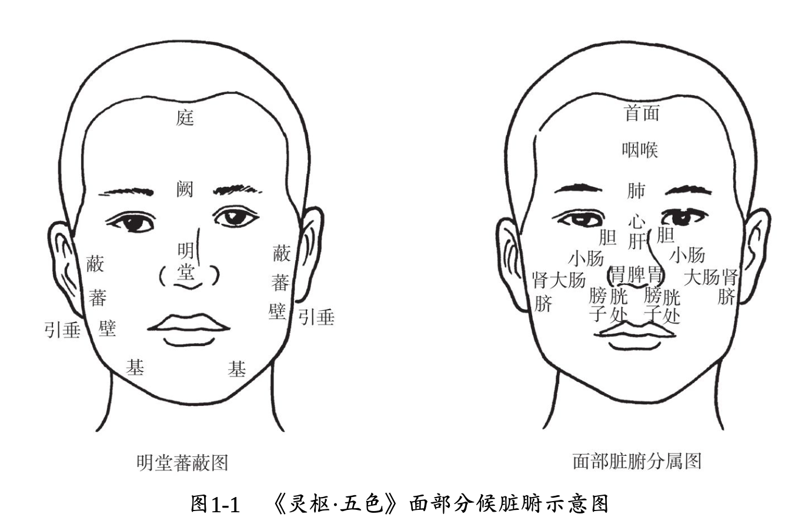
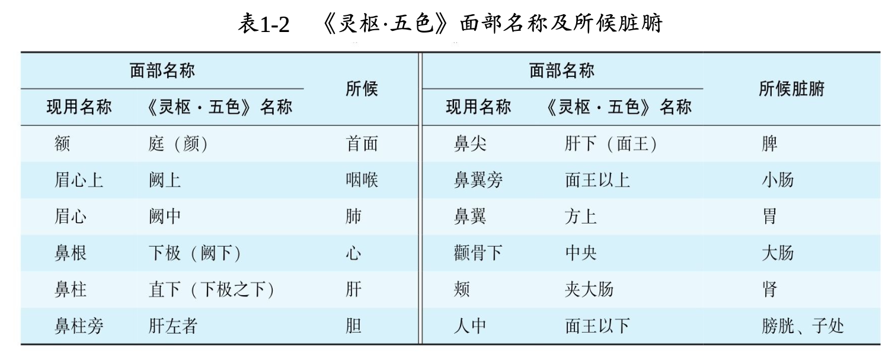

# 望全身
## 一、神
### (一)、概念
* 广义：生命的外在活动表现
* 狭义：精神思维活动
* "体精用神"，望神以明气血

### (二)、主要内容
* 部位：
  * 目：目光炯炯，精彩内涵，运动灵活，为有神，脏腑精气足；若目无光彩、晦暗，两眼运动呆滞，为无神，脏腑精气虚衰；
  * 面：皮肤荣润，红光满面，为神气充盛之象；皮肤枯槁，面色晦暗，乃神气衰败之征 - 心主藏神，其华在面；
  * 情：心神为人体生命活动的主宰，若神志清晰，思维有序，表情自然，表明心神健旺；反之，若神识不清，思维紊乱，表情淡漠，表明心神已衰；
  * 体：形体丰满，动作敏捷，转摇自如者，多属精气充盛；若消瘦枯槁，动作迟 缓，转侧艰难者，多属精气衰败；
* 状态：
  * 得神：神志清楚，语言清晰；目光明亮，精彩内含；面色红润，表情自然；肌肉不削，体态自如；动作灵活，反应灵敏；呼吸均匀。得神说明精气充盛，体健神旺，是健康的表 现；若病而有神，则表明脏腑功能不衰，正气未伤，病多轻浅，预后良好；
  * 少神：精神不振，嗜睡健 忘；目光乏神，双目少动；面色淡白少华；肌肉松弛，倦怠乏力，动作迟缓；气少懒言，食欲减退等。少神多由正气不足，精气轻度损伤，脏腑功 能减退所致，多见于轻病或疾病恢复期的患者；素体虚弱者，平时亦多出现少神；
  * 失神：又称 “无神”。可见于久病虚衰或邪实神乱的重病患者，其下有二：
    * 精亏神衰而失神：临床表现为精神萎靡，意识模糊；目暗睛迷，瞳神呆滞，或目翻上视；面色晦暗无华，表情淡漠；肌肉瘦削，大肉已脱，动作失灵；循衣摸床，撮空理线；呼吸异常，气息微弱。提示人体精气大伤，脏腑功能严重受损，机能衰竭，预后不良；
    * 邪盛扰神而失神：神昏谵语或昏愦不语，舌謇肢厥；或猝倒神昏，两手握固，牙关紧急，二便闭塞。多因邪陷心包，内扰神明；或因肝风夹痰，蒙蔽清窍。皆属病情危重
    > 谵语：胡言乱语且声音高昂；郑声：胡言乱语且声音低弱
  * 假神：是指久病、重病患者，精气本已极度衰竭，突然出现神气暂时“好转”的假象，并非佳兆，古人喻为“回光返照”、“残灯复明”。如本已神识不清，却突然精神转佳，语言不休，想见亲人；本已目光晦暗，却突然目似有光而浮露；本已面色晦暗枯槁，却突然颧赤如妆；本已久病卧床不起，却忽思下床活动；本来毫无食欲或久不能食，而突然食欲大增或主动索食。假神说明脏腑精气极度衰竭，正气将脱，阴阳即将离决，常为临终前的征兆；
  > 注意是"突然"

| | 得 | 少 | 失 | 假 |
| :----: | :----: | :----: | :----: | :----: |
| 目光 | 两目灵活 明亮有神 | 两目晦涩 目光乏神 | 两目晦暗 瞳神呆滞 | 原本目光晦暗 突然浮光暴露 |
| 神情 | 神志清晰 表情自然 | 精神不振 思维迟钝 | 精神萎靡 意识模糊 | 本已神昏 突然神识似清 |
| 面色 | 面色红润 含蓄不露 | 面色少华 色淡不荣 | 面色无华 晦暗暴露 | 本已面色晦暗 突然颧红如妆 |
| 体态 | 肌肉不削 反应灵敏 | 肌肉松弛 动作迟缓 | 形体羸瘦 反应迟钝 | 久病卧床不起 忽思活动 |
| 语言 | 语言清晰 对答如流 | 声低懒言 | 低微断续 言语失伦 | 本不言语 突然言语不休 |
| 饮食 | 饮食如常 | 食欲减退 | 毫无食欲 | 久不能食 突然索食 |
  
  * 神乱：神志意识错乱，主要表现为焦虑恐惧，淡漠痴呆，狂躁妄动，猝然昏仆等，多见于脏躁、癫、狂、痫等患者 - 仅此项是从狭义角度来划分的
    * 焦虑恐惧：患者常表现为焦虑不安，心悸不宁，或恐惧胆怯，不敢独处一室等。多由心胆气虚，心神失养所致，可见于脏躁等；
    * 淡漠痴呆：患者表现为神识痴呆，表情淡漠，喃喃自语，哭笑无常。多因忧思气结，痰浊蒙蔽心神，或先天禀赋不足所致，常见于癫病或痴呆等；
    * 狂躁不安：表现为狂妄躁动，呼笑怒骂，打人毁物，不避亲疏，甚或登高而歌，弃衣而走，妄行不休，力逾常人。多因暴怒化火，炼津为痰，痰火扰神所致，常见于狂病等；
    * 猝然昏仆：表现为猝然仆倒，不省人事，口吐涎沫，口出异声，四肢抽搐，醒后如常。多与先天禀赋因素有关，因肝风夹痰，蒙蔽清窍所致，常见于痫病；

## 二、色(泽)
### (一)、内容
* 颜色：青、赤、黄、白、黑，颜色可以反映气血的盛衰和运行情况，并在一定程度上反映疾病的不同性质和不同脏腑的病证。五脏之气外发，五脏之色可隐现于皮肤之中，当脏腑有病时，则可显露出相应的异常颜色
* 光泽：皮肤的光泽是脏腑精气盛衰的表现
* 面部脏腑分候，其下有二：
    * 《灵枢·五色》
        *   
        *   
    * 《素问·刺热》：额部候心，鼻部候脾，左颊候肝，右颊候肺，颏部候肾

### (二)、常
* 所谓常者，指人体健康时面部皮肤的色泽。我国正常人的常色特点是红黄隐隐，明润含蓄。红黄隐隐，即是面部红润之色隐现于皮肤之内，由内向外透发，是胃气充足、精气内含的表现，即"内含则气藏，外露则气泄"
* 主色：个人生来所有、一生基本不变的肤色，称为主色，属于个体肤色特征
* 客色：因季节、气候、昼夜等外界因素变动而发生相应变化的肤色，称为客色。如春季可面色稍青，夏季可面色稍赤，长夏可面色稍黄，秋季可面色稍白，冬季可面色稍黑

### (三)、病
* 人体在疾病状态时面部显示的色泽，称为病色。凡面色晦暗枯槁或暴露浮现，皆属病色。晦暗枯槁，即面部肤色暗而无光泽，是脏腑精气已衰，胃气不能上荣的表现；暴露浮现，即某种面色异常明显地显露于外，是病色外现或真脏色外露的表现，如肾病患者出现面黑暴露，枯槁无华，即为真脏色外露，或如假神之颧赤泛红如妆，为虚阳浮越之兆
* 病色善恶 - 大凡有光泽者为善，无光者为恶：
    * 善色：凡五色光明润泽者为善色，亦称 “气至”。《素问·五脏生成》中形象地描述为<strong>青如翠羽、赤如鸡冠、黄如蟹腹、白如豕膏、黑如乌羽</strong>。善色说明病变尚轻，脏腑精气未衰，胃气尚能上荣于面，多见于新病、轻病，其病易治，预后较好。如黄疸患者面色黄而鲜明如橘皮色，即为善色
    * 恶色：凡五色晦暗枯槁者为恶色，亦称 “气不至”。《素问·五脏生成》中形象地描述为<strong>青如草兹、赤如衃血、黄如枳实、白如枯骨、黑如炲</strong>。恶色说明脏腑精气已衰，胃气不能上荣于面，多见于久病、重病，其病难治，预后不良。如鼓胀患者面色黄黑、晦暗枯槁，即为恶色。

* 五色之病
    1. 青色：主寒证、气滞、血瘀、疼痛、惊风
       * 由于寒邪凝滞，或气滞血瘀，或因疼痛剧烈，或因筋脉拘急，或因热盛动风，致脉络阻滞，血行不畅，故见青色。
       * 面色淡青或青黑者，多属阴寒内盛、疼痛剧烈，可见于寒盛所致的骤起脘腹疼痛患者，如寒滞肝脉等证。
       * 突见面色青灰，口唇青紫，肢凉脉微，多属心阳不振、心脉闭阻之象，可见于胸痹、真心痛等患者。
       * 久病面色与口唇青紫者，多属心气、心阳虚衰，心血瘀阻；或肺气闭塞，呼吸不利。
       * 面色青黄(即面色青黄相兼，又称苍黄)者，多属肝郁脾虚、血瘀水停，可见于鼓胀，或胁下癥积的患者。
       * 小儿眉间、鼻柱、唇周发青者，多属惊风或欲作惊风之象，可见于高热抽搐患儿。
    2. 赤色：主热证，亦可见于真寒假热之戴阳证
       * 患者面色红赤，多因热迫血行，面部脉络扩张充盈，血色上荣于面所致。其中满面通红、目赤，为实热证，因热性炎上，血行加速而充盈于面，可见于脏腑火热炽盛或外感邪热亢盛患者；午后两颧潮红，为虚热证，因阴虚阳亢，虚火上炎所致，可见于肺痨病等患者。
       * 久病重病患者面色苍白，却时而颧赤泛红如妆、游移不定，为戴阳证。是因久病阳气虚衰，阴寒内盛，阴盛格阳，虚阳浮越所致，属真寒假热之证，多见于久病脏腑精气极度衰竭患者，为病情危重征象。
    3. 黄色：主脾虚、湿证
       * 患者面色发黄，多由脾虚失运，气血生化不足，无以上荣于面所致；或湿邪内蕴、脾失运化，以致脾土之色外现而见面黄。
       * 面色黄而枯槁无光，称为萎黄，多属脾胃气虚，气血不足。因脾胃虚衰，无以运化水谷精微，气血化生无源，机体失养所致。
       * 面色黄而虚浮者，称为黄胖，属脾虚湿蕴。因脾失健运，水湿内停，泛溢肌肤所致。
       * 面目一身俱黄者，称为黄疸。其中黄而鲜明如橘皮色者，称为阳黄，多由湿热蕴结所致；黄而晦暗如烟熏者，称为阴黄，多因寒湿困阻而成
    4. 白色：主虚证、寒证、失血、夺气
       * 虚证患者见面色白，是因气血亏虚，或失血、夺气，气血不能上荣于面所致。寒证患者见面色白，是因寒凝气收，脉络收缩，血行迟滞；或阳气虚弱，推动无力，以致运行于面血液减少，故亦见白色。
       * 面色淡白无华，唇、舌色淡者，多属气血不足，或见于失血患者。
       * 面色白者，多属阳虚寒证；㿠白虚浮者，则多属阳虚水泛。
       * 面色苍白伴大出血者，为脱血；面色苍白伴四肢厥冷、冷汗淋漓等，多属阳气暴脱之亡阳证。
    5. 黑色：主肾虚、寒证、水饮、血瘀、疼痛
       * 肾属水，其色黑，故肾虚患者多面见黑色。肾阳虚衰，阴寒内盛，血失温养，或寒凝经脉，瘀阻不通则痛，或阳虚水饮内停，皆可导致脉络拘急，血行不畅，故寒证、痛证、血瘀、水饮患者皆可见面色黑。
       * 面色黧黑晦暗，多属肾阳亏虚，为阳虚火衰，失于温煦，浊阴上泛所致。
       * 面色黑而干焦，多属肾阴亏虚，为阴虚内热，虚火灼精所致。
       * 面色紫暗黧黑，伴有肌肤甲错，多属瘀血，为瘀阻脉络，肌肤失养所致。
       * 眼眶周围发黑，多属肾虚水饮内停，或寒湿带下。

### (四)、望色十法
* 浮沉分表里
* 清浊审阴阳：清，是面色清明，多主阳证；浊，是面色浊暗，多主阴证
* 微甚别虚实：微，是面色浅淡，多主虚证；甚，是面色深浓，多主实证
* 散抟辨新久：散，是面色疏散，多主新病，或病邪将解；抟，是面色壅滞聚结，多主久病，或病邪渐聚
* 泽夭测成败：泽，是面色润泽，主精气未衰，病轻易治；夭，是面色枯槁，主精气已衰，病重难治

### (五)、其他
* 病色顺逆：生者为顺证，克者为逆证，顺易治，逆难治。以肝病为例：
  * 色生病(肝病见黑色) - 此为顺证，也是最好的一种，吉中之顺
  * 病生色(肝病见赤色) - 此为顺证，为次好的一种，吉中小逆
  * 病克色(肝病见黄色) - 此为逆证，为较差的一种，凶中之顺
  * 色克病(肝病见白色) - 此为逆证，为最差的一种，凶中之逆

## 三、形
* 形体强弱：
  * 体强：骨骼健壮，胸廓宽厚，肌肉充实，皮肤润泽，筋强力壮等，为形气有余，说明气血旺盛，脏腑坚实，抗病力强；体强者，一般不易患病，患病后恢复能力也强
  * 体弱：骨骼细小，胸廓狭窄，肌肉消瘦，皮肤干枯，筋弱无力等，为形气不足，说明气血不足，体质虚弱，脏腑脆弱，抗病力弱；体弱者，较容易患病，恢复能力也差
  * 五体对五脏：
    * 心主血脉，面色荣润是心气充盛，气血调和的表现；面色枯槁则属心血不足
    * 肺主皮毛，皮肤荣润光泽是肺气充沛，营卫充盛的表现；皮肤干枯，腠理疏松，则属肺气亏虚，营卫不足
    * 脾主肌肉，肌肉丰满坚实是脾胃之气旺盛，气血充足的表现；肌肉消瘦、无力，则属脾胃气虚，气血不足
    * 肝主筋，筋健运动灵活有力，是肝血充盛，血能荣筋的表现；筋弱关节屈伸不利，则属肝血不足，筋失濡养
    * 肾主骨，骨骼健壮是肾气充盛，髓能养骨的表现；骨骼细弱，或有畸形，则属肾气不足，发育不良
* 形体胖瘦 - 胖人多痰湿，胖人多阳虚；瘦人多火，瘦人多阴虚
  * 肥胖：“肉盛于骨”，脂肪偏多，多集中于肩颈、背部、腹部等，表现为头圆，颈短粗，肩宽平，胸厚短圆，大腹便便等。若胖而能食，为形气有余；肥而食少，是形盛气虚。肥胖多因嗜食肥甘，喜静少动，脾失健运，痰湿脂膏积聚等所致。肥胖之人由于形盛气虚，常多痰湿积聚，即所谓 “肥人多痰”“肥人湿多”
  * 消瘦：肌肉消瘦，严重者形瘦骨立，大肉尽脱，毛发枯槁，称为形脱。形瘦之人常表现为头颈细长，肩狭窄，胸狭平坦，腹部瘦瘪，体形瘦长。若形瘦食多，为中焦火炽；形瘦食少，是中气虚弱，多因脾胃虚弱，气血亏虚，或病气消耗等所致；若消瘦伴五心烦热、潮热盗汗，为阴虚内热；若久病卧床不起，骨瘦如柴者，为脏腑精气衰竭，病属危重。形瘦之人，多气火有余，阴虚居多，即所谓“瘦人火多”
* 形体体质
  * 阳脏人：多阴虚阳盛，体形偏于瘦长，头长颈细长，肩窄胸平，身体姿势多前屈，平时喜凉恶热。其特点是阴气较亏而阳气偏旺，患病易于从阳化热，导致伤津耗阴
  * 阴脏人：多阳虚阴盛，体形偏于矮胖，头圆颈短粗，肩宽胸厚，身体姿势多后仰，平时喜热恶凉。其特点是阳气较弱而阴气偏旺，患病易从阴化寒，多寒湿痰浊内停
  * 平脏人：阴阳和平之人，体型介于阴脏人和阳脏人两者之间。其特点是阴阳平衡，气血调匀，在平时无寒热喜恶之偏，是大多数人的体质类型

## 四、态
### (一)、内容
* 望诊八法：曰动、曰静、曰强、曰弱、曰俯、曰仰、曰屈、曰伸
* 动静姿态：
  * 坐形：坐而仰首，多见于哮病、肺胀，多因痰饮停肺，肺气壅滞所致；坐而喜俯，少气懒言，多属气虚体弱；但卧不能坐，坐则晕眩，不耐久坐，多为肝阳化风，或气血俱虚、夺气脱血；但坐不得卧，卧则咳逆，多为肺气壅滞，气逆于上，或心阳不足，水气凌心。坐卧不宁是烦躁之征，或腹满胀痛之故；坐时常以手抱头，头倾不能昂，凝神直视，为精神衰败
  * 卧式：卧时常喜向内，喜静懒动，身重不能转侧，多属阴证、寒证、虚证；卧时常喜向外，身轻自能转侧，躁动不安，多属阳证、热证、实证。仰卧伸足，掀去衣被，多属实热证；蜷卧缩足，喜加衣被者，多属虚寒证
  * 立姿：行走站立不稳，如坐舟车，不能自持，常并见于眩晕，多属肝风内动或气血亏虚；不耐久立，立则常欲倚物支撑，多属气血虚衰。坐立之时常以手扪心，闭目蹙额，多见于心虚怔忡；若以手护腹，俯身前倾者，多为腹痛之征。此即所谓“护处必痛”
  * 行态：行走时身体震动不定，是肝风内动，或筋骨虚损；行走之际，突然止步不前，以手护心，不敢行动，多为真心痛；以手护腰，弯腰曲背，转摇不便，行动艰难，多为腰腿病
* 异常动作：风主动，善行而数变，风气通于肝，形体的异常动作常与风和肝有关
  * 颤动：患者睑、面、唇、指、趾不时颤抖或振摇不定，不能自主，若见于外感热病，多为热盛动风；若见于内伤虚证，多为血虚阴亏，经脉失养，属虚风内动。
  * 手足蠕动：手足时时掣动，动作迟缓无力，类似虫之蠕行。多为脾胃气虚，气血生化不足，筋脉失养，或阴虚动风所致
	> 蠕动与颤动的区别在于是否有关节参与，有则为蠕动，无则为颤动
  * 手足拘急：手足筋肉挛急不舒，屈伸不利。如在手可表现为腕部屈曲，手指强直，拇指内收贴近掌心与小指相对；在足可表现为踝关节后弯，足趾挺直而倾向足心。多因寒邪凝滞或气血亏虚，筋脉失养所致
  * 四肢抽搐：四肢筋脉挛急与弛张间作，舒缩交替，动作有力，多因肝风内动，筋脉拘急所致，可见于惊风、痫病
  * 角弓反张：患者颈项强直，脊背后弯，反折如弓。为肝风内动，筋脉拘急之象，可见于热极生风、破伤风、马钱子中毒等
  * 循衣摸床，撮空理线：患者重病神识不清，不自主地伸手抚摸衣被、床沿，或伸手向空，手指时分时合。为病重失神之象
  * 猝然跌倒：猝然昏仆，不省人事，伴半身不遂，口眼斜者，多属中风病。猝倒神昏，口吐涎沫，四肢抽搐，醒后如常者，多属痫病。
  * 舞蹈病状：儿童手足伸屈扭转，挤眉眨眼，努嘴伸舌，状似舞蹈，不能自制，多由先天禀赋不足或气血不足，风湿内侵所致
* 衰惫姿态

# 望局部
## 头面
* 头为精明之府，为元神所居之处，内藏脑髓，髓为肾精所化；头为诸阳之会，手足三阳经及督脉皆上行于头，足厥阴肝经和任脉亦上达于头，故脏腑精气皆上荣于头部；面为心之华，脏腑精气上荣于面；肾之华在发，发为血之余。望头面主要观察头部的形态、囟门及头发和面部的状况

### 头
* 头形：主要观察头的大小、外形和动态
  * 头大：头颅增大，颅缝开裂，颜面较小，智力低下者，多因先天不足，肾精亏损，水液停聚于脑所致
  * 头小：头颅狭小，头顶尖圆，颅缝早合，智力低下者，多因肾精不足，颅骨发育不良所致
  * 方颅：前额左右突出，头顶平坦，颅呈方形，多因肾精不足或脾胃虚弱，颅骨发育不良所致，多见于佝偻病或先天性梅毒患儿
* 动态：头部不自觉地摇动而不能自制者，为头摇，俗称“摇头风”。无论成人或小儿，多为肝风内动之兆
* 囟门：囟门是婴幼儿颅骨接合处尚未完全闭合所形成的骨间隙，有前囟、后囟之分。后囟呈三角形，在出生后2~4个月内闭合；前囟位于顶骨与额骨之间，呈菱形，在出生后12~18个月内闭合，是临床观察的主要部位
  * 囟填：囟填即囟门突起，多属实证。多因热邪炽盛，火毒上攻；或颅内水液停聚；或脑髓有病所致。小儿哭泣时囟门可暂时稍微突起，安静后即恢复正常
  * 囟陷：囟陷即囟门凹陷，多属虚证。多因吐泻伤津，气血不足和先天肾精亏虚，脑髓失充所致。但6个月以内的婴儿囟门微陷属正常。
  * 解颅：解颅即囟门迟闭，骨缝不合，也称“囟解”“囟开不合”。此为先天肾精不足，或后天脾胃虚弱，发育不良的表现，多见于佝偻病患儿，常兼有“五迟”，“五软”等表现
> 五迟：立迟、行迟、发迟、齿迟、语迟  
> 五软：头项软、口软、手软、足软、肌肉软
  
### 发
* 头发的生长与肾气和精血的盛衰关系密切，故望发可以诊察肾气的强弱和精血的盛衰。正常人发黑稠密润泽，是肾气充盛，精血充足的表现
* 色泽：发黄干枯，稀疏易落，多属精血不足，可见于大病后或慢性虚损患者；小儿头发稀疏黄软，生长迟缓，多因先天不足，肾精亏损所致；青壮年白发，俗称“少白头”，若伴有耳鸣、腰酸等症者，属肾虚；伴有失眠、健忘等症者，为劳神伤血所致；短时间内须发大量变白，伴情志抑郁者，为肝郁气滞，也见于先天禀赋所致者；小儿发结如穗，枯黄无泽，兼面黄肌瘦，腹大便溏者，常见于疳积
* 脱发：头发突然呈片状脱发，显露圆形或椭圆形光亮头皮，称为斑秃，俗称“鬼剃头”，多为血虚受风。发稀而细易脱，质脆易断者，多因肾虚、精血不足所致。青壮年头发稀疏易落，若兼眩晕、健忘、腰膝酸软者，为肾虚；若兼头皮发痒、多屑、多脂者，为血热生风所致头发部分或全部脱落。日久不长，伴头痛、面色暗滞，舌质暗或有紫斑，脉细涩者，为瘀血阻滞
  
### 面
* 色泽、形态
* 形态异常：
  * 面肿：面部浮肿，皮色不变者，多见于水肿病；颜面红肿，色如涂丹，焮热疼痛，为抱头火丹，多由风热火毒上攻所致；头肿大如斗，面目肿甚，目不能开，伴壮热、口渴、苔黄者，为“大头瘟”，因天行时疫，毒火上攻所致
  * 腮肿：一侧或两侧腮部以耳垂为中心肿起，边缘不清，按之有柔韧感及压痛者，为痄腮，因外感温毒之邪所致，多见于儿童。若颐颔部肿胀疼痛，张口受限，伴有寒热者，为发颐，多因阳明热毒上攻所致
  * 面削颧耸：面削颧耸又称面脱。表现为面部肌肉消瘦，两颧高耸，眼窝、颊部凹陷。多因气血虚衰，脏腑精气耗竭所致，为失神的表现
  * 口眼歪斜：口目歪斜而不能闭合，又称为“面瘫”“僻”。若单见口眼歪斜，患侧面肌弛缓，肌肤不仁，额纹消失，鼻唇沟变浅，目不能合，口不能闭，不能皱眉鼓腮，口角下垂，偏向健侧，名口僻，为风邪中络所致；若口眼歪斜兼半身不遂者，多为肝阳化风，风痰阻闭经络所致
* 特殊形态：
  * 惊恐貌：面部呈现惊悚恐惧的表现，常因闻听高声或见水时而引发，多见于狂犬病。
  * 苦笑貌：面部呈现无可奈何的苦笑样表现。多因面部肌肉痉挛所 致，为破伤风的特殊征象

## 五官
### 目
 
* 五轮学说：
  * 瞳仁属肾，称为水轮
  * 黑睛属肝，称为风轮
  * 两眦血络属心，称为血轮
  * 白睛属肺，称为气轮
  * 眼睑属脾，称为肉轮
* 目色：
  * 目赤：双眼或单眼白睛红赤，俗称“红眼”“火眼”。目赤若伴见肿痛，多属实热证。如全目赤肿，多为肝经风热上攻；两眦赤痛，多为心火上炎；白睛发红，多为肺火；睑缘赤烂，多为脾经湿热。若白睛红赤灼热，眵多黏结，羞明畏光，有传染性者，多为感受时邪热毒所致，也称“天行赤眼”。
  * 白睛发黄：为黄疸的主要标志。伴身面发黄、尿黄等症，多因湿热内壅或寒湿内困，肝胆疏泄失常，胆汁外溢所致，有阳黄、阴黄之分。
  * 目眦淡白：属血虚、失血，是血少不能上荣于目所致。
  * 目胞色黑晦暗：多属肾虚；目眶周围色黑，多因肾虚水泛，或寒湿下注所致；目眶色黑，伴肌肤甲错，多为瘀血内阻所致；睡眠欠佳也可见目眶发黑。
  * 黑睛灰白混浊：为目翳，属外障眼疾。若黑睛深层呈圆盘状翳障，妨碍视力，为混睛障，多因邪毒侵袭，或肝胆实火上攻，或湿热熏蒸，或阴虚火旺等所致，常见于眼外伤及某些全身疾病；若小儿疳积日久也可见目生翳障，表现为目干夜盲，黑睛生翳糜烂，甚则溃破穿孔等
* 目形：
  * 胞睑肿胀：胞睑肿胀是指上胞下睑肿胀不适。目胞浮肿，如新卧起之状，皮色不变或较光亮，是水肿病初起之征；胞睑红肿，若眼睑边缘起节肿，状若麦粒，红肿痒痛，易成脓溃破者，为针眼；若整个胞睑漫肿，红如涂丹，热如火灼，化脓溃破者，为眼丹。后二者皆为风热毒邪相搏客于胞睑，或脾胃蕴积热毒，上攻于目，以致局部气血瘀滞
  * 眼窝凹陷：若见于吐泻之后，多因吐泻伤津所致；若见于久病、重病患者，为脏腑精气衰竭，病属难治
  * 眼球突出：眼突而喘，属肺胀，多因痰浊阻肺，肺气不宣，呼吸不利所致；眼突颈肿，为瘿病，因肝郁化火，痰气壅结所致
* 目态：
  * 瞳孔缩小：多因肝胆火炽，或劳损肝肾，虚火上扰所致。也可见于中毒(吗啡、川乌、草乌、毒蕈、有机磷农药中毒)等
  * 瞳孔散大：多属肾精耗竭，见于危重患者，是濒死前的征象之一。也见于肝胆风火上扰的绿风内障、中毒(如杏仁、麻黄、曼陀罗中毒)及某些西药(如阿托品)所致的药物性瞳孔散大等
  * 目睛凝视患者两眼固定，转动不灵，固定前视者，称瞪目直视；固定上视者，称戴眼反折；固定侧视者，称横目斜视。多属肝风内动之征，常伴神昏、抽搐等症，属病重；或见于脏腑精气耗竭，或痰热内闭证。瞪目直视还可见于瘿病
  * 嗜睡露睛：指患者入睡后胞睑未闭合而睛珠外露。多因脾虚清阳不升，或津液大伤，胞睑失养，启闭失常所致，多见于脾胃虚衰或吐泻伤津的患儿。此外，睡时露睛也可见于正常人，俗称“羊眼”
  * 胞睑下垂胞睑下垂又称睑废，是指上睑下垂，难以抬举，轻者半掩瞳仁，重者全遮黑瞳，垂闭难张。胞睑下垂分为先天与后天两类。其中双眼上睑下垂者，多为先天禀赋不足，脾肾亏虚，睑肌失养所致；单眼上睑下垂者，多因脾气虚衰，脉络失养，肌肉松弛所致，也可见于外伤
  
### 耳
* 耳为肾之窍，手足少阳经脉布于耳，手足太阳经和足阳明经也分布于耳或耳周围。此外，在耳廓上有全身脏器和肢体的反应点。所以，耳与全身均有联系，而尤与肾、胆的关系最为密切，望耳可以察知肾、胆乃至全身的病变。耳部望诊，主要是观察耳廓色泽、形态及耳内病变
* 色泽：
  * 润枯：正常人表现为耳廓色泽红润，是气血充足的表现；耳廓焦黑干枯，多属肾精亏虚
  * 颜色：耳廓淡白，多属气血亏虚；耳轮红肿，多属肝胆湿热或热毒上攻；耳轮青黑，多见于阴寒内盛或有剧痛的患者；小儿耳背有红络，耳根发凉，多为麻疹先兆
* 耳之形态
  * 耳廓形大：耳廓外形厚而大，属形盛，为肾气充足；耳廓肿大，伴见色红，为邪气实，多属少阳相火上攻
  * 耳廓瘦小：耳廓瘦小而薄，属先天亏损，肾气不足；耳廓瘦削而干焦，为正气虚，多为肾精耗竭或肾阴不足；耳廓萎缩，为肾气竭绝。
  * 耳轮甲错：即耳轮肌肤甲错，多属久病血瘀
* 耳内病变
  * 耳内流脓：耳道内流出脓液，其色或黄或青，其质或稠或稀，称为脓耳。耳内流脓有虚实之别，涉及肝、胆、肾三经。发作急骤，脓液黄稠，耳痛剧烈者，属实证，多因风热上扰或肝胆湿热所致；流脓日久，脓液清稀，耳痛较缓者，属虚证，多因肾阴虚损，虚火上炎所致
* 耳道红肿耳道局部红肿疼痛，突起如椒目状，为耳疖，多因邪热搏结耳窍所致

### 鼻
* 鼻居面部中央，为肺之窍，属脾，与足阳明胃经亦有联系。望鼻可诊肺、脾、胃等脏腑的病变。鼻部望诊应注意观察色泽、形态及鼻内病变
* 色泽
  * 润枯：鼻端微黄明润，见于新病，为胃气未伤，属病势较轻；见于久病为胃气来复，属病势向愈。鼻端晦暗枯槁，为胃气已衰，属病重
  * 颜色：鼻端色白，多为气血亏虚；色赤为肺脾蕴热；色黄为有湿热；色青为阴寒腹痛；小儿山根青筋，多因肝经气滞寒凝、肝脾不和、乳食积滞所致
* 鼻之形态
  * 鼻头肿胀：若属红肿或生疮，并感疼痛，属邪热盛，常见于胃热或血热。若鼻及鼻周围皮色暗红或血络扩张，伴丘疹、脓疱或鼻赘，称为酒齄鼻，多因肺胃蕴热，血瘀成齄所致
  * 鼻柱溃陷：多见于梅毒患者；若鼻柱塌陷，兼眉毛脱落，为麻风恶候
  * 鼻翼扇动：鼻孔两翼因呼吸急促而扇动的症状，也称为鼻扇。多属肺热，或见于哮病，是肺气不宣，呼吸困难的表现；若重病中出现鼻孔扇张，喘而额汗如油，是肺气衰竭之危候
* 鼻内病变
  * 鼻流清涕：若伴见恶寒发热、鼻塞等，多属风寒表证；若常流清涕，量多，经久不愈，多为鼻鼽，多因阳气虚弱所致
  * 鼻流浊涕：若伴见恶寒发热，咽痛等，多属风热表证；若常流浊涕，量多不止，其气腥臭，常伴头痛、鼻塞、嗅觉减退，为鼻渊，多因外感风热，或胆经蕴热上攻于鼻所致
  * 鼻腔出血：鼻腔出血称为鼻衄。外感引起者，多因风热犯肺、燥邪伤肺所致；出血量多，色深红质稠者，多因肝火犯肺，或胃火炽盛，火热上炎，灼伤阳络，迫血外溢所致；血色淡红而质稀，多因脾不统血，血不循经而外溢所致。个别妇女经期鼻衄随月经周期而作，称为“倒经”，多因肝郁化火犯肺，或阴虚肺热所致
  * 鼻内赘生物：鼻腔内长有状若葡萄或榴子，光滑柔软，带蒂可活动，而无痛感的肉状物，为鼻痔(鼻息肉)。若其撑塞鼻孔，则致气息难通。多因湿热邪毒壅结鼻窍所致

### 口唇
* 口为饮食通道，脏腑要冲，脾开窍于口，其华在唇，手足阳明经环绕口唇，故望口与唇的异常变化，可以诊察脾与胃的病变。望口与唇注意观察形色、润燥及动态的变化。
* 望口
  * 口角流涎：小儿口中流涎，称为滞颐，多因脾虚湿盛。《诸病源候论》曰：“滞颐之病，是小儿多涎唾流出，渍于颐下，此由脾冷液多故也。”成人见之多为中风口歪不收所致。
  * 口疮：口腔内膜上出现黄白色如豆大、表浅的小溃疡点，周围红晕，局部灼痛者，为口疮，《黄帝内经》也称为“口糜”或“口疡”。多因心脾积热，或由阴虚火旺所致。若口疮反复发作，时轻时重，疮面色淡，疼痛较轻，伴少气乏力，大便溏薄，舌淡嫩，脉虚等症者，多为中气不足所致。
  * 鹅口疮：若小儿口腔、舌面满布片状白屑，状如鹅口者，为鹅口疮，又称“雪口”。多因感受邪毒，心脾积热，上熏口舌所致；也可因肾阴亏损，虚火上炎而为。
  * 口之动态：正常人口唇可随意开合，动作协调。《望诊遵经》将口唇的异常动态归纳为“口形六态”：
    * 口张：口开而不闭，属虚证；若状如鱼口，张口气出，但出不入，则为肺气将绝之候。
    * 口噤：口闭难开，牙关紧闭，属实证。口噤不语，兼四肢抽搐，多为痉病或惊风；兼半身不遂，则为中风入脏之重证。
    * 口撮：上下口唇紧聚，为邪正交争所致。兼见角弓反张，多为破伤风患者；新生儿撮口不能吮乳，多为脐风。
    * 口僻：口角向一侧歪斜，见于风邪中络，或风中脏腑之患者。
    * 口振：战栗鼓颌，口唇振摇，常见于疟疾初起。
    * 口动：口频繁开合，不能自禁，是胃气虚弱之象；若口角掣动不止，为动风之象。
* 望唇 唇部色诊与望面色基本相同，但因唇黏膜薄而透明，故其色泽变化比面色更为明显，易于观察。正常人唇色红润，是胃气充足，气血调匀的表现。
  * 唇色淡白：多属血虚或失血。
  * 唇色深红：多属热盛；深红干燥，属热盛伤津。
  * 唇色青紫：多属阳气虚衰，血行瘀滞。
  * 唇色青黑：因寒凝血瘀，或痛极血络郁阻所致。
  * 口唇干裂：为津液损伤，多因燥热伤津或阴虚液亏所致。
  * 口唇糜烂：多因脾胃积热上蒸，热邪灼伤唇部所致；唇内溃烂，其色淡红，为虚火上炎。
  * 唇边生疮，红肿疼痛，为心脾积热