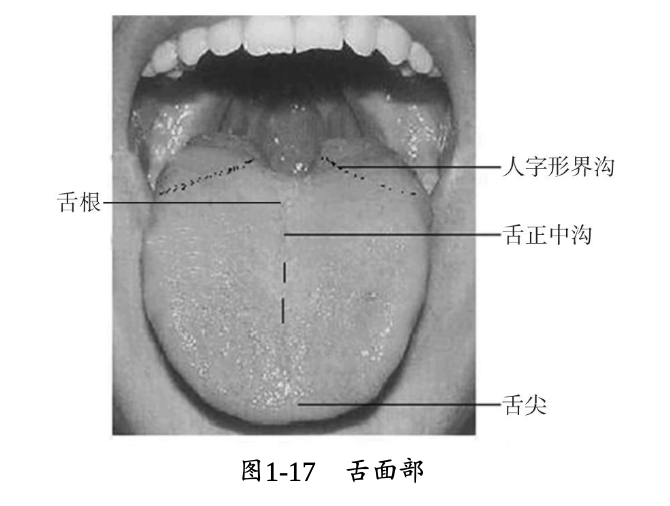

# 舌诊
## 一、基本结构
* 
*  
> 舌下肉阜，皆有腺管开口，中医称左侧为金津，右侧为玉液，是胃津、肾液上潮的孔道
*  

## 二、基本内容
* 舌质与舌苔
* 正常舌象：淡红舌，薄白胎。具体来说，舌质荣润，舌色淡红，大小适中，舌体柔软灵活自如；舌苔薄白均匀，胎质干湿适中，不黏不腻，揩之不去，其下有根。正常舌象说明胃气旺盛，气血津液充盈，脏腑功能正常

## 三、舌质
* 神、色、形、态
### 舌神：荣枯与灵动
* 荣舌
  * 象：舌质荣润红活，有生气，有光彩，舌体活动自如，故谓舌之有神
  * 意：气血旺盛，气帅血液上荣于舌，故而荣润红活。《辨舌指南》曰：“荣者谓有神......凡舌质有光有体，不论黄、白、灰、黑，刮之而里面红润，神气荣华者，诸病皆吉。”
* 枯舌
  * 象：舌质干枯死板，毫无生气，失去光泽或活动不灵，故谓舌之无神
  * 意：脏腑气血败坏，不能荣润舌体，故而晦暗干枯死板。《辨舌指南》曰：“若舌质无光无体，不拘有胎无胎，视之里面枯晦，神气全无者，诸病皆凶。”

### 舌色：淡红、淡白、红、绛、青紫
* 淡红舌
  * 象：舌色淡红润泽，常见于健康人；外感病见之，多属表证；内伤杂病见之，多病轻
  * 意：红为血之色，明润光泽为胃气之华。淡红舌则说明心血充足、胃气旺盛。健康之人，气血调和，故舌见淡红。《舌苔统志》曰：“舌色淡红，平人之常候......红者心之气，淡者胃之气。”《舌鉴辨正》亦曰：“全舌淡红，不浅不深者，平人也。”
  * 其他：外感表证初起，病情轻浅，邪尚未伤及气血、脏腑，故舌色仍见淡红。内伤杂病中，若舌色淡红明润，表明阴阳平和，气血未损，病情尚轻，或为疾病转愈之佳兆
* 淡白舌
  * 象：比正常舌色浅淡。舌色白而几无血色者，称为枯白舌
  * 意：主气血两虚、阳虚。枯白舌主亡血夺气
  * 析：气血亏虚，血不荣舌，或阳气虚衰，运血无力，不能温运血液上荣于舌，致舌色浅淡。故《舌鉴辨正》指出淡白舌是“虚寒舌之本色”。若淡白光莹，舌体瘦薄，属气血两虚；若淡白湿润，舌体胖嫩，多属阳虚水湿内停。亡血夺气，病情危重，舌无血气充养，则显枯白无华
* 红舌
  * 象：比正常舌色红，或呈鲜红色
  * 意：主热证。舌鲜红而起芒刺，或兼黄厚胎，多属实热证。鲜红而少胎，或有裂纹，或红光无胎，为虚热证。舌尖红，多为心火上炎；舌两边红，多为肝经有热
  * 析：于血得热则循行加速，舌体脉络充盈，故舌质鲜红。《舌苔统志》曰：“舌本之正红者，为脏腑已受温热之气而致也。”或因阴液亏乏，虚火上炎，而舌失津液滋润，故舌色鲜红而少胎，或有裂纹。《辨舌指南》指出：“舌色鲜红，无胎点，舌底无津，舌面无液者，阴虚火炎也
* 绛舌
  * 象：较红舌颜色更深，或略带暗红色
  * 意：主热盛证
  * 析：绛舌多由红舌进一步发展而成。其形成的原因是热入营血，气血沸涌，耗伤营阴，血液浓缩；或虚火旺盛，上炎于舌络，血络充盈，故舌呈绛色；舌绛有胎，多属温热病热入营血，或脏腑内热炽盛。绛色愈深，热邪愈甚。《辨舌指南》曰：“绛，深红色也。心主营、主血，舌苔绛燥，邪已入营中。”；舌绛少胎或无胎，或有裂纹，多属久病阴虚火旺，或热病后期阴液耗损。《辨舌指南》曰：“绛而光亮者，胃阴涸也。”亦曰：“舌虽绛而不鲜，干枯而萎者，肾阴涸也。”
* 青紫舌
  * 象：全舌淡紫而无红色，称为青舌，有古籍谓之水牛舌。深绛而色暗，称为紫舌。其中，舌淡而泛现青紫者，为淡紫舌；舌红而泛现紫色者，为紫红舌；舌绛而泛现紫色者，为绛紫舌；舌体局部出现紫色斑点，大小不等，称为紫斑或紫点
  * 意：主气血瘀滞
  * 析：由于气血运行不畅，故舌见青紫。青紫舌多由淡白舌或红绛舌发展而成，故其主病即是在淡白舌或红绛舌基础上出现气血运行不畅的病理改变；全舌青紫者，其病多是全身性血行瘀滞；舌有紫色斑点者，可能是瘀 血阻滞于某局部，或局部血络损伤所致，故常称之为 “瘀斑”或 “瘀点”。舌色淡红中泛现青紫者，多因肺气壅滞，或肝郁血瘀，或气虚无力推动血液运行，血流缓慢所致；亦可见于先天性心脏病，或某些药物、食物中毒等；淡紫舌多由淡白舌转变而成，其舌淡紫而湿润。可由阴寒内盛，阳气被遏，血行凝滞，或阳气虚衰，气血运行不畅，血脉瘀滞所致。紫红舌、绛紫舌多为红绛舌的进一步发展，其舌紫红、绛紫而干枯少津。为热毒炽盛，内入营血，营阴受灼，津液耗损，气血壅滞所致

### 舌形：老嫩、胖瘦、点刺、裂纹、齿痕
* 老、嫩舌
  * 象：舌质纹理粗糙或皱缩，形色坚敛苍老者，舌色较暗者，为苍老舌；舌质纹理细腻，形色浮胖娇嫩，舌色浅淡者，为娇嫩舌
  * 意：老舌多主实证；嫩舌多主虚证
  * 析：舌质老、嫩是疾病虚实的标志之一。实邪亢盛，充斥体内，而正气未衰，邪正交争，邪气壅滞于上，故舌质苍老。气血不足，舌体脉络不充，或阳气亏虚，运血无力，寒湿内生，以致舌嫩色淡白。正如《辨舌指南》所说：“凡舌质坚敛而苍老，不论胎色白、黄、灰、黑，病多属实；舌质浮胖兼娇嫩，不拘胎色灰、黑、黄、白，病多属虚。”
* 胖、瘦舌
  * 象：胖舌有胖大、肿胀之分。舌体比正常舌大而厚，伸舌满口，称为胖大舌；舌体肿大满嘴，甚至不能闭口，伸出则难以缩回，称为肿胀舌。舌体比正常舌瘦小而薄，称为瘦薄舌
  * 意：胖大舌多主水湿、痰饮内停；肿胀舌多主湿热、热毒上壅；瘦薄舌多主气血两虚、阴虚火旺
  * 析：舌淡胖大者，多为脾肾阳虚，津液输布障碍，水湿之邪停滞于体内的表现。舌红胖大者，多属脾胃湿热或痰热相搏，湿热痰饮上泛所致。舌肿胀色红绛，其成因主要有：心脾热盛，热毒上壅；或素嗜饮酒，又病温热，邪热夹酒毒上壅；或因中毒导致血液瘀滞。此外，先天性舌血管瘤患者，可因舌局部血络郁闭，呈现青紫肿胀者；瘦薄舌总由气血阴液不足，不能充盈舌体，舌失濡养所致。舌体瘦薄而色淡者，多是气血两虚；舌体瘦薄红绛，舌干少胎或无胎者，多见于阴虚火旺
* 点、刺舌
  * 象：点，指突起于舌面的红色、白色或黑色星点。大者为星，称红星舌；小者为点，称红点舌。刺，指舌乳头突起如刺，摸之棘手的红色或黄黑色点刺，称为芒刺舌。点和刺相似，时常并见，故可合称点刺舌。点刺多见于舌的边尖部分
  * 意：主脏腑热极，或血分热盛
  * 析：点，是由蕈状乳头增生，数目增多，充血肿大而形成。刺，是蕈状乳头增大高突，形成尖峰，形如芒刺。舌生点刺是邪热炽盛，充斥舌络所致。一般点刺愈多，邪热愈甚。观察点刺的颜色，可以判断气血运行情况及病情的轻重。例如，舌红而生芒刺，多为气分热盛；点刺色鲜红，多为血热内盛，或阴虚火旺；点刺色绛紫，为热入营血而气血壅滞。根据点刺出现的部位，一般可区分热在何脏，如舌尖生点刺，多为心火亢盛；舌边有点刺，多属肝胆火盛；舌中生点刺，多为胃肠热盛
* 裂纹舌
  * 象：舌面上出现各种形状的裂纹、裂沟，深浅不一，多少不等。舌上裂纹可见于全舌，亦可见于舌前部或舌尖、舌边等处，裂纹可呈现“人”“川”“爻”等形状，严重者可如脑回状、辐射状、卵石状，或如刀割、剪碎一样
  * 意：主阴血亏虚、脾虚湿侵
    > 总结下来是：1. 津亏；2. 津液输布出现问题
  * 析：舌红绛而有裂纹，多属热盛伤阴。因邪热内盛，阴液大伤，或阴虚液损，使舌体失于濡润，舌面萎缩所致。舌淡白而有裂纹，多为血虚不润。因血虚不能上荣于舌，舌体失养，故见裂纹。舌淡白胖嫩，边有齿痕又兼见裂纹者，则多属脾虚湿侵。因脾失健运，湿邪内侵，则舌胖嫩有齿痕；精微不能上输濡养舌体，则舌淡而见裂纹。若生来舌面上就有较浅的裂沟、裂纹，裂纹中一般有胎覆盖，且无不适感觉者，称为先天性舌裂，应与病理性裂纹加以鉴别
* 齿痕舌
  * 象：舌体边缘有牙齿压迫的痕迹，又称齿印舌
  * 意：主脾虚、湿盛证
  * 析：舌边有齿痕，多因舌体胖大而受牙齿挤压所致，故多与胖大舌同见。亦有舌体不大而呈现齿痕者，是舌质较嫩的齿痕舌。舌淡胖大而润，舌边有齿痕者，多属寒湿壅盛，或阳虚水湿内停；舌质淡红而舌边有齿痕者，多为脾虚或气虚；舌红而肿胀满口，舌有齿痕者，为内有湿热痰浊壅滞。舌淡红而嫩，舌体不大而边有轻微齿痕者，可为先天性齿痕舌，病中见之示病情较轻，多见于小儿或气血不足者

### 舌态：灵活/痿软、强硬、歪斜、颤动、吐弄、短缩
* 痿软舌
  * 象：舌体软弱，无力伸缩，痿废不用
  * 意：主气血俱虚、阴亏已极
  * 析：痿软舌多因气血亏虚，阴液亏损，舌肌筋脉失养而废弛，致使舌体痿软。舌痿软而淡白无华者，多属于气血俱虚，多因慢性久病，气血虚衰，舌体失养所致。舌痿软而红绛少胎或无胎者，多见于外感病后期，热极伤阴，或内伤杂病，阴虚火旺所致。舌红干而渐痿者，乃肝肾阴亏，舌肌筋脉失养所致
* 强硬舌
  * 象：舌体板硬强直，失于柔和，屈伸不利，甚者语言謇涩
  * 意：主热入心包、热盛伤津、风痰阻络
  * 析：强硬舌多因外感热病，邪入心包，扰乱心神，致舌无主宰；或热盛伤津，筋脉失养，使舌体失其柔和之性，故见强硬；或肝风夹痰，风痰阻滞舌体脉络等，亦可使舌体强硬不灵。舌强硬而色红绛少津者，多因邪热炽盛所致。舌体强硬、胖大兼厚腻胎者，多因风痰阻络所致。舌强语言謇涩，伴肢体麻木、眩晕者，多为中风先兆。由于舌能调节发音，故强硬舌多兼见语言謇涩。《备急千金要方》曰：“舌强不能言，病在脏腑。”《辨舌指南》曰：“凡红舌强硬，为脏腑实热已极。”说明舌强硬虽为局部表现，但与内在脏腑病变密切相关。
* 歪斜舌
  * 象：伸舌时舌体偏向一侧，或左或右
  * 意：多见中风或中风先兆
  * 析：歪斜舌多因肝风内动，夹痰或夹瘀，痰瘀阻滞经络，使一侧舌肌弛缓，伸缩无力，导致伸舌时舌体向此侧偏斜。《辨舌指南》曰：“若色紫红势急者，由肝风发痉，宜息风镇痉；色淡红势缓者，由中风偏枯。若舌偏歪，语塞，口眼斜，半身不遂者，偏风也。”
* 颤动舌
  * 象：舌体震颤抖动，不能自主。轻者仅伸舌时颤动；重者不伸舌时亦抖颤难宁
  * 意：多主肝风内动
  * 析：凡气血亏虚，使筋脉失于濡养而无力平稳伸展舌体；或因热极阴亏而动风、肝阳化风等，皆可出现舌颤动。久病舌淡白而颤动者，多属血虚动风；新病舌绛而颤动者，多属热极生风；舌红少津而颤动者，多属阴虚动风、肝阳化风。另外，酒毒内蕴，亦可见舌体颤动
* 吐弄舌
  * 舌象：舌伸于口外，不即回缩者，称为吐舌；舌微露出口，立即收回，或舌舐口唇四周，掉动不停者，称为弄舌
  * 意：多主心脾有热
  * 析：心开窍于舌，脾开窍于口，心脾有热，故舌常伸于口外。吐舌可见于疫毒攻心，或正气已绝；弄舌多见于热甚动风先兆。吐弄舌亦可见于小儿智力发育不全
* 短缩舌
  * 象：舌体卷短、紧缩，不能伸长，甚者伸舌难于抵齿
  * 意：主寒凝、痰阻、血虚、津伤
  * 析：舌短缩，色淡白或青紫而湿润者，多属寒凝筋脉，舌脉挛缩；或气血俱虚，舌失充养，筋脉痿弱而显短缩。舌短缩而胖，胎滑腻者，多属脾虚不运，痰浊内蕴，经气阻滞所致。舌短缩而红绛干燥者，多属热盛伤津，筋脉挛急所致。总之，病中见舌短缩，是病情危重的表现。
  > 此外，先天性舌系带过短，亦可显现出舌短缩，但无辨证意义，应与短缩舌鉴别

## 四、舌苔
* 舌苔，是指散布在舌面上的一层胎状物，由胃气向上熏蒸胃中谷气、食浊，凝聚于舌面而形成。正常的舌苔，一般是薄白均匀，干湿适中，舌面的中部和根部稍厚。由于患者的胃气有强弱，病邪有寒热，故可形成各种不同的病理性舌苔
> 如外感邪气(寒/热)，则往往苔会变多
### 胎质 
* 舌苔的质地、形态。临床上常见的胎质变化有薄厚、润燥、腻腐、剥落、偏全、真假
* 薄、厚胎
  * 象：胎的薄、厚以"见底""不见底"为标准。即透过舌苔能隐约见到舌质者，称为薄苔，又称底苔；不能透过舌苔见到舌质者，称为厚苔，又称不见底苔
  * 意：主要反映邪正的盛衰和邪气的深浅。薄苔，多见于疾病初起，病邪在表。厚苔多主邪盛入里，或内有痰饮食积。薄白苔为正常舌苔表现之一
  * 析：舌苔薄白而均匀，或中部稍厚，干湿适中，此为正常舌苔，提示胃有生发之气。若在病中，说明病情轻浅，未伤胃气。厚苔是由胃气兼夹湿浊、痰浊、食浊等熏蒸，积滞舌面所致。说明疾病在里，病情较重。舌苔的厚薄变化，称为舌苔的消长。舌苔由薄转厚，为舌苔长，提示邪气渐盛，或表邪入里，为病进；舌苔由厚转薄，为舌苔消，提示正气胜邪，或内邪消散外达，为病退的征象。舌苔的厚薄转化，一般是渐变的过程，如薄苔突然增厚，提示邪气极盛，迅速入里；苔骤然消退，舌上无新生舌苔，为正不胜邪，或胃气绝
* 润、燥苔
  * 象：舌苔润泽有津，干湿适中，称为润苔；舌面水分过多，扪之湿滑，甚者伸舌欲滴，称为滑苔；舌苔干燥，望之干枯，扪之无津，甚则舌苔干裂，称为燥苔；苔质颗粒粗糙如砂石，扪之糙手，称为糙苔
  * 意：反映津液盈亏和输布情况
  * 析：润苔是正常舌苔的表现之一，是胃津、肾液上承，濡润舌面的表现。疾病过程中见润苔，提示体内津液未伤，如风寒表证、湿证初起、食滞、瘀血等均可见润苔。滑苔为水湿之邪内聚的表现，主痰饮、水湿。因寒湿内侵，或阳气虚衰，不能运化水液，寒湿、痰饮内生，聚于舌面而成。燥苔提示体内津液已伤。如邪热炽盛，大汗、吐泻后，或过服温燥药物等，导致津液不足，舌苔失于濡润而干燥。亦有因痰饮、瘀血内阻，阳气被遏，津液输布障碍而不能上承舌面而见燥苔。糙苔可由燥苔进一步发展而成。舌苔干结粗糙，津液全无，多见于热盛伤津之重证；苔质粗糙而不干者，多为秽浊之邪盘踞中焦。舌苔由润变燥，表示热重津伤，或津失输布；舌苔由燥转润，主热退 津复，或饮邪始化。故 《辨舌指南》曰：“滋润者其常，燥涩者其变；润泽者为津液未伤，燥涩者为津液已耗。”
    > 此外，《察舌辨症新法》指出：“湿症舌润，热症舌燥，此理之常也。然亦有湿邪传入气分，气不化津而反燥者；热症传入血分，舌反润者。”说明舌苔的润、燥、滑、糙(涩)形成的机理不是单一的
* 腻、腐苔
  * 象：苔质颗粒细腻致密，融合成片，如涂有油腻之状，紧贴舌面，揩之不去，刮之不脱，称为腻苔；苔质颗粒疏松，粗大而厚，形如豆腐渣堆积舌面，揩之易去，称为腐苔；若舌上黏厚一层，犹如疮脓，则称为脓腐苔
  * 意：皆主痰浊、食积；脓腐苔主内痈
  * 析：腻苔多由湿浊内蕴，阳气被遏，湿浊痰饮停聚舌面所致。舌苔厚腻，多为湿浊、痰饮、食积；舌苔白腻不燥，自觉胸闷，多为脾虚湿困，阻滞气机；舌苔白腻而滑者，为痰浊、寒湿内阻，阳气被遏，气机阻滞；舌苔黏腻而厚，口中发甜，是脾胃湿热，邪聚上泛；舌苔黄腻而厚，为痰热、湿热、暑湿等邪内蕴，腑气不畅。腐苔的形成，多因阳热有余，蒸腾胃中秽浊之邪上泛，聚积舌面，主食积胃肠，或痰浊内蕴。脓腐苔，多见于内痈或邪毒内结，是邪盛病重的表现。病中腐苔渐退，续生薄白新苔，为正气胜邪之象，是病邪消散；若腐苔脱落，不能续生新苔者，为病久胃气衰败，属于无根苔
* 偏、全苔
  * 象：舌苔遍布舌面，称为全苔。舌苔半布，偏于前、后、左、右某一局部，称为偏苔。
  * 意：病中见全苔，常主邪气散漫，多为湿痰中阻之征。舌苔偏于某处，常提示该处所候脏腑有邪气停聚。
  * 析：舌苔偏于舌尖部，是邪气入里未深，而胃气却已先伤；舌苔偏于舌中舌根部，是外邪虽退，但胃滞依然；舌苔仅见于舌中，常是痰饮、食浊停滞中焦；舌苔偏于左或右，常提示肝胆湿热之类疾患。偏苔应与剥苔鉴别。偏苔为舌苔前、后、左、右厚薄不均，而非剥苔之本来有苔而剥落，以致舌苔显示偏于某处。若因一侧牙齿脱落，摩擦减少而使该侧舌苔较厚者，亦与病理性偏苔有别
* 真、假苔
  * 象：舌苔坚敛着实，紧贴舌面，刮之难去，像从舌体上长出者，称为有根苔，此属真苔。若舌苔不着实，似浮涂舌上，刮之即去，不像舌上自生出来的，称为无根苔，即是假苔。
  * 意：对辨别疾病的轻重、预后有重要意义。
  * 析：判断舌苔真假，以有根无根为依据。真苔是胃气所生或胃气熏蒸食浊等邪气上聚于舌面而成，苔有根蒂，故舌苔与舌体不可分离。假苔是因胃气匮乏，不能续生新苔，而已生之旧苔逐渐脱离舌体，浮于舌面，故苔无根蒂，刮后无垢。平人之正常苔，见薄苔有根，乃胃有生气。病之初期、中期，舌见真苔且厚，为邪气深重，正气亦盛，病属实证；久病见真苔，说明正气虽有损耗，但胃气尚存，预后较佳。无根之苔，无论厚薄，只要刮后舌面光滑，无生苔迹象，便是脾、胃、肾之气不能上潮，正气已衰竭。舌面上浮一层厚苔，望似无根，刮后却见已有薄薄新苔者，是疾病向愈的善候。正如《形色外诊简摩》所说：“前人只论有地无地，此只可以辨热之浮沉虚实，而非所以辨中气之存亡也。地者，苔之里一层也；根者，舌苔与舌质之交际也......无苔者，胃阳不能上蒸也，肾阴不能上濡也。”

### 苔色
* 白苔、黄苔、灰黑苔
* 白苔
  * 象：舌面上所附着的苔垢呈现白色。白苔有厚薄之分。苔白而薄，透过舌苔可看到舌体者，是薄白苔；苔白而厚，舌体被遮盖而无法透见者，是厚白苔。
  * 意：为正常舌苔，亦主表证、寒证
  * 析：白苔为舌苔之本色，是最常见的苔色，其他苔色均可由白苔转化而成。苔薄白而润，可为正常舌象，或表证初起，或里证病轻，或阳虚内寒。苔薄白而滑，多为外感寒湿，或脾肾阳虚，水湿内停。苔薄白而干，多由外感风热或凉燥所致。苔白厚腻，多为湿浊内停，或为痰饮、食积。但在特殊情况下，白苔也主热证。如苔白如积粉，扪之不燥者，称为积粉苔，常见于瘟疫或内痈等病，系秽浊湿邪与热毒相结而成。苔白而燥裂，粗糙如砂石，提示燥热伤津，阴液亏损
* 黄苔
  * 象：舌苔呈现黄色。根据苔黄的程度，有浅黄、深黄和焦黄之分。浅黄苔呈淡黄色，多由薄白苔转化而来；深黄苔色黄而深浓；焦黄苔是深黄色中夹有灰黑色苔。黄苔多分布于舌中，亦可布满全舌。黄苔常与红绛舌同时出现
  * 意：主热证、里证
  * 析：邪热熏灼于舌，故苔呈黄色。一般情况下，苔色愈黄，说明热邪愈甚，浅黄苔为热轻，深黄苔为热重，焦黄苔为热结。舌苔由白转黄，或呈黄白相兼，多为外感表证处于化热入里，表里相兼阶段。故《伤寒指掌》曰：“白苔主表，黄苔主里，太阳主表，阳明主里，故黄苔专主阳明里症而言。辨症之法，但看舌苔带一分白，病亦带一分表，必纯黄无白，邪方离表入里。”薄黄苔提示热势轻浅，多见于风热表证，或风寒化热入里之初。苔淡黄而润滑多津者，称为黄滑苔，多为寒湿、痰饮聚久化热；或为气血亏虚，复感湿热之邪所致
  苔黄而干燥，甚至苔干而硬，颗粒粗大，扪之糙手者，称为黄糙苔；苔黄而干涩，中有裂纹如花瓣状，称为黄瓣苔；黄黑相兼而干焦，称为焦黄苔。以上诸苔均主邪热伤津，燥结腑实之证。黄苔而质腻者，称为黄腻苔，主湿热或痰热内蕴，或为食积化腐
  根据苔黄出现的部位，还可分辨邪热所在病位：舌尖苔黄，为热在上焦；舌中苔黄，为热在胃肠；舌根苔黄，为热在下焦
* 灰黑苔
  * 象：苔色浅黑，称为灰苔；黑苔较灰苔色深，多由灰苔或焦黄苔发展而来。灰苔与黑苔只是颜色浅深差别，故常并称为灰黑苔。灰黑苔的分布，在人字界沟附近苔黑较深，越近舌尖，灰黑色渐浅。灰黑苔多由白苔或黄苔转化而成，多在疾病持续一定时日、发展到相当程度后才出现
  * 意：主阴寒内盛，或里热炽盛等
  * 析：灰黑苔可见于热性病中，亦可见于寒湿病中，但无论寒、热均属重证，黑色越深，病情越重。《敖氏伤寒金镜录》云：“舌见黑色，水克火明矣，患此者百无一治。”又曰：“若见舌苔如黑漆之光者，十无一生。”但亦有苔灰黑而无明显症状者，如吸烟过多者，是为染苔
  苔质的润燥是辨别灰黑苔寒热属性的重要指征。在寒湿病中出现灰黑苔，多由白苔转化而成，其舌苔灰黑必湿润多津；在热性病中出现，多由黄苔转变而成，其舌苔灰黑必干燥无津液。舌边、舌尖部呈白腻苔，而舌中、舌根部出现灰黑苔，舌面湿润，多为阳虚寒湿内盛，或痰饮内停。舌边、舌尖见黄腻苔，而舌中为灰黑苔，多为湿热内蕴，日久不化所致。苔焦黑干燥，舌质干裂起刺者，无论外感或内伤，均为热极津枯之证。苔黑褐色或如有霉斑者，为霉酱苔，多由胃肠素有湿浊宿食，积久化热，熏蒸秽浊上泛舌面所致，亦可见于湿热夹痰的病证

## 五、舌下络脉
* 望舌下络脉主要观察其长度、形态、色泽、粗细、舌下小血络等变化
* 舌下络脉异常及其临床意义舌：下络脉短而细，周围小络脉不明显，舌色偏淡者，多属气血不足，脉络不充。舌下络脉粗胀、分叉，或呈青紫、绛、绛紫、紫黑色，或舌下细小络脉呈暗红色或紫色网络，或舌下络脉曲张如紫色珠子状大小不等的瘀血结节等改变，皆为血瘀的征象。其形成原因可有气滞、寒凝、热郁、痰湿、气虚、阳虚等，需结合其他症状综合分析
* 舌下络脉的变化，有时会早于舌色变化，因此，舌下络脉是分析气血运行情况的重要依据

## 六、总结
