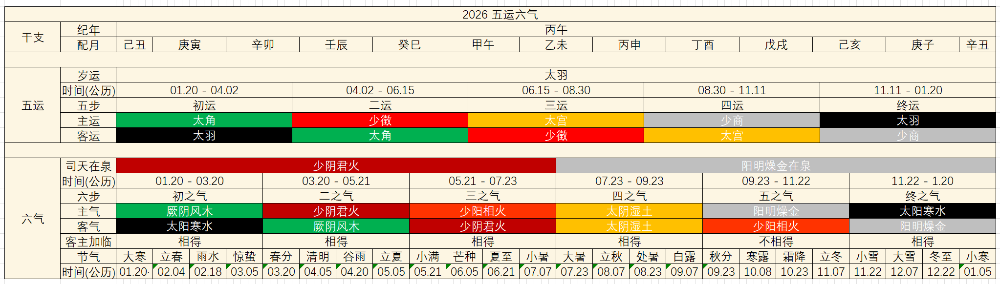

# 2026 五运六气推导

## 总图

## 总论
1. 岁运太羽 - 水运太过
2. 少阴君火司天，阳明燥金在泉，客气六步：太阳寒水 - 厥阴风木 - 少阴君火 - 太阴湿土 - 少阳相火 - 阳明燥金
> 三阴三阳的排列顺序
3. 根据运气异化理论，若运生气或运克气，均属运盛气衰。运生气，为小逆；运克气，为不和。小逆和不和之年，气候变化均较大，对人体影响也大
4. 丙午年，岁运为水运太过，少阴君火司天。岁运五行属性为水，司天少阴君火五行属性为火。所以，水克火，岁运克司天，运克气，为不和之年

## 岁运分析
水运太过之年称为“流衍之纪”，是封藏之年。水在季节上对应冬季，在气候上代表寒冷。对应经脉是足少阴肾经和足太阳膀胱经，对应脏腑为肾和心

### 气候
- 水运太过，寒气偏盛，冬季过于寒冷或者东令早至。闭藏之气行使权力，火的生长之气得不到发扬，阳气不足
- 水克火，则火的子气，也就是土气（湿气）来复，水土交争，大雨频至，湿气弥漫。气候上表现为湿的天气变化
- 故而自然气候整体偏寒凉，还要注意湿

### 健康
- 心阳受损，导致心系疾病多发，如发热、烦燥、心悸，甚至会出现胡言乱语、心痛的症状
- 寒水之气亢盛，反而会伤及肾脏，会产生腹胀、下肢浮肿等问题
- 有寒有湿，要注意寒湿困脾，如腹部胀满、肠鸣、腹泻、消化不良等症

## 少阴君火司天
- 此少阴司天之政，气化运行先天，地气肃，天气明，寒交暑，热加燥，云驰雨府，湿化乃行，时雨乃降，金火合德，上应荧惑太白。其政明，其令切，其谷丹白。水火寒热持于气交而为病始也，热病生于上，清病生于下，寒热凌犯而争于中，民病咳喘，血溢血泄鼽嚏，目赤眦疡，寒厥入胃，心痛腰痛，腹大嗌yì干肿上
- 少阴司天，热气下临，肺气上从，白起金用，草木眚，喘呕寒热，嚏鼽衄鼻窒，大暑流行，甚则疮疡燔灼，金烁石流。地乃燥清，凄沧数至，胁痛善太息，肃杀行，草木变
- 少阴司天，其化以热
- 少阴司天，热淫所胜

### 气候
- 上半年气候炎热。而且因为气太过，气候会先于季节到来
- 寒暑相交，热气叠加燥气，可能还会出现湿化之气流行，雨水偏盛
- 但是，今年(丙午)水运太过，水克火，少阴无法正常行令，上半年会形成水火相博的气运。可能会出现高温，但伴随着气温骤升骤降、寒热交替

### 健康
- 水火相搏，寒热二气相互作用成为疾病发生原因，容易出现上热下寒，中焦寒热错杂等问题

## 阳明燥金在泉
- 岁阳明在泉，燥淫所胜，则霿méng雾清瞑mínɡ。民病喜呕，呕有苦，善太息，心胁痛不能反侧，甚则嗌干面尘，身无膏泽，足外反热

### 气候
- 阳明主燥，燥气过盛，气候干燥，雾气弥漫，清冷昏暗
- 受岁运水运太过的影响，下半年寒冷干燥，寒燥交织，秋冬季雨雪偏少。金生水，更容易加重水寒之势
- 燥气盛行，制约木气

### 健康
- 燥邪侵袭人体，易伤肺系统
- 受金的制约，肝胆易受影响

## 全年饮食性味分析
- 丙子、丙午岁，上少阴火，中太羽水运，下阳明金。热化二，寒化六，清化四，正化度也。其化上咸寒，中咸热，下酸温，药食宜也
- 上咸寒：宜食海产品（海鲜、海带、紫菜），蛋类（鸡蛋、鸭蛋）
- 中咸热：宜食五谷（红高粱、紫米、紫糯米），禽类（如鸡肉），薤白、蒜等
- 下酸温：宜食五谷（大米）、五果（山楂）、五菜（山药）等
