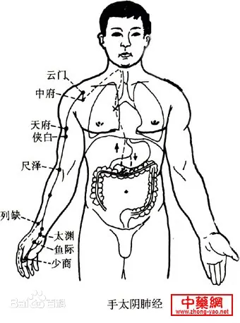

# 任脉，主降，诸阴之海
> 腹部距离不宜用同身寸
* 承浆
* 廉泉：颌下
* <strong>天突：最上一根肋骨交汇处</strong>
* 璇玑：天突与华盖中点
* <strong>华盖：天突与玉堂中点</strong>
* 紫宫：华盖与玉堂中点
* <strong>玉堂：天突与鸠尾中点</strong>
* 膻(dàn)中：玉堂下一寸半，两乳连线中点，气会于此。禁针，可灸
* 中庭：膻中与鸠尾中点
* <strong>鸠尾：下肋骨交汇点，脐上七寸</strong>，禁灸，可针
* 巨阙：鸠尾与中脘中点，心募于此，对于心脏疾病效果极佳。
* <strong>上脘：巨阙与中脘中点</strong>
* <strong>中脘：鸠尾与肚脐中点</strong>，(六)腑会于此穴；梅花灸主穴，统治一切胃病，吐(出)血时禁用。
* 建里：中脘与下脘中点
* <strong>下脘：中脘与肚脐中点</strong>，解刨学上，此位置正好位于胃的下(出)口，小肠的上(入)口
* 水分：下脘与与肚脐中点，常用于治水肿
* <strong>神阙：肚脐</strong>，禁针，可灸
* 石门：关元上一寸，妇人慎之，犯之绝子
* 绝孕：奇穴，石门下半寸
* <strong>关元：脐(神阙)下三寸</strong>，丹田穴
* 中极
* 曲骨

> 任脉三八起会阴，曲骨中极关元锐。  
> 石门气海阴交仍，神阙水分下脘配。  
> 建里中上脘相连，巨阙鸠尾蔽骨下。  
> 中庭膻中慕玉堂，紫宫华盖璇玑夜。  
> 天突结喉是廉泉，唇下宛宛承浆舍。  

# 督脉，主升，诸阳之海
* 龈交：俩门牙上正中间牙龈，治牙龈肿溃烂、牙周病、鼻窦(近取穴)，仅放血。
* 兑端：上嘴唇(红白)正中间。很少用，米粒灸。
* 水沟：(人中)治消渴、饮水无度、饮饮、口歪眼斜、面部中风等的近取穴。
* 素髎：鼻头正中间。与女人会阴相对(处女素髎穴骨头为一整片，非处女两片骨)。不针不灸。点刺放血治酒糟鼻。 
* 神庭：上星前五分，不针可灸
* <strong>上星：额头中线沿督脉往上摸，在头顶的前半部遇到的第一个凹洞即为上星</strong>。囟会前一寸半。米粒灸，可治疗鼻窦炎
* 囟会: 前顶前一寸半，少用。又名聪会
* 前顶：百汇前一寸半，百汇辅穴
* <strong>百汇：正上方视角，双耳耳尖连线中点后五分处，此处有一凹洞</strong>。诸阳之汇，治头痛，百病皆治。中风大穴。下针时百汇前五分处斜刺百汇。
    > 梅花灸：四神聪穴
* 后顶：百汇下一寸半，百汇辅穴
* 强间：枕骨上边缘，禁灸
* 脑户：枕骨下边缘，禁灸
* <strong>风府：后脑脑骨下</strong>，禁灸。卧姿，下针时方向指向舌根，到位时，病人会吐舌头。中风、头项强痛可取此穴。
* 哑门：风府下半寸，禁灸。下针同风府。
* <strong>大椎：第 1 椎上，转脖子颈椎动胸椎不动，动骨与不动骨之间即为大椎穴。</strong>发烧感冒，三菱针刺破挤点血出来，烧即退。是手三阳足三阳督脉之会。太阳少阳并病时项强，小柴胡汤症
* <strong>陶道：第 1 椎下</strong>，大椎穴辅助之穴
* 身柱：第 3 椎下，若此骨碎，则终身瘫痪。灸此可长个子
* 神道：第 5 椎下，若心脏上有病，按压此穴会有痛感
* 灵台：第 6 椎下，辅助诊断用，禁针，若血液上有病，按压此穴会有痛感(主)
* <strong>至阳：第 7 椎下</strong>，辅助诊断用，血汇于此，若血液上有病，按压此穴会有痛感(副)
    > 人平趴于床上， 两肩胛骨最下端连线与脊柱交点即为第 7 椎
* 筋缩：第 9 椎下，肝脏正后方，针/灸均可。癫、痫、狂、抽筋、抖动、吐白沫都可以用此穴
    > 眼诊：
    > * 只有眼上白有血丝，且血丝像鸡脚贯穿至眼珠，此一，易治疗；
    > * 眼上下白均有血丝，此一，难治；
    > * 眼下白有血丝，此一，不治；
* 中枢：第 10 椎下
* 脊中：第 11 椎下，可针，不灸。脾脏后方，治黄疸、便血
* 悬枢：第 13 椎下
* <strong>命门：第 14 椎下，肚脐正对面</strong>，针/灸均可，可治疗剧烈头疼、角弓反张(脑膜炎)、下腰部病
* 腰阳关：命门下两椎，第 16 椎，针/灸均可，治腰痛，较少使用
* 腰俞：尾椎三角形上面第 21 椎，较少使用
* <strong>长强：尾椎骨与肛门中间</strong>。下针为斜刺一寸左右，无补泄，引气即可，主治痔疮。
    > * 内痔：先血后便，不痛
    > * 外痔：先便后血，痛。先用放血针刺破，后用小一点的火罐吸出淤血即愈  

> 督脉行于脊中央，二十八穴始长强。  
> 腰俞阳关入命门，悬枢脊中中枢防。  
> 筋缩至阳上灵台，神道身柱陶道乡。  
> 大椎哑门进风府，脑户强间后顶扬。  
> 百会前顶通囟会，上星神庭素髎量。  
> 水沟兑端唇沟点，龈交上牙唇缝藏。  

# 手太阴肺经
* 肺，气之本；传导之官；藏魄；主皮毛；属金主忧，忧过伤肺，喜(火)能胜之。在五音属商
* 此一经起于中府，终始少商，取少商、鱼际、太渊、经渠、尺泽与井荣俞经合也。
* 肺流注在寅时，3.00 起于左肺底部，5.00 结束于右肺底部，路线呈倒 U 型。
* 吸气肾管吐气肺管。  

* 中府：云门下约一寸半（云门下隔一根肋骨）
* <strong>云门：锁骨外边缘与肌肉的凹洞处</strong>，肺之募穴
    > 云门下即肺，若垂直下针，则必伤肺，故此处下针手法是一针透两穴，从中府平入，逆上云门，不入肋骨
* 天府：手肘内侧至腋下中间，禁灸，可治疗流鼻血，左流右扎，14 岁以下儿童流鼻血时一定不会发烧
* 侠白：天府下一寸，此穴可作为天府的辅助加强穴
* 尺泽：手肘弯曲的地方，大筋外侧。
    > * 肺经属金，尺泽在肺经五穴中属水，故此穴又称肺经子穴  
    > * 若病初发于此经，为实症，故可用针泄于此穴，因‘实则泄其子’也
* 孔最：尺泽下三寸，肺经郄穴（一般用于炎症）
* 列缺：经渠后 5 分
    > * 主任脉，任脉有问题下列缺。虚症小便多，实症手掌过热。手太阴肺经的络穴（联络表里经）。  
    > * 尺脉摸不到，跑到络脉阳溪穴上，称为反关脉，大于寸口三倍。（反关脉相：其人非富即贵）
* <strong>经渠：腕部高骨之下</strong>，属金，故为肺经本穴，可补可泄，不灸
* 太渊：经渠前 5 分（手横纹处），属土，手太阴肺的母穴(补)
* 鱼际：位于拇指掌部关节中间，骨头与肉之间。荣穴属火。乳痈（乳癌）
* 少商：拇指盖掌内侧下角。放血，主治小儿扁桃体发炎、退烧。大椎和少商放血退烧。

> 中府云门天府诀，侠白尺泽孔最存  
> 列缺经渠太渊涉，鱼际少商如韭叶。

# 手阳明大肠经
* 传道之官，变化出嫣
* 大肠流注在卯时，此时可顺时针揉按此部位。
* 此一经起于商阳，终于迎香，取商阳、二间、三间、阳溪、曲池，与井荣俞经合也，合谷为本经原穴。  

* 商阳：左(右)手食指右(左)下角(外侧)，放血用。大肠经井穴，属本穴(金)。
    > 商阳，少商，大椎三穴放血可消退大部分发烧
* 二间：食指跪之，位于指根关节纹络尽头略上一点，大肠经荣穴，并为子穴，实证可泄之。
* 三间：二间关节后骨头缝处，大肠经俞穴，属木
    > 三间透劳宫，可治疗手部痛风；三间亦可透合谷
* 合谷：大肠经原穴
    > * 合谷为大肠经原穴，可联合里经列缺一起下针，虚实皆可治之；
    > * 油性皮肤/青春痘/美白可灸合谷；
    > * 有麻醉之效，可缓解牙痛；"面口合谷收" - 面部、口部的病症可以在合谷下针以减轻其他穴位的痛感；
    > * 合谷至商阳一脉可用于诊断孕妇是否快生：手握这一脉，若感觉到脉动则要生，无之则只有阵痛;
    > * 孕妇可泄不可补，补之则堕；
    > * 牙痛合谷穴，合谷后，拇指食指骨关节交汇处略前一点；
    > * 在小儿，食指至指尖三节，分为风、气、命三关，若有黑线至风，病轻；至气，病重；至命，危矣；
    > * 四关穴 - 双合谷双太冲，病人全身痛，开此四关，则患处现；
    > * 气满此穴饱满丰隆，气亏此穴亦亏
* 阳溪：手张开，拇指靠腕部两骨凹陷处。用的较少。
* 偏历：手阳明络穴，左右手虎口相合，中指端即偏历。肩痛喉痛，大肠经实症牙痛耳鸣，虚症补之(齿怕冷)
* 温溜：偏历上两寸。大肠经郄穴。治大肠经炎症。
* 下廉：上廉下一寸
* 上廉：手三里下一寸。治乳痈(乳房硬块)，手臂的病
* 手三里：曲池下两寸，又称扭伤穴
* <strong>曲池：小臂弯曲，弯处有一纹络，肘部骨头与纹络尽头连线中点</strong>。大肠经合穴，属土，故而为母穴，大肠经虚证可补之。
    > * 此穴可作为肚脐以上的消炎穴；
    > * 皮肤止痒穴：合谷 + 曲池；
    > * 落枕：躺回床上，头置于床外自然下垂，约 3 - 4 分钟，此间慢慢回正头部，3 - 4 分钟后慢慢将头拖回床上，拖回后慢慢坐起，即愈
* 肘髎：曲尺绕过大骨即是。可下针可放血。
* 五里：肘髎上三寸，禁针，此处有大动脉
* 臂臑：肩髃下两寸/手肘上七寸。主肩不得举。
* <strong>肩髃：手臂侧面抬起，肩部凹洞</strong>。主中风、半身不遂。肩髃透极泉治狐臭(无补泄)。肩膀问题近取穴好，治症对侧下针效果好。
* 巨骨：禁针，易扎到肺
* 天鼎：脖子大筋和锁骨处，只下五分
* 扶突：喉结平移至大筋外侧，很少下针。
* 禾髎：鼻孔下与嘴唇中间，主鼻窦炎，鼻子不通。五分针或一寸针下很浅；
* 迎香：鼻翼开五分，主嗅觉。针下至皮层，透至鼻根与眼中间(內迎香)，鼻孔不通下同侧迎香对侧合谷。
    > 脸上只针不灸。  

> 手阳明穴起商阳，二间三间合谷藏，  
> 阳溪偏历温溜长，下廉上廉手三里，  
> 曲池肘髎五里近，臂臑肩髃巨骨当，  
> 天鼎扶突禾髎接，鼻旁五分号迎香。

# 足阳明胃经
* 仓廪之官，五味出焉；
* 此经流注在辰时；
* 此一经起于头维，终于厉兑，取厉兑、内庭、陷谷、解溪、三里，与井荣俞原经合也，冲阳为本经原穴。  

  

* 头维：神庭外开四寸半，很少下针，讲话是有脉动，禁灸，足阳明和足少阳二脉之会；
* 下关：鬓角处，下巴脱臼可针，主治中耳炎。不灸，下关痛，先下患处下关，下对侧合谷；
* 颊车：咬牙肌肉起来的位置，面部中风针患侧合谷+对侧地仓透颊车。牙关不开、口歪眼斜、面部中风；
* 承泣：眼中下方骨头上方，一般不针。足阳明和任脉的会穴；
* 四白：眼中下骨一寸；
* 巨髎：与人中(水沟)在同线与眼中线汇聚点，颧骨下，可针不可深。麻痛，拔牙后。多用于牙痛，附近肌肉麻痹；
* 地仓：嘴角外开 5 分处，手阳明与阳跷脉之会穴。地仓鼓，有地产；
    > 天仓：眉毛外，天仓凹，无主业或者身体差
* 大迎：地仓与颊车中间(骨头之下)；
* 人迎：大迎之下，人迎脉有则胃气有，病人不会死，很少针；
* 水突：可治疗甲状腺肿大，下针时指甲拨开大筋，针顺指甲入 5 分；
* 气舍
    > 大迎至气舍均很少用，只需了解其位置即可
* 缺盆：不针，易扎到肺；
* 气户
* 库房
* 屋翳
* 膺(yīng)窗： 此穴 + 乳根穴下针可治疗乳房肿块；此穴 + 乳根 + 丰隆穴可丰胸；
* 乳中：此穴禁针禁灸。足厥阴肝经络穴。女人喂奶期间因吵架导致奶水不出(情志郁结)，日久则结块，结硬块约十数年(平均 14 年)后亡.
* 乳根：女人乳房下为乳根；奶水月事也，归心管；
    > * 气户至乳根皆是每隔一根肋骨是一穴，下针需斜刺入穴；穴位距离任脉均为 4 寸， 乳根之下的穴位距离任脉均为 2 寸
    > * 乳房硬块：1.慢慢按揉；2.隔姜灸；3.若正好在胃经上，按症状虚实在子母穴上泄补。
* 不容：巨阙外开 2 寸，吃食物不消化或者呕吐，不分虚实寒热，可近取穴而治；
* 承满：上脘外开 2 寸，吃一点即饱，可近取此穴而治；
* 梁门：中脘外开 2 寸；
* 关门
* 太乙
* 滑肉门
    > 此三穴为任脉辅助穴，滑肉门 + 身柱 + 太乙可增高
* 天枢：神阙外开 2 寸，大肠募穴，按此穴若病人大叫，则有燥矢(积便)。此穴若灸则需要隔姜灸。
    > 腹四针：双天枢 + 中脘 + 关元治：胃口不好、便秘、肚子痛、小便淡白则灸天枢，尿深则小针，左右捻转即可，不可同转
* 外陵：阴交外开 2 寸；
* 大巨：石门外开 2 寸；
* 水道：关元外开 2 寸，常和任脉水分一起用，可治水肿；
* 归来：中极外开 2 寸，可治睾丸缩回；
* 气冲：曲骨外开 2 寸，孕妇肚脐一下禁针。平常用灸，中极、归来、关元、气冲等在卵巢附近的穴位，有助孕效果；
* 髀关：伏兔上 6 寸，几乎不用；
* 伏兔：膝盖上 6 寸，可治手脚痉挛，抽筋，脚心冷等；
* 阴市：膝盖头上三寸外开一寸，膝盖冰冷可近取此穴，可缓膝痛脚痛；
* 梁丘：阴市下一寸，足阳明胃经的郄穴；
    > 膝盖外侧直角骨头上一寸，有奇穴解穴，不小心针到动脉很痛时，下此穴可恢复。
* 犊鼻：膝盖下韧带中间，很少下针，有油馕。韧带两侧凹洞为奇穴 - 膝眼 ；
    > 五穴四针：治风湿关节炎、膝盖伤痛、肿痛、风湿痛。 膝盖头上鹤顶+双膝眼+阳陵泉+阴陵泉。在膝眼下针，直进直出不捻针(称雀啄术)，两处非垂直入针，而是呈八字型(故而从低头的视角，两针成直角)。阳陵泉透阴陵泉，故曰五穴四针。
* 足三里：(常用的大穴)主治一切胃病，手指顺胫骨往上至即将突起处，外开一指。手指按足三里，冲阳穴脉就没了。胃经合穴、本穴。虚症实症皆可治。能使燥气下行，火气往下导。顺补逆泄，快转慢回，补单数拔针绿豆大小高度，气很快到。
    > * 血压上升脸红，可在足三里下五分刺斜45度，即可。
    > * 有胃气则生，无胃气则死。经过治疗后有胃口，证明病快恢复。常灸足三里生胃气。
    > * 足三里下约一寸，奇穴：阑尾穴 病人腹痛(男左女右)，有压痛为盲肠炎，针下压痛点。引到气就好，不需补泄。为了让大便清出来，可下大肠幕穴(天枢)小肠幕穴(关元)，如果盲肠破裂变成腹膜炎，变之前会很痛然后痛感消失(手摸肚子身上凉，此处热的)，可针天府中脘关元阑尾。
* 上巨虚：足三里下三寸。治乳房硬块乳癌。(上面巨大的东西虚掉，硬块需要在胃经上)
* 条口：上巨虚下一寸，治脚麻。治糖尿病，用处方把水补足，把陈旧的糖导引回身上，初期会有一段时间血糖升高。不渴时说明病好了。
    > * 从中医的角度，糖尿病起因是原本身体内的水分亏掉，故而糖浓度提升。
    > * 条口透承山可治肩膀抬不起来
* 下巨虚：上巨虚下三寸。治肚脐一下腹部肿块、子宫瘤、卵巢瘤。(硬块需要在胃经上)
* 丰隆：小腿外侧胫骨突起到外踝骨突起中间，即丰隆，可用于丰胸(补)，直针下，可祛痰。导痰方式很特殊，针至酸麻，提针至皮层，下倒45度对身体方向下针捻针至酸麻，再提针至皮层上倒45度下针捻针至酸麻。
* 解溪：系鞋带的地方，两根大筋之间下针。胃经母穴。虚症治之。
* 冲阳：解溪下摸到动脉，动脉下即冲阳，胃经原穴。冲阳脉在则胃气在，虚实症都可针，以前针粗禁针。
* 陷谷：内庭上两寸，足阳明胃经俞穴。
    > 晚上宵夜吃多，水喝多，导致脸浮肿可下此穴。（因为胃经走脸上，水汽排不掉所以会脸肿）
* 内庭：脚趾食指中指交缝处上 5 分，胃经荣穴；
* 历兑：脚食趾趾甲外侧下角，胃经井穴，同时是子穴，可治心脏病
    > * 此穴是胃经子穴，若遇胃部实证，当用针泄于此穴。但是此穴位于四肢末端较为敏感，不太好补泄，故而有“补井当补合，泄井当泄荣”，因荣穴在五行上又是井穴的子穴，从而达到泄荣以泄井的目的。
    > * 下牙痛，下对侧足阳明胃经内廷，上牙痛，下对侧手阳明大肠经合谷等
    > * 井主心下满，故而心脏之下的阻碍不通，肿胀等都可尝试远取脚上胃经穴位，如：
        >   * 动脉血管阻塞，下历兑穴； 
        >   * 十宣放血的原理是因为指/趾头末端大多是井穴； 
        >   * 涨奶可下内廷，陷谷或者上巨虚均可； 

> 四十五穴足阳明，头维下关颊车停,  
> 承泣四白巨髎经，地仓大迎对人迎,  
> 水突气舍连缺盆，气户库房屋翳屯,  
> 膺窗乳中延乳根，不容承满梁门起,    
> 关门太乙滑肉门。天枢外陵大巨存,  
> 水道归来气冲次，髀关伏兔走阴市,  
> 梁丘犊鼻足三里，上巨虚连条口位,  
> 下巨虚跳上丰隆，解溪冲阳陷谷中,  
> 内庭厉兑经穴终。

# 足太阴脾经
* 谏议之官，智周出焉；
* 此经流注在巳时；
* 此一经起于隐白，终于大包，取隐白、大都、太白、商丘、阴陵泉与井荣俞经合也
* 中央生湿，湿生土，土生甘，甘生脾，脾生肉，肉生肺，脾主口。思伤脾，怒胜之；湿伤肉，风胜之；甘伤肉，酸胜之。
    > 天然甜味入脾胃，天然酸味入肝胆；人工的糖实质上属于酸味  

  

* 隐白：脚大趾内侧下角，井。可治尸厥昏迷，疝气，井穴，脾主少腹。妇人的白带，经漏不止，阴道的问题，皆可针隐白。隐白上面有毛区域为奇穴：三毛，灸三毛治失眠。
* 大都：脚趾头跟脚掌交接横纹的侧面，荣，母穴。侧面直插入针。扎下去很痛，要扎的话把脚趾头弯起来，肉就比较多。
    > 脾虚时，除了四肢无力以外，唇会比较白(脾开窍于唇)。因为是虚症，白色是金，土生金，所以整个颜色会出现，嘴唇会比较白，极虚的话，会容易产生蛔虫，治虫需实脾。多运动，少胡思乱想可强脾。
* 太白：大都穴绕过骨头的凹陷处即为太白，下针应直入。俞穴治按时间发的病。属性相同，在俞穴上做补泻，虚实都可以。
* 公孙：脚背凸骨下方跟肌肉交接的地方，主冲脉（任脉旁开半寸的地方），脾经络穴。
    > * 公孙、内关治三病(任何的胃病、心脏病、胸部的问题：气喘、咳嗽、肺病、心脏肥大，公孙通通可以治。足三里、公孙都可以治妊娠呕吐。
    > * 公孙作为脾经络穴，可与足阳明胃经的原穴冲阳联合进行原络治疗。列缺管任脉，公孙管冲脉。实则肠中切痛，泻之。虚则鼓胀，补之。”因为它是络穴，原穴、络穴虚实都可以在这下针。
* 商丘：脚尖向内弯，翘脚趾足部内侧凹陷处。直刺入针。
    > 此穴有助孕的效果
* 三阴交：内踝裸，沿胫骨上三寸的地方(脚后跟方向)，骨头的后侧，不要贴在骨头旁边下针。
    > * 足部三条阴经汇聚于此。
    > * 手阳明大肠合谷是气聚之穴，故而一人之气可探合谷以观之。同理，三阴交是血聚之穴。一人之穴可探三阴交以观之。因此，如果内有积块或瘀血，按三阴交均能感受到压痛。在治疗过程中，此穴也是一个辅助诊断的穴位，一段疗程后，如果按住三阴交仍有痛感，则需要继续治疗。
    > * 脾主少腹，腹部寒冷的时候，瘀血容易堆积在里面。判断一个人腹部是否有寒，看其脚部是否冰冷。正常人小肠是受胜盛之官，与心相表里，为火，其将食物的营养吸收后经脾脏运致其他脏器(脾主运化)，如红色的营养交给心脏，青色的交给肝脏，黄色的自己吸收，白色的交给肺脏，黑色的给肾脏，故而有云脾统血。如有一天脚上冰凉，说明血脉有寒，进一步说明源头的火不及。故而只有两处地方，一心脏，一小肠。小肠温度不够，则小腹必然冷(小肠在少腹部位)，所以说当发现腿上尤其脾经一线上都是冷的，那么腹部大概率有积寒。(三阴汇三阴交一穴，故而一经冷，余二经也好不到哪儿去，所以会感觉整条腿是冷的)
    > * 月经痛，针此可缓解。诊断痛经可按三阴交，叫声越大，痛经越厉害。
    > * 奶水与月经的关系：初奶是黄的，因为产自于脾，其后为白，因土生金之故。小肠与心脏互为表里(人体结构上小肠位于子卵巢的前面)，故而小肠之热，实际来源于心脏。奶水顺着心脏的火气下行至卵巢，受小肠之热熏蒸，故而其色鲜红。所以月经鲜红是对的。若月经色淡，说明小肠热不及；如果月经黑、深，说明热过。 - 本质上还是脾统血(营养)，在不同的部位有不同的名称，从脾至乳房再至宫内是其循行路线。
    > * 小肠的寒热，可以在关元上灸，因为这是近取穴。而远取穴就在三阴交上面。有人脚没有了，三阴交不能治，那就灸中极、关元。若不方便，可远取灸三阴交。
    > * 三阴交是妇科的大穴，更年期会用到一些穴道，像三阴交、隐白、中极、巨阙都可以用。
    > * 腹部的问题，男女都可以用。男人遗精 、梦遗，灸三阴交，灸不管用就下针也可以。阴茎痛，少腹痛都可以。这个少腹痛除了月经痛以外，像肠子打结，也可以用三阴交。公孙穴也很好。因为冲脉直接从下腹往上冲经过腹部，效果会更好。
    > * 孕妇的问题。一个正常的孕妇有两种情况，血旺气衰跟气旺血衰。因为怀孕的时候。婴儿都是靠血在滋养，所以我们要让孕妇血旺气衰，小孩子会长的好。如果孕妇平时是血旺气衰，但在怀孕的时候生气啊，婆媳不和，变成气旺血衰，就会落胎，这是情志上的反应。因此很多气穴、血穴，孕妇是禁止下针的，原因就在与补泄容易搞错，初手禁针。
    > * 水肿、脚积水，也可以用三阴交来消导。小便不利 ，也可以用三阴交。因为三条阴经经过，同时又主少腹。小便不出来，也可以用中极，因为中极是膀胱之募。三阴交中极都下针效果更好!小便不出来，是因为膀胱太冷了，而膀胱太冷是因为小肠的温度不够。不够以后，这小便在膀胱里面是冷水而不是热水，冷水在里面会造成频尿，这时再灸关元。
    > 中医认为血无止法，生病时没有止血的药，只有消导的药，让血自然停，不要让本来要排出的血流在身体里面，这血要是留在里面，以后会做乱的。
* 漏骨：三阴交上三寸，禁灸，脾经络穴；
* 地机：阴陵泉下三寸就是地机。脾经郗穴。郗穴就是消炎、镇痛穴。水肿腹坚、肚子胀满，女子癥瘕(zhengxia) ，女生腹部有肿瘤、硬块，都可以用。
* 阴陵泉：膝盖下来，小腿内侧胫骨转弯的地方就是阴陵泉。下针不要贴到骨边下，会很痛。脾经合穴。
    > * 天地人三皇穴：三阴交为人皇穴；地机为地皇穴；阴陵泉为天皇穴；
    > * 治疗水肿，可针灸三皇穴，强土以治水；脾主四肢，腿没有力，也可以用三皇穴，这是强土的动作。
    * 血海：手掌按膝盖，拇指朝内侧，拇指方向肌肉最高处即血海
    > * 全身最大的穴位，有压痛。是妇科的名穴。女人痛经，不管是滴漏不止或是月经不来，都可以在血海上下针。血海后，三阴交、中极，几乎可治理一切情况引起的痛经。病人痛时治疗效果最好，立竿见影。无虚实补泄。不深针，一寸针下即可。  
    > * 血海平移(直立时平移，坐姿为拇指向下)一寸为奇穴百虫窝。可诊断有没有虫，按到百虫窝，小朋友有痛拒按，就是有虫，治到无痛即愈。
* 箕门：血海穴直上五寸。很少用。近取穴对阴部的病有帮助。
* 冲门：从耻骨往上，正中间是任脉的曲骨穴。从曲骨外开四寸即冲门。
* 府舍：中级外开四寸，即府舍；
* 腹结：石门外开四寸。很少在腹结上治疗，但要知道经络的走向。
* 大横：大横就是神阙外开四寸，外开二寸就是足阳明经的天枢穴，再外开二寸是大横。大部分都是治肠胃方面，常看到这个病人泻利 、拉肚子，都可以在这附近取穴。
* 腹哀：建里外开四寸。腹部、肠胃的问题、大便不顺、胃不消化，都可以用这个穴道。
* 食窦：天溪穴下跳一个肋间就是食窦。
* 天溪：乳中穴外开二寸。
    > * 乳房硬块在哪个位置，它代表的经络是不一样的，我们选择的角度就不一样，所以没有乳癌特效穴，而是看经络走向，顺着经络选取它的穴道。
    > * 穴道除了了解穴性以外，要了解经络的走向，同时要了解井荣俞经合，原穴、络穴、郄穴你怎么选择，诸如此类等。如虚实寒热搞不清楚，原穴、络穴都可以治疗。
* 胸乡：周荣下跳一个肋骨。
* 周荣：中府下跳一个肋骨。云门、中府、周荣，胸乡是一条线下来的。
* 大包：胳肢窝(极泉)正下六寸。
    > * 大包管理全身的络(经与经之间、脉与脉之间、腑脏与腑脏之间的联系)。如果攻击此穴，则容易致人瘫痪。

> 二十一穴脾中州，隐白在足大趾头.  
> 大都太白公孙盛，商丘三阴交可求.  
> 漏谷地机阴陵穴，血海箕门冲门开.  
> 府舍腹结大横排，腹哀食窦连天溪.
> 胸乡周荣大包随。

# 手少阴心经
* 君主之官，神明出焉；
* 此经流注在午时；
* 此一经起于极泉，终于少冲，取少冲、少府、神门、灵道、少海与井荣俞经合也；
* 南方生热，热生火，火生苦，苦生心，心生血，血生脾，心主舌。喜伤心，恐胜之；热伤气，寒胜热；苦亦伤气，咸胜苦；

  

* 极泉：腋下，一般不针不灸；
* 青灵：少海上三寸；
* 少海：手臂弯曲，外侧曲池，翻到另外一面的地方即少海。合穴，属水。“补井当补合，泄井当泄荣”；
    > * 心经属火，其母穴当为木，根据阴经穴性排布，正好母穴是少冲，而少冲又为井穴，不容易补泄，故而需要另取穴进行。
* 灵道：通里上半寸，心经经穴，属金；
* 通里：阴郄上半寸，心经络穴；
* 阴郄(xì): 神门上半寸，心经郄穴；
* 神门：手腕部分小拇指方向的筋的内侧，跟手掌横纹交接的地方，心经俞穴，又为子穴，心经实证可泄之；
    > * 神门可定心。常用在治疗失眠，惊悸，心脏动悸。对心脏方面，情志方面，情绪不稳，心神不守的，均可以下此穴。
* 少府：握拳小拇指和无名指指甲中间。中指和无名指中间为劳宫，心经荣穴，属火，本穴；
    > * 心脏病的急救大穴。心脏急停时，下关元、巨阙、少府。如少府下针后仍无心跳，回天乏术。涌泉、公孙均可用于急救。
    > * 少府又名手解穴。足解穴是在膝盖外侧直角骨上一寸的地方。过去点穴名家，若被打到了，丢到墙上，或打到大包，他们就躺下去。可下少府穴解回来了。
* 少冲：此穴很罕见的不在手心侧，而在手背侧的手小指内侧(小指指甲另一侧为小肠经少泽)。心经井穴，属木，母穴。  

> 九穴午时手少阴，极泉青灵少海深，  
> 灵道通里阴郄邃，神门少府少冲寻。  

# 手太阳小肠经
* 受盛之官，化物出焉；
* 此经流注在未时；
* 此一经起于少泽，终于听宫，取少泽、前谷、后溪、阳谷、少商与井荣俞经合也，腕骨为本经原穴；

  

* 少泽：小指指甲外侧，少冲另一侧。本经井穴，属金。
* 前谷：握拳的时候，小拇指靠近手掌的横纹头处，本经荣穴，属水，直针下。
* 后溪：手掌横纹头的穴道。本经俞穴，属木，故而为母穴，小肠虚证可补此穴。此穴亦管督脉。
    > * 如果肩、项有问题时，亦可针此穴
* 腕骨：手外侧腕前起骨下陷中。本经原穴，虚实皆治。
* 阳谷：握拳，骨头跟掌骨的中间有个大筋，从这个筋的下方下针，在关节和筋的中间。本经经穴，属火，本穴。
* 养老：前臂后区，腕背横纹上 1 寸，尺骨头桡侧凹陷中，针半寸，本经郄穴。
    > * 可治视物不明
    > * 养老透间使，治手肘扭伤、手不能拧毛巾。不留针
* 支正：在阳谷穴上五寸的地方。本经络穴。虚实都可以用，实则节弛肘废，手肘没有力气，泻之。虚则生疣，生了很多疣在皮肤表面上，都可用支正。
* 小海：本经合穴，子穴。压到会感觉到麻。入针一寸即可。
* 肩贞：臑腧往下三寸；肩胛区，肩关节后下方，腋后纹头直上1寸。
* 臑(nào)俞：腋后纹头直上，肩胛冈下缘凹陷中。
    > 与巨骨同在一骨，巨骨在上侧边缘，此穴在下侧边缘。
    > * 臑腧是手太阳、阳维脉、阳蹻脉的会穴。
* 天宗：肩胛骨中间。
    > 肩胛骨旁边的痛，都属于小肠经
* 秉风：肩胛冈中点上方冈上窝中，天宗上三寸。
* 曲垣：肩井下三寸，肩胛冈内侧端上缘凹陷中。
* 肩外俞：督脉陶道穴外开四寸的地方。
* 肩中俞：大椎外开二寸。
* 天窗：人迎横开三寸。
* 天容：在耳朵正下方。伸长脖子时，耳朵下方的颈部粗肌肉，与下颌角之间的凹陷处。
* 颧(quán)髎(liáo)：太阳穴下三寸就是颧髎，很少下针。
> 颧髎偶尔会用到治上牙痛
* 听宫：耳屏前有个骨缝，要张口才能找到。以前面这个骨缝为主，分上中下，上面叫耳门，中间是听宫，下面是听会。耳鸣耳脓中耳炎用到的机会多。

> 手太阳穴一十九，少泽前谷后溪薮，  
> 腕骨阳谷养老绳，支正小海外辅肘，  
> 肩贞臑俞接天宗，髎外秉风曲垣首，  
> 肩外俞连肩中俞，天窗乃与天容偶，  
> 锐骨之端上颧髎，听宫耳前珠上走。  

# 足太阳膀胱经
* 州都之官，津液藏焉；
* 此经流注在申时；
* 此一经起于晴明，终于至阴，取至阴、通谷、束骨、昆仑、委中与井荣俞经合也，京骨为本经原穴；

   

* 睛明：下针的时候，要把眼珠子拨开，下针在骨和眼球中间。可针不可灸。
> 起针时要直进直出。眼睛视力不好、视力模糊 、青光眼 、白内障 ，我们都可以在睛明上下针。
* 攒竹：穴正在眉头，我们的眉头平常有几根毛翘起来的点就叫攒竹。
* 眉冲：从攒竹直上进入发际五分，在曲差和神庭的正中间就是眉冲。
* 曲差：神庭督脉旁开一寸半。
* 五处：上星旁开一寸半。都是治疗眼科的问题。
* 承光：五处往后一寸半。眼看不到光，或对光很敏感，所以叫承光。
* 通天：承光往后一寸半。像鼻窦炎 ，鼻塞，下通天也可以。
> 所以可以先下合谷，再来迎香，再通天。下通天时像扎百会，用一样的方向。
* 络却：在通天后一寸半。治头眩、耳鸣等。
* 玉枕：络却往后一寸半.
* 天柱：后脑有两个大筋，可以摸到，两个大筋跟后脑骨交接的地方叫天柱。
> 自天柱开始分两条路线

# 分支一

* 大杼：督脉陶道外开一寸半。骨会于此。故此穴可治疗骨头上疾病。
* 风门：第二椎下方外开一寸半。脑后的穴道多用风来命名，通常这里没有多少肉，而周边又是神经密布，各经络密集于此，易感风邪。
> * 脖子的地方相当于身体的一个散热处，下方热气流经此处进行适当降温，避免过度的热量入脑。
> * 男女不一样。女人正面是阳，背面是阴，男人背面是阳，正面是阴。
> * 风门是很好的治疗痈疽的穴道。背发的肿块、褥疮，中风的病人躺在床上，屁股后面都会长疮，都是痈，都可以烧。褥疮，不要在褥疮上面烧，要在风门上面烧(灸)。
* 肺俞：第三椎下，外开一寸半。肺有问题时，压此处会痛。
    > 过敏性鼻炎，肺阳虚，固摄不住津液，艾灸此处可以减轻
* 厥阴俞：第四椎下旁开一寸半。厥阴俞又称为心包，心包经就落在心包上面。针、灸都可以。可治疗心脏病。心脏本身正常应该不受病，有病都在心包上面。
* 心俞：第五椎下旁开一寸半。当用手指头压的时候，如果有心脏病，压此处会痛。灸、针都可以。
> * 痛点压下去有闷痛是虚症，是刺痛，剧烈的痛时，就是实症，堵到了。心脏有问题，可能是有瘀血在那边。扎心的募穴巨阙，背后就下心俞，这就是俞募治疗。先扎正面或先扎背面无所谓。
> * 心脏一有问题，第一个会影响到肺(病情影响直接关系为相克)。如果心脏火能去生土，就代表没有病。但如果克到金，那我们在下第五椎心俞时，也要同时扎第三椎的肺俞，因为要强金，可以让病不再移转。
> * 健忘，是因为心藏神，神不守。记忆不好，在心脏上治疗会有帮助的。
> 见案例红斑狼疮。
* 督俞：第六椎下旁开一寸半。专管督脉，督脉是诸阳之会。可针可灸。
> * 临床上，看血癌的时候，在第六椎可以找到压痛点。也就是说是督脉受到伤害，得到了不正常的营养所致。
* 膈俞：第七椎下旁开一寸半。有压痛。血会膈俞，血病治此。这里讲的血病，不是西医讲的血癌，是贫血，瘀血，内伤打击造成内脏出血；大便是血，小便是血，那小便出血可能是肾脏癌，大便可能是大肠癌或是痔疮。膈俞下面有肝，上面有心，它夹在中间。心生血，肝藏血，所以它统领全身的血。
> * 遇到血症的时候，不管是用灸，用针都可以。血症有很多很特定的现象。如果病人说很渴但是不想喝水，这是身体里面有瘀血的缘故。
> * 唐容川写了一本书叫《血证论》，提出久病必瘀的道理。很久的病一定有瘀血在，所以要用活血化瘀来治疗。膈俞就是活血化瘀的穴道。
* 肝俞：第九椎下旁开一寸半。肝脏的后方。肝病治此，可用俞募治疗，下肝经的募穴，再下肝经的俞穴，任何的脏腑都有募穴与俞穴。俞穴可灸可针，在左、右两侧外开一寸半。下针的时候或灸的时候，都是两边一起灸，一起下。四肢上取穴的时候，才有左病右治，右病左治。
> * 全身只有肝经会经过男人的阴器睾丸，或经过女人的阴部。所以阴部有病，可以在肝俞下针。
> *  “积聚痞痛”，就是讲肝里面有肿瘤，有硬块。治症都可以在肝俞上面治疗。
* 胆俞：在第十椎外开一寸半。按时间的时症，晚上十一点到半夜一点，可以在胆俞穴上下针。
> 见案例肺结核
* 脾俞：第十一椎下外开一寸半。脾主四肢，四肢上的问题，不管是肌肉，还是关节痛、风湿痛都可以在脾俞下针。这个土是治水的，脾主少腹（肚脐以下），腹部这边的水肿胀通通都可以用脾俞，用强土来治水，就可以解决水的问题。灸、针皆可。
> * 由于脾主肌肉，主四肢。所以脾脏有问题的时候，很明显的表症就是身重，身体会非常沉重。正常人，我们站立成这样子，人的气是往上升的，气就是全身的水液，气是往上升的。所以站在那边，不会感觉到体重。
> * 脚是身上最底层的地方。当你全身都在气化的时候，脚虽在最底下但却是温热的，这个热气一直往上来，全身都是在气化的状态。当全身充满气的时候，是没有癌症的，像个热水瓶一样。所以常常讲，脚是热的就没有癌症。
> * 脾主开胃，小孩子不吃东西，可以灸脾俞，再灸身柱，小孩会长得又高又大，肌肉又发达，骨头又大，人又高大。
* 胃俞：第十二椎下外开一寸半。胃病治此。
> * 如果胃有病，不管是西医讲的胃溃疡、胃出血、胃下垂都没关系。扎胃俞，用俞募治疗，胃的募穴中脘穴。扎正面的中脘，再扎胃俞就是俞募治疗。比如，有胃痛，足三里、梁丘，郄穴可以止痛。足三里也可以止呕。俞募治疗、会郄治疗都可以。腑会中脘，胃的会穴是中脘，用会郄法治病时，就再下胃经的郄穴梁丘，这是会郄治疗。
* 三焦俞：第十三椎外开一寸半。
> * 三焦的地方是水道，三焦有问题时，可以用俞募治疗。我们用三焦俞跟正面的石门穴。三焦有专门三焦的病，心包有心包的病。像水的问题，下利、大便带水、排水，水肿，吃东西不消化都可以用三焦。治肚子胀满，三焦俞也用得很多。用了俞穴，就会用到募穴，脐以下二寸的石门穴。
* 肾俞：第十四椎外开一寸半是肾俞。第十四椎命门。正面是肚脐，背后是命门穴。
> * 肾主骨，骨头要长的好，是肾脏在管。肾又藏志。
> * 肾其华在发，头发光亮说明肾气好。肝主的是生发，是让头发往上长，这两个不太一样。化疗伤肝。
> * 肾脏管耳朵。所以耳鸣、耳聋、听力不好，通通是肾脏在管。肾又管记忆，所以在治疗记忆有问题的时候，或脑部有问题的时候，头发有问题的时候，听力有问题的时候，骨头有问题的时候，通通是在肾脏上治疗。胸无大志，也在肾脏上治疗。
> * 糖尿病下消就是在肾脏着手。肾管大小便，不单单是管小便，而且管大便。所以肾脏功能衰落的时候，一天上好几次厕所，拉出来是稀的。中医认为，肾阳不够的话，就阳不举了。因为肾主水是水脏，所以如果下半身积水的话，也是肾在管。
> * 如果是两个脚平均的肿起来是肾脏有问题。如果腿没有肿，就只是脚踝裸关节肿是心脏有问题。
> * 治症非常多。是腰痛的近取穴，很多人肾俞这里痛，怕针的话，可以用灸。
> 从第十四椎以下，均可以直针下，灸也可以。
* 气海俞：气海俞：第十五椎下旁开一寸半。
> 腰痛、靠近肛门这边，治疗痔疮，都可以用。因为是近取穴。在这个器官的周围，选择穴道就是近取穴。在四肢上找就是远取穴。
* 大肠俞：第十六椎下旁开一寸半。
> 近取穴也可以治疗腰痛、大肠的问题，如便秘、下利都可以治疗。
* 关元俞：第十七椎下旁开一寸半。
* 小肠俞：第十八椎下旁开一寸半。
* 膀胱俞：第十九椎下旁开一寸半。
* 中膂(lǚ)俞：第二十椎下旁开一寸半。可灸，可针。
> 像肾虚、消渴病、大小便的问题、腰痛、女人的赤带白带都可以。
* 白环俞：第二十一椎下外开一寸半，接近尾椎骨。我们的尾椎骨长三角形，尾椎骨上面突起来的是第二十一椎。
> 接近阴部的地方，像疝气、大小便、腰酸背痛、女人的白带，通通可以在这治疗。
* 上髎：小肠俞和督脉中间的地方。上髎穴很小，大概像绿豆这么大。所以，你下针时可以左右找到一个洞，扎到洞里面去约一寸，平常是一寸半的针。要下在骨头里面，但不要下很深，碰到骨洞下五分就够了，这样穴道才会有效，这才是穴道的正位。
> * 上髎统治所有的腰痛，不管腰痛在那个部位，都可以治。
> * 妇女无法怀孕，想要生小孩，可以灸上髎，针上髎也可以。
> * 阴部的治症，通通可以用上髎穴。
* 次髎：在督脉和膀胱俞的中间。在督脉跟膀胱俞的中间下针。
* 中髎：是中膂俞和脊椎骨交接的中间。在一寸半距离的中间是中髎。
> 中髎书上写妇人绝子、不会怀孕、白带很多。八髎穴治症雷同。
* 下髎：在白环俞与督脉的中间。
> 可治大便下血，大便下血可能是痔疮漏血，也可能是大肠炎，大便跟血会混在一起，你可以在下髎这边做。
* 会阳：很少用。在腰俞和尾椎骨中间这个点外开一寸。治症跟八髎穴差不多。

# 分支二

* 附分：第二椎下外开三寸
* 魄户：第三椎下是身柱，外开一寸半是肺俞，从肺俞外开一寸半。也就是从第三椎外开三寸。可针可灸。
> 肺藏魄，跟肺俞靠的很近，我们把他叫魄户。以俞穴为主。肺病不想扎肺俞，扎魄户也可以。扎完肺俞扎魄户有加强效果。
* 膏肓：把第五椎分三份，上三分之一处外开三寸，叫膏肓。无所不疗。
> * 一定要把肩胛骨打开，所以让病人反坐在椅子上，前面抱个枕头，一抱肩胛骨就打开了，膏肓就出来了，平常膏肓躲在肩胛骨里面。
> * 整个膀胱经里面，以膏肓穴最为重要。大部分是用灸和放血。
> * 此穴除治症以外，最常见的就是膏肓痛。临床上，很多的警察、治安人员，都有膏肓痛。一般来说，膏肓痛代表这个人很卖力。唯一治疗的方法是放血，针灸都不用。你让他肩胛骨打开，用手去按。在原来肩胛骨这个地方，这个膏盲穴跑出来后，拿放血针刺破皮肤，火罐放上去，把血吸出来，当场就好了。伤到膏肓唯一的方法，就是放血。平常膏肓是无所不治的。
> * 在灸膏肓的时候，灸四五百壮都没有关系。在灸完膏肓后，如果嘴巴燥渴、嘴唇会干裂，那是因为你的胸腔里面气很旺，这时候你去灸关元，气海，中极，石门、阴交都可以。灸的时候，气就会往下走。再去灸足三里，足三里灸完就会把这热气往下导。我们最主要是要把热气导到脚上去。脚是热的人没有癌症，没有心脏病，不会中风。灸膏肓后，整个胸腔都是热的，热气停在胸腔还没有达到治病的效果，需要靠灸少腹的穴道及足三里，让气导到小肠里面去，才会达到治症的效果。在灸膏肓的时候，胸腔里面、肚子里面会一直咕噜咕噜在叫，这是水的声音在跑，这就表示灸对了。书上指出，膏肓穴是起死回生的妙穴。像重病，或当你不知道怎样出手治病时，就灸膏肓。但灸完膏肓后一定要灸足三里。不然嘴唇都会裂掉，舌头也会干。
* 神堂：第五椎下外开三寸。也可以说是心俞外开一寸半。肺藏魄，心藏神，所以叫神堂。
* 譩嘻(yī xī)：第六椎外开三寸。或者说督俞外开一寸半。
> 在治疗血癌的时候，你可以用针或灸，来帮助督俞的效果。
* 膈关：第七椎下外开一寸半就是膈俞，外开三寸就是膈关。
> 治症跟膈俞差不多，像小便黄，大便不好，都可以用。
* 魂门：第九椎外开三寸。肝藏魂，也是辅助肝俞的效果。
* 阳刚：胆俞的外开一寸半，第十椎下外开三寸。
* 意舍：在第十一椎下外开三寸。脾藏意。
> * 主治腹满虚胀。因为脾主少腹，大便滑泻，因为脾脏湿的缘故。脾有问题的时候，湿不守就会进入大肠，就会洞泄。小便赤黄，因脾主黄色，这黄色本来应该在脾里面的，因为脾脏虚了，所以营养会跟着小便排出来。所以很多讯息可以推论出来。
> * 呕吐消渴，因脾是在中焦。身热目黄，因脾是黄色的。意舍是辅助脾俞的。
* 胃仓：第十二椎下外开三寸，是辅助胃的穴道。
* 肓门：第十三椎外开三寸。
> * 乳房属于三焦系统。很多黄色的营养都在三焦。所以书上写的乳疾，在三焦俞、肓门、还有三焦募石门，通通可以用，石门有绝孕的功能。包括乳癌硬块，都可以在这里针或者灸。
> * 有非常多的穴道，可以治乳癌。有压痛点在十三椎下的时候，就在三焦俞、肓门下针，这样效果很好。有时候有乳癌不一定在十三椎下有压痛点，但一有压痛点就在这选穴最好。
* 志室：在第十四椎外开三寸。
> * 平时下针的时候，肾俞、志室都是一起下的，都有帮助肾俞的功能。
* 胞肓：第十九椎外开三寸的地方。
> 胞肓是治大小便的近取穴，都是在下焦排泄系统。大便、小便，都可以在胞肓上治疗。
* 秩边：第二十椎下外开三寸。
> 秩边穴是很有名的治痔疮的近取穴，可扎长强、秩边、孔最，孔最是肺经的郄穴，肺跟大肠相表里，还有温溜穴，都对痔疮有消炎镇痛，止血的效果。秩边对各种痔疮的效果都很好，临床上用的很多。

# 分支二(结束)

* 承扶：臀部下缘横纹正中间。
> 近取穴，对坐骨神经痛、背痛效果非常好。承扶下针时是用三寸针，一针透到骨头上面。深针才有效果，因为这里肉很多，扎太浅就没效，一定要深针。像久年痔疮、背痛、小便不利，近取穴都可以用。坐骨神经痛也可以下针。扎承扶没有什么危险性。
* 殷门：承扶和委中连线中点。
* 浮郄：委阳上一寸。
* 委阳：委中外侧两根筋中间。
* 委中：膝盖部分背后两个筋的正中间这个穴道，称之为委中。汗易从此穴发，故而不灸。
> * 委中又名血郄，故而血中有毒时，可在此将毒血放掉，因此，此穴又是一个解毒的大穴。
> * 此穴是膀胱经的合穴，属土。但是膀胱属水，其母当为金，在此经上正好是井穴，于是我们要遵循“补井当补合”的原则，实际对此膀胱经进行补法应取此穴进行。
> * “腰背委中求”，腰背上的痛，都可以取此穴下针。
* 合阳：委中直下三寸。是辅助委中的，以委中为主。
* 承筋：在委中和承山的正中间。
> 筋骨的筋，顾名思义，抽筋可以在这下针，脚不能动，痉挛，霍乱抽筋都可以在这下针。 
* 承山：小腿肚肌肉人字纹下面。
> * 脚抽筋，手指重压承山，就解掉了。
> * 在临床上，因痔疮大量出血时，针承山，灸孔最都有止血的效果。若有个人痔疮很严重，走过来腿都是弯的，就下长强、承山、孔最，痛就去掉了。若还痛，比如说痔疮很大，就天应放血，把脓血放掉。痛是来自压力，不是来自发炎。脓血一放掉，压力从此就去掉了。
> * 委中和承山常常并用在中风上面。腰背委中求，所以委中一下去，腰背力量就加强了。下承山可让脚有力，因为中风的人脚没有力，下承山穴，脚就会有力。
> * 临床上，有很多妇女因爱美穿高跟鞋，走路摔倒，结果尾椎骨被撞到。很痛。新伤的时候，在承山穴会看到青筋，有时在右腿，有时在左腿，有时两腿都有，这是针对尾椎骨受伤。这时拿放血针，承山穴一放血，当场就好了，这是伤科的大穴。其它如脚后跟痛、脚无力、抽筋都可以在这里治。
> * 承山穴下针，一定要透到骨头上，透到胫骨上。尤其是抽筋，同时用手去按它，筋就慢慢松开来了。
* 飞扬：承山穴再往下一寸，再外开一寸。膀胱络穴。刚好就在我们人字横纹肌这边。
> * 飞扬针下去，脚就像飞毛腿一样。当脚不能跑步，前面可以下足三里，后面可以下飞扬、承山，都是让脚有力的穴道。
* 跗阳：昆仑往上三寸。
> 跗阳穴是阳蹻脉的郄穴，治症跟飞扬、承山差不多。
* 昆仑：脚后跟骨上方，脚外踝和后跟大筋中间。属火。孕妇禁针，下针会落胎。是膀胱经的经穴。
> * 是专门治疗项背痛很有名的穴道。
> * 平常用在生完小孩，胎盘没有下来，可以用昆仑，把胎盘掉出来，这是用在生完小孩以后的。
* 仆参：昆仑下到脚后跟骨边，就是仆参。近取穴，治疗足后跟痛。
> 一般中医的观念里面认为，脚后跟的问题是肾脏在管。脚踝裸这边会水肿大部分是心脏的问题。全部下半身水肿的话是肾脏的问题。这些病可以下仆参穴。
* 申脉：在外侧踝裸下五分的地方。一摸有个骨缝，这骨缝就是申脉穴，我们下针的时候，手法斜的成45度，不是直针进去。
> * 申脉主管阳蹻脉。所谓蹻，顾名思义就是“足”字边再加一个“乔”，所以脚可以往外转就是阳蹻管。可以往内转是阴蹻管。阴蹻、阳蹻管我们的左右转。
> * 第二个是治疗癫痫。白天发痫病，灸阳蹻--申脉。夜发就灸阴蹻--照海(就在内踝下五分的地方)，所以阳蹻、阴蹻，刚好在脚踝的两侧。白天晚上都发作，就阳蹻阴蹻都灸。灸到什么程度，一天灸九壮以上都可以。脚上的火气是不会上来的，有空就灸，灸到眼上的鸡爪慢慢退下去，跟黑眼珠没有碰到就不会发了。如果鸡爪还在，你虽知道不会发，但还要继续灸，让它整个都退掉。这是我们用针灸来治癫痫的方法。
* 金门：膀胱经的郄穴，可以起到止痛，消炎，镇痛。主治身站不能久立等。在脚掌外侧有个凸骨，凸骨前面是金门，后面是京骨。下针的时候，金门穴和京骨穴，都是直针下。正好要扎在脚掌骨或脚趾骨跟肌肉的中间。
* 京骨：膀胱经的原穴。扎原穴不管虚实，平补平泻都可以，不一定做补泄。越靠脚旁边，穴道的力量越强，所以强烈膀胱经的头痛，下京骨穴也可以。
* 束骨：小脚趾足底凸骨后，专治经络之病。膀胱经的子穴，俞穴。专治膀胱经的实症。
> 像背痛、生疮、生脓疮、化脓，因为都是长在膀胱经上面，都是属于膀胱经的实症，故而可以在此穴下针以治症。
* 足通谷：小脚趾足底凸骨前，荣穴。本穴。
* 至阴：在脚小趾头趾甲外侧旁边。井穴。
> 特殊的治症：治疗胎位不正。针下去，二十四小时以后，慢慢就回正了。在下针时，一寸小针刺下去就好了，因为在脚趾头的旁边，肉比较少。

> 足太阳经六十七，睛明目内红肉藏，  
> 攒竹眉冲与曲差，五处上寸半承光，  
> 通天络却玉枕昂，天柱后际大筋外，  
> 大杼背部第二行，风门肺俞厥阴四，  
> 心俞督俞膈俞强，肝胆脾胃俱挨次，  
> 三焦肾气海大肠，关元小肠到膀胱，  
> 中膂白环仔细量，自从大杼至白环，  
> 各各节外寸半长。上髎次髎中复下，  
> 一空二空腰髁当，会阳阴尾骨外取，  
> 附分侠脊第三行，魄户膏盲与神堂，  
> 譩嘻膈关魂门九，阳纲意舍仍胃仓，  
> 肓门志室胞肓续，二十椎下秩边场。  
> 承扶臀横纹中央，殷门浮郄到委阳，  
> 委中合阳承筋是，承山飞扬踝附阳，  
> 昆仑仆参连申脉，金门京骨束骨忙，通谷至阴小指旁。

# 足少阴肾经
* 作强之官，伎巧出焉；
* 此经流注在酉时；
* 此一经起于涌泉，终于俞府，取涌泉、然谷、太溪、复溜、阴谷与井荣俞经合也；
* 北方生寒，寒生水，水生咸，咸生肾，肾生骨髓，髓生肝，肾生耳。恐伤肾，思胜之；寒伤血，燥胜之；咸伤血，甘胜之；

  

* 涌泉：脚底人字纹顶端，直针下。本经子穴兼井穴，遵循“泄井当泄荣”的原则取然谷做泄法
> * 急救大穴。治疗头痛时会用。
> * 有助孕的效果
* 然谷：公孙往后一寸，沿着骨边和肌肉中间。
> 脑震荡可以在此穴治疗。脑震荡以后，然谷穴会崩起来一块青筋。病人会头晕、恶心，拿放血针放血即可。然谷放血是很有名的急救大穴。尤其是针对脑震荡。然谷穴放完血后，头昏就没有了，但恶心还有的话，再扎冲脉公孙(治恶心很好用)，恶心就去掉了。
* 太溪：在内踝高骨与脚后大筋的中间。太溪脉，手摸上去有个脉在里面会跳。俞穴，属土。
> * 太溪脉可以用来诊断，如果病人昏过去了，但太溪脉还有，就可以救回来。冲阳是足阳明胃经的原穴，有冲阳脉，就是胃气还在。太溪脉有摸到就是肾气还在。若太溪脉没有了。瞳孔放大，这个人就没有救了。
* 大钟：在脚后跟内侧骨头跟大筋交接的地方。足少阴肾经的络穴，络走太阳经。络穴跟原穴一样，虚实都可以治。肾经的实症，如小便排不出来，扎大钟穴。虚症，如腰酸痛，也可以扎大钟穴。它是络穴，当你做补泻的时候，你可以按照它的虚实来做补泻。
* 水泉：太溪穴下到骨边。斜向下下针。水肿在这下针。常常用水泉治疗脚后跟痛。所以左脚后跟痛扎右脚。溪、泉都可以用来泻水。
> 在临床上，像月经停经不来可以在水泉上下针。水泉是很好用的一个穴道。
* 照海：内踝裸下五分凹缝处，下针是斜45度从内踝裸向下刺到照海穴。照海穴管阴蹻脉。
* 复溜：从太溪穴正直上二寸的距离。本经母穴兼经穴，虚症治此。
> * 临床上，遇到水肿、小便不出、肚子肿胀腹鼓。都可以用复溜穴。常用的穴道。复溜下针的时候，常常会被麻或电一下。
> * 平常没事，就灸灸关元、复溜，那就很强啊。灸复溜是非常好的，因为肾是水经，那艾绒是找水的，所以一灸下去的时候，脚就会热起来。正常人水一定要气化，身上绝对不能有累积多余的水。不然会滋生各种病变。
* 交信：复溜穴往前一寸，到骨头旁边。知道在这就好。
> 交信可用在女子月事不止或滴漏不止的时候，还有阴挺(子宫颈下垂到外面），阴蹻脉的郄穴，下针也是直下，不要贴着骨边下针。
* 筑宾：太溪穴直上五寸，再往后开一寸。阴维脉的郄穴。
> * 筑宾穴跟曲池相呼应：筑宾穴是肚脐以下的消炎、解毒、镇痛穴位。肚脐以上是曲池。
> * 巨阙是上纪，关元是下纪。在上焦、上半身，由巨阙穴管它的纪律，也就是管周边的循环。肚脐以下的纪律是由关元在管。肚脐以上的炎症下曲池。肚脐以下就下筑宾。
> * 有一个病人全身皮肤痒，就下合谷。因为合谷是气脉，再下曲池，这两个穴道一下去，上半身就不痒了。下半身是筑宾，三阴交是三条阴经的交会，血海有清血的作用。所以，如果我们正面下针的时候，在合谷、曲池、筑宾、血海、三阴交，这五个穴道下针，针下去痒就同时去掉了。如果起了很多皮肤 、干癣，在委中放血，这是针灸上治疗皮肤病很好用的穴道。
* 阴谷：腿弯曲的时候在膝盖后面小腿根内侧，有两条筋，在两个筋的中间，这是阴谷穴。是肾经的合穴，本穴，虚、实皆可治。
> * 五行的理论是非常灵活的。肾主水，阴谷穴又是水穴，水会生木，所以当遇到木经肝、胆的虚症时，阴谷穴可补肝胆，也可以泻金经大肠经和肺经的实症。
> * 萝卜腿通常是牛奶喝太多造成的。
> * 阴谷、委中、委阳是在一条线上。
> * 腿拉直的时候，这两条经会变成一条经，很紧密，所以腿弯着，下两条筋中间；腿打直，筋会蹦紧。要在筋的内侧下针。
> * 阴谷穴也是妇科大穴，治白带等都可以用。
* 横骨：这曲骨外开一寸的距离是。是冲脉、少阴交会的地方。所以，从这开始冲脉和足少阴肾经两者是重叠在一起的。
> 近取穴。大多数近取穴没有补泻的问题，可以直接在这里下针。当然，以前腹部很少下，因为针比较粗。现在针比较细，而且女孩子比较不会介意，所以可以下针。
* 大赫：中极外开一寸。
> 近取穴，像阴缩，睾丸缩到腹部里面去，妇人的赤带、白带 都可以在大赫穴这下针。
* 气穴：关元外开一寸。治症跟大赫差不多。
* 四满：石门穴外开一寸。
> 四满的位置，差不多到了大肠附近，所以肠子泻痢、腹泻 、肠鸣 都可以在此下针。
* 中注：阴交外开一寸。越靠近肚脐或天枢的地方，都可治疗大肠的问题。
* 肓俞：神阙外开一寸。
* 商曲：在下脘穴外开一寸。
* 石关：建里外开一寸。你想石头关到的，一定是胃方面的问题东西吃不下去、胃胀，诸如此类。
* 阴都：中脘外开一寸。
* 腹通谷：上脘穴外一寸。我们有两个通谷，一个在肾经里面，一个是膀胱经的本穴，就是在至阴的后面那个。治症一样是胃的停饮，胃不消化及一般的胃病。
* 幽门：巨阙穴外开一寸。在主力穴外开的穴道都可以辅助主力穴，辅助它的治症。比如说，我们下了巨阙，心脏若还有闷痛，你就在巨阙旁一寸下针，来加强力量，所以它是加强力量用的。
* 步廊：中庭外开二寸。气喘、胸肋痛等可以在这治。
* 神封：很接近膻中，步廊上一个肋骨。
> 治咳逆 、乳痈(乳房硬块)。
* 灵墟：神封穴再上一个肋骨。灵墟在玉堂外开两寸。
> 治症都一样，治咳嗽、胸满。
* 神藏：灵墟再往上一个肋骨，神藏是紫宫外开二寸，彼此治症差不多。
* 彧中：华盖穴外开二寸。
* 俞府：璇玑外开二寸。
> * 临床上，扎俞府跟彧中时，刺法都是从任脉往肾经方向斜刺，从一寸半下针。针要下在肋骨交缝的地方。
> * 气喘、咳嗽，几乎都可以治。

> 足少阴穴二十七，涌泉然谷太溪溢，  
> 大钟水泉通照海，复溜交信筑宾实，  
> 阴谷膝内跗骨后，以上从足走至膝。  
> 横骨大赫联气穴，四满中注肓俞脐，  
> 商曲石关阴都密，通谷幽门寸半辟。  
> 折量腹上分十一，步廊神封膺灵墟，神藏彧中俞府毕

# 手厥阴心包经
* 此经流注在戌时；
* 此一经起于天池，终于中冲，取中冲、劳宫、大陵、间使、曲泽与井荣俞经合也；
* 与三焦经相表里，夏至到冬至，心包经属火。冬至到次年夏至，心包经属水。

  

* 天池：乳中旁开一寸。
> * 《针灸甲乙经》：手厥阴、足少阳脉之会。寒热胸满，头痛，四肢不举，腋下肿，上气，胸中有声，喉中鸣，天池主之。
> * 《针灸大成》：主胸中有声，胸膈烦满，热病汗不出，头痛，四肢不举，腋下肿，上气，寒热痃疟，臂痛，目不明。
* 天泉：腋下横纹头下二寸。取腋下二寸，也是近取穴。
> * 《针灸甲乙经》：石水，天泉主之；足不收，痛不可以行，天泉主之。
> * 《针灸大成》：主目不明，恶风寒，心病，胸胁支满，咳逆，膺背胛间、臂内廉痛。
* 曲泽：把手臂弯起来的时候，中间有一条大筋。大筋外侧是尺泽，内侧凹陷处就是曲泽。大筋外侧是肺经。大筋的内侧是心包经。合穴。冬至以后，心包经的曲泽穴是心包经的本穴。
> * 病人说委中痛、委阳痛。都是在膝盖的后面，就可在对侧曲泽、曲池这边下针。
> * 心脏非常容易受到惊吓。心主汗，所以心脏功能恢复的话，病人会发汗。不管是中风、中脏，我们都知道心脏有问题，舌强不能语，发一点点汗，心脏就恢复了。还没有出汗，就还没恢复，就要再治。
> * 《针灸甲乙经》：心憺憺然善惊，身热，烦心，口干，手清，逆气，呕血，时瘛，善摇头。颜青汗出不过肩，伤寒温病，曲泽主之。心痛，卒咳逆，曲泽主之，出血则已。
> * 《针灸大成》：呕血，曲泽、神门、鱼际
* 郄门：从手横纹头，中间有两条筋，在筋上约五寸的地方，两根筋之间。郄穴，有镇痛、止痛的效果好。
> * 《针灸甲乙经》：心痛，衄，哕，呕血，惊恐畏人，神气不足，郄门主之。
> * 《针灸大成》：主呕血、衄血，心痛。
* 间使：在手掌横纹头上三寸，叫间使。心包经的经穴，属金。
> * “指针”指头当针来用。用在儿科。来退烧、退热。小孩受惊吓，小孩眼歪。
> * 间使穴专治手麻，如果有人手麻，间使针一下马上就去掉了。
> * 《针灸甲乙经》：热病烦心善呕，胸中憺憺，善动而热，间使主之。卒心中痛，瘛疭互相引，肘内廉痛，心敖敖然，间使主之。胸痹引背，时寒，间使主之。头身风热，善呕吐，憷惕，寒中少气，掌中热，肘挛腋肿，间使主之。心悬如饥状，善悲而惊狂，面赤目黄，喑不能言，间使主之。头大浸淫，间使主之。
> * 《针灸大成》：治月水不调，血结成块。咽中如梗，间使、三间。
* 内关：在掌上横纹上二寸的地方，两根筋之间。非常好用。可以止吐，也可以催吐。
> * 晕车呕吐，或者是怀孕呕吐、吃饭呕吐，就用手压内关。很有名的止吐大穴。我们下内关的时候，一般是配合公孙在做。公孙主冲脉，跟着肾经上来直接冲到胃，所以下公孙以后，再下内关可治胃、心、胸，所有胃方面、心口方面、气胸方面如长年气喘，公孙、内关都可以用。
> * 内关穴管奇经八脉的阴维脉，所以当下公孙时，管冲脉。再下内关，内关管阴维脉（肋骨里面叫阴维，围一圈。肋骨外面叫阳维，围一圈）。所以病人说“我心口痛”问在哪，回答在“肋骨里面”，就是内关穴。如果在肋骨外，就是阳维。
> * 内关穴是心包的络穴，无所谓虚实补泻。虚实症都可以治疗。内关穴是大穴。几乎任何的胃病、心脏病、气喘，都可以用。
> * 《针灸甲乙经》：面赤皮热，热病汗不出，中风热，目赤黄，肘挛，腋肿，实则心暴痛，虚则烦心，心惕惕不能动，失智，内关主之。心憺憺而善惊恐，心悲，内关主之。
> * 《针灸大成》：中满心胸痞胀，肠鸣泄泻脱肛，食难下膈酒来伤，积块坚横胁抢，妇女胁痛心痛，结胸里急难当，伤寒不解胸膛，疟疾内关独当；主手中风热，失志，心痛，目赤，支满肘挛。实则心暴痛泻之，虚则头强补之。
* 大陵：内关穴往下走二寸。大陵下针，跟神门一样，对手掌方向下针，神门对着少府，大陵对劳宫穴的方向。俞穴，属土。夏至到冬至，心包经的属性是火，大陵穴就是子穴。实症治此。
> * 《针灸甲乙经》：热病烦心而汗不止，肘挛腋肿，善笑不休，心中痛，目赤黄，小便如血，欲呕，胸中热，苦不乐，太息，喉痹嗌干，喘逆，身热如火，头痛如破，短气胸痛，大陵主之。心痛，善悲，厥逆，悬心如饥之状，心憺憺而惊，大陵及间使主之。两手挛不收伸及腋偏枯不仁，手瘛偏小筋急，大陵主之。咳血，大陵及郄门主之。
> * 《针灸大成》：短气，大陵、尺泽。主热病汗不出，手心热，肘臂挛痛，腋肿，善笑不休，烦心，心悬若饥，心痛，掌热，喜悲泣，惊恐，目赤，目黄，小便如血，呕啘无度，狂言不乐，喉痹，口干，身热，头痛，短气，胸胁痛，瘑疮疥癣。
* 劳宫：手轻握拳时，中指无名指尖所到的地方中间。以解剖学来看，是在手掌的正中间。荣穴，属火，夏至到冬至是本穴。
> * 在儿科治症，手的推拿，让小孩子退烧，都是以劳宫为基准。因为它在心包上面，跟他属性相同的，就是心包的本穴。手掌心因汗多，所以不灸，用下针或推拿。
> * 《针灸甲乙经》：热病发热，烦满而欲呕哕，三日以往不得汗，憷惕，胸胁痛，不可反侧，咳满，溺赤，大便血，衄不止，呕吐血，气逆，噫不止，嗌中痛，食不下，善渴，舌中烂，掌中热，欲呕，劳宫主之。烦心，咳，寒热善哕，劳宫主之。少腹积聚，劳官主之。胸胁支满，劳宫主之。风热善怒，心中喜悲，思慕歔欷，善笑不休，劳宫主之。黄瘅，目黄，劳宫主之。口中腥臭，劳宫主之。小儿口中腥臭，胸胁支满，劳宫主之。
> * 《针灸大成》：主中风，善怒，悲笑不休，手痹，热病数日汗不出，憷惕，胁痛不可转侧，大小便血，衄血不止，气逆呕哕，烦渴食饮不下，大小人口中腥臭，口疮，胸胁支满，黄疸目黄，小儿烂龈。
* 中冲：中指的指尖中央是中冲穴。井穴，可以退烧。
> * 心包络直接络到喉咙的舌后。中医说心开窍在舌、肾开窍在耳、肝开窍在眼、脾开窍在唇、肺开窍在鼻。除了内脏以外，最主要是因为有心包络跟三焦夹在中间，所以内脏跟外面的器官是相互连到的。
> * 心包经，因为是跟心脏在一起，所以它是偏向走阴的。而三焦完全是行阳的，行阳气。因为三焦是行阳气，所以全身上下的内脏之间，布满了三焦。你到市场去买牛腱，肉在中间，白白的那一层把它包着的，就是三焦。内脏包着很多的网，拉开来就是三焦。三焦行阳，心包是阴，这两个是表里经，一个阴一个阳。
> * 中冲是井穴，井穴是木，由夏至到冬至是属火，是母穴。因补井当补合，当井穴是母穴时，要到合穴(曲泽)上面做补。三焦跟心包都要配合节气交换。
> * 《针灸甲乙经》：热病烦心，心闷而汗不出，掌中热，心痛，身热如火，浸淫烦满，舌本痛，中冲主之。
> * 《针灸大成》：惊风，灸中冲、印堂、合谷，各数十壮。

> 九穴心包手厥阴，天池天泉曲泽深，  
> 郄门间使内关对，大陵劳宫中冲侵。

# 手少阳三焦经
* 决渎之官，水道出焉。
* 此经流注在亥时；
* 此一经起于关冲，终于耳门，取关冲、液门、中渚、支沟、天井与井荣俞经合也，阳池为本经原穴；
* 上焦如雾，中焦如沤，下焦如渎。人心湛寂，欲想不兴，则精气散在三焦，荣华百脉。及其想念一起，欲火炽然，翕撮三焦，精气流溢，并与命门输泻而出，故号此府为三焦。

  

* 关冲：在无名指指甲外侧底部与侧缘引线的交点处即是。属金，井穴，是急救、治昏迷的大穴。
* 液门：在第四指掌骨及第五指掌骨间，靠近骨边，在骨缝中间。荣穴，属水。
> 三焦经由于贯通全身，它是行阳的。因为它连贯脏和腑，有沟通协调的作用。所以，当阴阳在三焦相抗争的时候，或内脏在抗争时候，因病想进到内脏，而内脏不让病进，所以身体就往来寒热、忽冷忽热。这些症状都可以在三焦经上面找到很好的穴道。
* 中渚：液门往后一寸，俞穴，属木。夏至到冬至,三焦经属火，是三焦经的母穴，虚症治此。
* 阳池：在手的背面，手腕关节正中间有凹洞，这个穴道我们称阳池穴。
> 阳池透大陵，可以辅助治疗糖尿病
* 外关：阳池穴往上二寸叫外关。外关的对面就是内关。外关管阳维脉，内关管阴维脉。
> 通生死桥：病人在壮热、大热、高烧的时候，在外关下针，左捻右捻，不需要补泻，引到气以后，把针慢慢推到内关。这是通生死桥的地方。
* 支沟：外关上一寸就是支沟。
> 支沟下针以后再配合照海，可治便秘。
* 会宗：从支沟穴平行移到骨头旁边就是。
* 三阳络：支沟上一寸。
* 四渎：在手肘骨尖，往下五寸，在这个骨头的阳侧，很少用。
* 天井：手臂弯起来，伸直时没有天井穴，要弯起来，手肘关结后面，在两个筋的中间，那个凹洞就是天井穴。合穴，属土。夏至到冬至，三焦相火，合穴属土，是三焦经的子穴。很常用。
* 清冷渊：天井直上一寸。
> 三焦是行阳的，在清冷渊下针也可以治发烧。
* 消泺：清冷渊与臑会连线中点，肘尖往上约五寸，很少用。
* 臑会：清冷渊上五寸或肩髎下三寸。可治疗甲状腺功能亢进，脖子肿，脖子强硬，淋巴有肿瘤，我们都可在臑会上下针。
* 肩髎：在手臂上方，手背一弯起来有一个凹洞，这是肩俞穴。肩俞是在手阳明大肠经。从肩俞穴跨一个大筋到肩膀后面的凹洞，这就是三焦经的肩髎。有非常多的穴道可以治疗这个淋巴结、甲状腺的肿，一般是找天应。
> 三焦经散布全身，所有的淋巴系统、内分泌系统，都是三焦在管。淋巴结通通属于三焦。我们在三焦经上找，在三焦经上按，若找到压痛点，那个穴道就是最好下针的地方。三焦经这样走，但不一定要对着穴道上下针，而是找到天应，最痛的那一点下针。对于淋巴结肿，临床上不管是淋巴癌，或是甲状腺肿瘤，通通可以使用。所以一般腺体的问题，内分泌啊，通通是属于三焦。
* 天牖：在颈后中间两个大筋，这两个大筋外侧是天柱。这边还有一条大筋。大筋和骨头交接的地方是天牖，三焦经的地方，很少下针，禁灸，头后面的地方都不灸的。
* 翳风：由侧面看，在耳朵下方，这个骨头后面差不多一寸的地方。所以白内障他们都在这治疗。你下针的时候，在下颚骨和筋中间下。下得很浅，直针进去。这个穴道大部分是用在治耳鸣、耳聋，还有下巴脱臼，还有牙关痛。有的人牙关这里痛，不能咬合食物。你下针的时候先下对侧的合谷，再下下关、颊车、翳风，下完针起来就好。
> * 把耳朵翻过来，这后面有个骨头叫智慧骨。这个智慧骨跟智慧就有关系，用手去摸，摸到是平的或扁的，就是笨蛋。越凸越高越聪明，越平的越笨。有个病人说头痛，沿着耳朵一圈。马上就要想到是三焦经。痛好几个月，就下中渚，这是夏至到冬至。如果是痛的二、三天，就下天井。
> * 耳朵后面只有一条经经过，就是三焦经。临床上治症很多，中风在急救的时候，耳朵翻开来看，有鸡足筋，拿三棱针，在青筋两端放穴，针刺过去，手推一推，把血放出来，有的是在耳朵后面，可以找到。放完血，人就会醒过来，这也是一个急救大穴。癫痫 也在这放，小孩子脑膜炎、角弓反张、高烧不退，人整个这样弯折过去，也在这个地方治疗。
* 瘈脉：翳风上一寸半，可以刺出血。不针不灸，大部分是放血。
* 颅息：再往上差不多一寸到二寸的距离。用度骨法来找最好。因为每个耳朵不一样，跳过这个智慧骨，跳过这个大骨头上去，骨头上方凹洞的地方。
> 颅息跟瘈脉刚好隔一个智慧骨。近取穴，治耳朵肿、治耳鸣、耳流脓 。一般只要是耳朵后面的问题，你只要耳朵翻过来，看一下，看到有青筋冒出来，或是有血脉在，你就在上面点刺放血。因为一把血放掉，压力一去掉，人就醒过来了。筋挛的现象也就退掉了，尤其是脑膜炎。
* 角孙：耳朵上方根部到发际中间这个地方。
* 丝竹空：在眉毛尾端，眼睛旁边五分的地方有个凹洞是太阳。
> 在眼科，我们最常在这些地方放血，比如说角膜炎，眼红肿。
* 和髎：从丝竹空到耳门，在靠近耳门前半寸到一寸的中间，有个动脉在跳，就是和髎。
> 下针时需要把经脉博拨开
* 耳门：听宫：耳屏前有个骨缝，要张口才能找到。以前面这个骨缝为主，分上中下，上面叫耳门，中间是听宫，下面是听会。

> 二十三穴手少阳，关冲液门中渚旁，  
> 阳池外关支沟正，会宗三阳四渎长，  
> 天井清冷渊消泺，臑会肩髎天髎堂，  
> 天牖翳风瘈脉青，颅息角孙丝竹张，和髎耳门听有常。

# 足少阳胆经
* 中正之官，决断出焉。
* 此经流注在子时；
* 此一经起于瞳子髎，终于窍阴，取窍阴、侠溪、临泣、阳辅、阳陵泉与井荣俞原经合也，丘墟为本经原穴。

  

* 瞳子髎：又名太阳穴
> 太阳穴下针，如果是只扎太阳的话，扎很浅的，半寸就到，临床用最多的是放血，像眼睛发炎、红肿、角膜炎，会在太阳穴放血。下针最常用于偏头痛。很多人偏头痛就是在这部位痛，所以要知道穴道的位置，才知道是什么病。病人说头痛，但头痛有分很多地方痛。我们有个很有名治疗偏头痛的治法--太阳透率谷。很少灸，因为是脸面。眼科治症有翳膜的时候，这翳膜一定是由外往内生，才会去扎太阳。由内往外的时候要扎睛明。由下往上的时候，就是承泣四白巨髎等近取穴。
* 听会：耳朵骨缝最下端。耳门、听宫、听会都是张口取穴。这三个穴道下针，直进直出，不捻针，用上下插提法。
* 上关：上关和下关正好差一个骨头。胃经的头维、下关之间有一个高骨，这高骨下的凹洞，就是下关，跨过这个骨头就是上关。
> 以前禁针，因为上面有个动脉。治耳朵耳鸣的近取穴。
* 颔厌：头维至曲鬓的连线上 1/4 处。
* 悬颅：头维至曲鬓的连线上 2/4 处。
* 悬厘：头维至曲鬓的连线上 3/4 处。
* 曲鬓：跟耳朵很接近，在发际这边有个动脉是曲鬓。把曲鬓到颔厌分成三等份，上面是悬颅，第二个是悬厘，那治症的时候，都是治疗头痛。越靠近耳朵，就越能治疗耳朵。越靠近上方，就越能治疗偏头痛。在上面找压痛点下针。只要摸到动脉，一般穴道都有脉在那边，不然就是骨缝中间。如果有凹缝，就下到那个缝中间。遇到血管的时候，用指甲把血管切开再下针。治症都差不多，最常见的偏头痛在这个地方。
* 率谷：从耳尖上去是一寸半。
> 治头痛很有名的针法就是太阳透率谷：就是从瞳子髎一针透到率谷去。先用三寸针，扎到瞳子髎捻一捻，再把针提起来，不要拔出来，提到皮层，然后手摸到率谷，率谷在耳朵的正上方，非常好找，这有个骨缝。把针倒过来以后，把皮拉起来，一点一点的透过去。如果你透对了，透到瞳子髎时，头痛就都没了。你可能觉得这透法很痛，但那个人在头痛的时候，根本感觉不到你透的痛。当这个头痛已经很痛时，病人根本没感觉.透这个针的时候，先在针侧下一针合谷，会有麻醉效果。记得透过去时要把皮肤拉起来一点。效果就非常好。
* 天冲：耳朵后缘与发际线交接处直上3横指(约 2 寸)，按压有酸痛感。
* 浮白：耳朵上缘向后入发际线一横指(约 1 寸)，按压凹陷处。
* 头阴窍：浮白下一横指，按压凹陷处。
* 完骨：乳突后下凹陷处，按压明显酸胀感。
* 本神：外眼角直上入发际半横指，头临泣外一寸。
* 阳白：鱼腰上一寸。
> 阳白穴的下法是把皮肤拉起来，从阳白刺进去，刺到眉毛的中间，叫做阳白透鱼腰，治疗眼睛近视，视物不明，或是眼睛痛、白内障都可以在这治。所以，胆经通到鱼腰，所以内障(前面说的白翳，即白内障)如果是从上面下来，就还是在胆经上面来治。有的病人是阳白痛，说明病在胆。如果不在这边下针，也可以在经络上的子母补泻，在子穴上或母穴上，一样可以治疗头痛。
* 头临泣：神庭外开二寸。眼睛平视，沿眼睛与鱼腰连线直上入发际半横指。
* 目窗：头临泣直后一寸半。
* 正营：目窗后一寸半。
* 承灵：正营后一寸半。
* 脑空：承灵后一寸半。
* 风池：脑空下，后头骨两条大筋外缘凹陷处，大致与耳垂齐平，按压有酸胀、脑部沉重感。
* 肩井：大椎与肩峰高点(肩部高骨)连线中点，两筋之间，按压有明显酸胀感。
> * 气感强烈，一般只下半寸针，且与对侧足三里同下针
> * 孕妇禁下此穴。
* 渊液：在极泉正下方三寸。一般来说不灸，多汗的地方都不灸。
* 辄筋：在渊液往前一寸，是近取穴，治吐酸、呕吐。很少下针，也很少灸。
* 日月：胆募日月。巨阙旁开四寸，到两个肋骨中间的穴道叫期门(肝之募)。跟着期门往下一寸，跳过一个肋间。
* 京门：手肘靠着肋骨，胸肋骨最下面的那个点。也正好是平我们的手肘尖，这个穴道叫章门穴。从章门穴，也就是肋骨最下端，往后摸，刚好有一个肋骨从后面凸出。正在这肋骨头上面，就是京门穴。
> * 肾募京门。治肾脏虚症 或实症的时候，用俞募治疗并无所谓虚实。肾结石、肾脏癌、肾阳虚、阴虚，耳鸣，都没有关系。扎肾俞以后，再扎京门，这就是俞募治疗。针直接下进去差不多一寸就到，不要太深有骨头。
> * 京门常配合肾俞常常一起使用(肾俞在肚脐正后方是第十四椎骨的命门，再外开一寸半)。用得很多，像耳鸣、腰酸、肾脏等问题或水肿，都可以用。最常用在腰酸及耳鸣。
* 带脉：手肘弯到肋骨底边是章门穴，从章门穴往下走一寸八分的地方，找两个肌肉中间，找到肌肉缝，这个穴道就是带脉。
* 五枢：关元外开二寸就是水道，水道在足阳明胃经上。从水道再走五寸半，就是五枢。
* 维道：中极穴外开八寸?，或者五枢前下五分。
> 带脉、五枢、维道 组成了奇经八脉中的带脉
* 居髎：从章门穴直下八点三寸或八点五寸，很难找。直下下来以后，摸到了肌肉中间。不然就是在肌肉跟骨头中间，因为有的人比较瘦，所以可以看到在肌肉跟骨头中间，知道就好了，下针机会不多。但要知道这里痛，是属于胆经的。
* 环跳：下针的时候，要病人腿弯起来。摸到骨头的尽端(臀部方向)，一般我们的手法是握拳，食指关节对骨头尽端，大拇指指尖到处是穴。如果不能确定穴位。可以用指关节去点，点到后它会非常痛。三寸针直下，一般不留针。针下进去，要扎到骨头旁边到关节处，感觉针碰到关节。腿弯起来才有环跳。这个针是从皮肤表面扎到三寸。有时病人屁股比较大，要把肌肉压下去才扎得到。
> * 环跳痛的时候，不能以为只是单纯的神经痛，也可能有骨癌，骨癌也是从这开始，也可能骨头有损伤，骨头有可能被破坏。
* 风市：在大腿外侧，从膝盖交接的缝这里直上七寸。直立时，手臂自然下垂，中指指尖处即是，按压有酸胀感。治疗中风、瘫痪的大穴。
> 风市、环跳都是中风的大穴，脚、膝盖麻木不仁，都可以下针。下风市用三寸针，下去要碰到骨头才有效果。从两个肌肉缝下去的时候，都是用三寸针。任何的病人中风，都会用到风市穴。膝盖无力、不能站起来，用风市+阴市合并使用。
* 中渎：风市下二寸。足少阳的一个别络。治症是增加风市的效果。中渎可以治的病，风市通通可以治。风市能治的病，中渎不见得能治。它是一个加强风市效果的一个穴道。
* 膝阳关：膝盖缝头就是阳关穴。在膝关节弯曲的中间这边。阳关穴很浅，因为下面是骨头，用一寸针扎下去就酸了。近取穴，对风湿、关节炎效果都很好。痛风、红肿都可以治。
* 阳陵泉：膝下面有两条骨头，把这两个骨头突起点连一条线，心里面想把它对到一个三角形，这个三角形的交接点是穴。按照《难经》筋会阳陵。中风的大穴。合穴。
* 阳交：外丘往后一寸，就是阳交穴。阳维脉的郄穴。像发狂奔走、抽筋、脚痛，这些通通可以，无所谓虚实。
* 外丘：外踝直上七寸，足少阳胆经的络穴，主要的络，络到肝，胆跟肝经表里，络到肝经的地方就是外丘。因为它是络穴，肝又是解毒的，一刺激外丘穴，人体解毒的力量就会加强。无所谓虚实寒热。灸三壮，原文是“速以三壮可灸”。
* 光明：外踝直上五寸。
> 治眼科的穴位有瞳子髎、丝竹空、攒竹、睛明、承泣、四白、养老、光明穴可用。
* 阳辅：外踝上四寸。胆经的经穴。胆经是阳木它的属性是金水木火土，子穴。实症治此。
* 悬钟：外踝上三寸，也叫绝骨穴。按照《难经》：髓会绝骨。髓生病的时候，在绝骨穴上治疗。手按外踝，顺着外踝沿着骨头一路往上推，推到骨头突然陷下去的地方，那个地方就是绝骨。所以说，三寸是一个形，有的人这骨头很高，有的很短。我们是以度骨法，就是按照骨来度量它。
> * 从外踝摸到绝骨穴，如果绝骨穴越高，就表示越聪明。一般标准，是二寸，但有人的很高，有的很短。可以看出人的脑容量，越高的脑容量就越大，因为髓会绝骨，脑为髓之海。如果髓海多个东西，那就是脑瘤。
> * 骨髓生病在绝骨穴会有压痛点，可针绝骨。绝骨穴也是治疗中风的大穴。所以在腿上治中风的时候，在腿上下风市、阳陵泉、绝骨。
> * 所以任何骨髓、筋骨的问题，都可以在绝骨穴下针。
* 丘墟：脚的胫骨和脚掌骨交接的缝，就是丘墟穴。
* 足临泣：由丘墟走下来，在脚小趾脚趾骨的地方。把这脚趾头拉一拉，你会发现到有个筋在这边，在这条筋的后方这个穴道，就是临泣。这临泣穴是在两个骨头的中间。
> * 足临泣主治带脉。脊椎骨旁边一点痛，下临泣+足三里，这是治脊椎旁边的华陀夹脊。
> * 足临泣是胆经的俞穴。本穴。临泣穴非常好用，带脉的病、眼科的病、妇人乳房硬块，都可以用临泣穴，只要是胆经经过的地方，通通可以用临泣穴.
> * 时症可以下足临泣。用途非常多。
* 地五会：与足临泣相隔一条筋，过去不下针，因为里面有动脉。以前针很粗，现在可以下针，因为针很细。
> 一个很好治疗乳房硬块的大穴。
* 足背部第4、第5趾之间连接处的缝纹头处
* 足窍阴：井穴。第4趾甲外侧。临床上，头昏眼花、昏迷，可以用井穴来下针。眼睛痛，如果是眼外侧痛，可以下足窍阴，那如果是从内侧痛下睛明穴。眼睛下方下厉兑，因为眼睛下方是胃经经过的地方。就是按这个原则来辨证，顺着经络来取穴、辨证。

> 少阳足经瞳子髎，四十四穴行迢迢，
> 听会上关颔厌集，悬颅悬厘曲鬓翘，  
> 率谷天冲浮白次，窍阴完骨本神邀，  
> 阳白临泣目窗辟，正营承灵脑空摇，  
> 风池肩井渊液部，辄筋日月京门标，  
> 带脉五枢维道续，居髎环跳风市招，  
> 中渎阳关阳陵穴，阳交外丘光明宵，  
> 阳辅悬钟丘墟外，足临泣地五侠溪，第四指端窍阴毕。

# 足厥阴肝经
* 将军之官，谋虑出焉。
* 此经流注在丑时；
* 此一经起于大敦，终于期门，取大敦、行间、太冲、中封、曲泉与井荣俞原经合也。

  

* 大敦：足大趾趾甲外侧，井穴，本经本穴。
> * 肝经环阴器，故而可治一切阴部毛病。
* 行间：第一趾掌骨，第一个脚掌骨和第二个脚掌骨交接的地方，有两个高骨，要扎在高骨的后方。荣穴，属火，子穴。实症治此。可以用一寸针直接下进去，下针很浅。
> * 比如说肝里面有积，就是晚上一点到三点不能睡；第二个，右肋痛、肋间痛，第三个，人发黄。所以像猛爆性肝炎，急性的肝炎，发起来的时候，全身泛黄，行间都可以治疗。
* 太冲：俞穴。治疗时症时，病人就是一点到三点不能睡，行间、太冲都可以。《针灸甲乙经》，时症出现的时候是俞穴。这两个都有效。扎一个没效，再换一个，或两个一起扎，这都无所谓。
> * 太冲很重要，我们针灸很有名的叫“开四关”，就是左、右两边的太冲+合谷。中医观念里面，合谷主气，太冲主血。人的左半边是血，人的右半边是气。所以说，太冲合谷同时下针，气血兼顾。
> * 如果病人全身痛，这个时候，就下合谷+太冲，下完以后，他的痛转变了，那个病变的经络会出来，此时再找按对应的经络来治疗。这就是开四关，针对这种情形，他全身痛，因为他气血不和。它可能是一条经或两条经引起的气血不和。
> * 合谷是气脉，太冲也有个脉。一般来说，太冲是管血的，所以，在左脚这边比较强，有时右脚按不到。我们脚上有三个血脉，第一个是太冲脉。第二个是冲阳脉，在足阳明胃经，第三个是太溪脉，太溪脉在脚后，内踝裸后方。
> * 太溪脉是管肾脏，冲阳是管胃气，太冲脉是管血，管肝脏。有脉则生，无脉则死。如果他没有脉，就算知道他快死了，还是要想办法去救。
> * 当选择穴位辅助治疗的时候，最常用的就是相隔一寸的穴道。比如说扎太冲，我们知道这个妇人恶露不止、血崩 ，或是男人疝气痛、阴部痛。用行间效果很好，如果行间不见效的时候，再扎太冲，相差一寸的同一条经来取穴，会增加它的效果。最有名的就是治疗妇科女人漏下、滴漏不止、大量的下血、出血、月经不停。所以任何睾丸痛、阴茎痛，或是女人阴道的问题，都可以在太冲下针。
* 中封：拇趾上翘，足背内侧上可见一大筋，大筋内侧，足内踝前方(约一寸)凹陷处。肝经的经穴。
* 蠡沟：在内踝上五寸。内踝裸上三寸是三阴交。肝经的络穴。虚、实症都可以下针。
> * 一般来说，肝经的实症如，吃了威而刚，阴茎软不下来，就是肝经的实症，阳挺不下。可以用络穴、子穴，让它下来。也可以放冰水，要想尽办法让它下来。肝经的虚症出现的时候是皮肤痒。
> * 身体有淤积、积块时，所有名称里有沟的穴(如水沟、蠡沟)都可以取。腹胀满少腹有积块，我们名称有沟的、谷的，如阴谷。沟，如这个蠡沟、水沟。谷，如小肠经的本穴阳谷穴，沟、谷可以取。看它的名称来取穴。
* 中都：中封穴上二寸，在内踝上七寸这个穴道就叫中都。可治妇人产后恶露。
* 膝关：常用穴道。膝盖横纹头上五分的地方。治疗膝盖风湿关节炎效果非常好。当膝盖痛很严重时，可在膝五关下完之以后再下一个膝关，加强治疗效果。
* 曲泉：大腿骨旁边有条大筋，在这大筋的内侧和骨头的中间。合穴。属水，母穴。虚症治此，肝经皮肤痒 、阴挺不下，都可以下曲泉。肝主筋，主所有身上的筋。
* 阴包：从曲泉上三寸，或从膝关上四寸。
> * 可治小便困难，其原因可能是膀胱结石、肾结石、小肠太寒了、尿道感染等，小便有困难、女人月经不好，通通可以用阴包穴。
* 足五里：在曲骨外开二寸是气冲，再下三寸。
* 阴廉：在气冲穴旁开五分下两寸处。曲骨外开二寸，是足阳明胃经的气冲。从气冲下三寸再旁开五分就是五里。往上就是阴廉。
> 阴廉跟五里差一寸，都是求子穴。妇人没怀孕，想生小孩生不到，这时候用隔姜灸接近腹腔的地方。多数是用灸的。因为动脉很多。平常不针，用的最多就是求子。
* 章门：手臂之下、胸肋骨正下方。手臂自然下垂，手肘尖所对之处。脏会章门。按照《难经》，脏病治此。五脏肝心脾肺肾，章门穴都可以治。
> * 章门不仅是脏会，还是脾之募穴。所以我们治疗脾脏、胰脏在内，都可在此下针。那我们除了下背后膀胱经的脾俞以外，正面就下章门穴，因为它是脾的募穴。这个穴很重要，不能用力打，过去武术家攻击这个地方，一打脏气就乱掉了。内脏就受到伤害。
> * 临床上，章门下针都是斜刺，不可以直刺。脾脏有问题，在这治疗，五脏有问题也可以在这治疗。像脾主胃口、恶吐等等。
* 期门：在胃经的不容穴外开一寸半。以肋来算的话，第一个肋跟第二个肋骨中间是日月，再跳过一个肋骨，就是期门穴。肝募期门。常用穴道。
> * 下针时也是从身体内侧向外斜刺过去。肝有问题的时候，用俞募治疗，先刺期门，再扎后面的肝俞。这时候我们一定要去补土。治木一定会去补土，这样病就不会再恶化。补土的时候，可以用旁边的章门穴（脏会章门），一去强土以后，肝病就不会恶化了。这时候再去强水，让水去生木，逼木往火上走。当我们在强土和强水的时候，病人会一直嗝气（打嗝），说明病人到我们手上已经来的太晚了。这是中医的观念。
> * 肝募期门，胸胁苦满，胁下痛、肝脏痛都可以下针(近取穴)，同时也可以让病人灸。下完针以后，在病人期门穴上画个圈圈，让病人回家灸，晚上看电视时就灸。看一些赏心悦目的，或一些悲的东西，很苦的电视。看了会流泪的，这对肝很好。边灸边看。肝主酸，病人呕酸、吐酸都是肝脏的问题，都可以灸。

> 一十三穴足厥阴，大敦行间太冲侵，  
> 中封蠡沟中都近，膝关曲泉阴包临，  
> 五里阴廉羊矢穴，章门常对期门深。

# 注意：
* 指/趾头内外：同一指/趾头，靠近任督的一侧为内，另一侧为外
