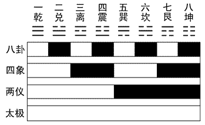
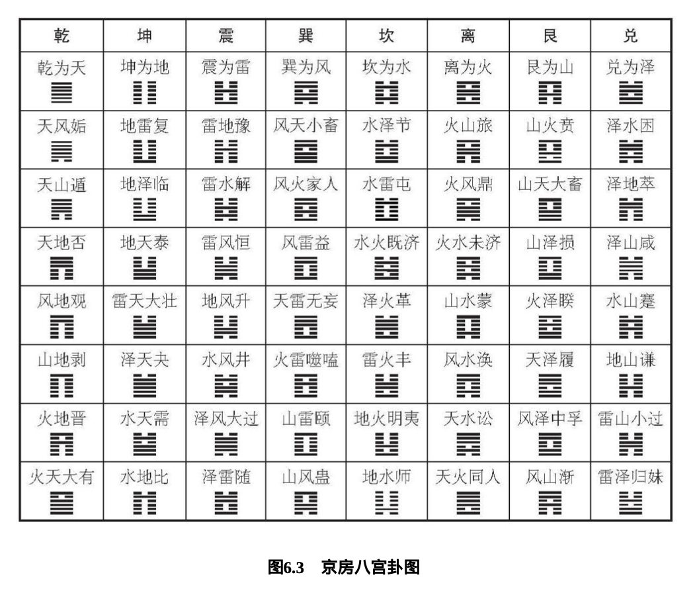

# 谦
> 谦：亨，君子有终  
> 彖曰：谦，亨。天道下济而光明，地道卑而上行。天道亏盈而益谦，地道变盈而流谦，鬼神害盈而福谦，人道恶盈而好谦。谦尊而光，卑而不可逾，君子之终也。
> 象曰：地中有山，谦。君子以裒多益寡，称物平施。

### 《周易入门》 - 中华书局 - 曹胜高/刘银昌
* 两个系统：言辞 - 卦辞爻辞；符号 - 卦与爻

## 一、学习方法
* 理解字义
* 理解文意
* 追本溯源
* 举一反三

## 二、学习的态度
* 《周易》不应停留于‘术’，更应从‘道’的角度来理解
* <strong>洁净（静）精微而不贼</strong>
> 孔颖达：正则获吉，邪则获凶，不为淫滥，是洁净；穷理尽性，言入秋毫，是精微  
> 张善文：洁，一尘不染，通体清澈；净，涵咏沈潜，闲适乐天；精，纯粹不杂，坚确不移；微，虚无缥缈。得失无度。
* <strong>清明条达而不鬼</strong>
> 条达，条理疏通也；
* <strong>顺道以行而不悖</strong>
* <strong>敬慎始终而无咎</strong>

## 三、河洛
* 河图演先天，以阴阳象宇宙之秩序
    - 左旋趋势：人体左升右降；银河亦是左旋，故：左旋趋势反映五行万物相生之理；
    - 四象图示：周天二八星宿；风水，建筑，时令等；
    - 先天法式：
        + 先天之理，五行万物相生相制，以生发为主。后天之理，五行万物相克相制，以灭亡为主；
        + 先天法式主静，意为宇宙本初之静。后天法式主动，宇宙后来之动(运动)；
        + 乾一兑二离三震四巽五坎六艮七坤八，此先天法式也。
        >  先天法式为宇宙本来的面目，后天法式为宇宙中各种要素相互吸引而产生运动的模式
* 洛书演后天
    - 寄身九宫，阳数左旋，阴数右旋，二者相抱成阴阳交泰之象；
    - 后天卦序：寄身之宫即为卦序。
        + 后天卦序不用于起卦，而是作为观察万事万物运行的秩序

## 四、八经卦
  

| 序 | 1 | 2 | 3 | 4 | 5 | 6 | 7 | 8 |
| :----: | :----: | :----: | :----: | :----: | :----: | :----: | :----: | :----: |
| 名 | 乾 | 兑 | 离 | 震 | 巽 | 坎 | 艮 | 坤 |
| 符 | ☰ | ☱ | ☲ | ☳ | ☴ | ☵ | ☶ | ☷ |
| 象 | 天 | 泽 | 火 | 雷 | 风 | 水 | 山 | 地 |
| 事 | 父 | 少女 | 中女 | 长子 | 长女 | 中子 | 少子 | 母 |
| 位 | 西北 | 西 | 南 | 东 | 东南 | 北 | 东北 | 西南 |
| 德 | 刚健 | 喜悦 | 光明 | 发动 | 不定 | 危险 | 阻碍 | 柔顺 |
| 行 | 健 | 说 | 丽 | 动 | 入 | 陷 | 止 | 顺 |
| 人体 | 首 | 口 | 目 | 足 | 股 | 耳 | 手 | 腹 |
| 动物 | 马 | 羊 | 雉 | 龙 | 鸡 | 豕 | 狗 | 牛 |

### 卦象小词典
* 乾，健也。坤，顺也。震，动也。巽，入也。坎，陷也。离，丽也。艮，止也。兑，说也。
* 乾为天，为父，为圆，为君，为玉，为金，为寒，为冰，为大赤，为良马，为老马，为瘠马，为驳马，为木果。
* 坤为地，为母，为布，为釜，为吝啬，为均，为子母牛，为大舆，为文，为众，为柄，其于地也为黑。
* 震为雷，为长男，为龙，为玄黄，为专，为大途，为决躁，为苍筤竹，为萑苇。其于马也，为善鸣，为馵足，为作足，为的颡。其于稼也，为反生。其究为健，为蕃鲜。
* 巽为木，为长女，为风，为绳直，为工，为白，为长，为高，为进退，为不果，为臭。其于人也，为寡发，为广颡，为多白眼，为近利市三倍，其究为躁卦。
* 坎为水，为中男，为沟渎，为隐伏，为矫輮，为弓轮。其于人也，为加忧，为心病，为耳痛，为血卦，为赤。其于马也，为美脊，为亟心，为下首，为薄蹄，为曳。其于舆也，为多眚，为通，为月，为盗。其于木也，为坚多心。
* 离为火，为中女，为日，为电，为甲胄，为戈兵。其于人也，为大腹。为乾卦，为鳖，为蟹，为蠃，为蚌，为龟。其于木也，为科上槁。
* 艮为山，为少男，为小石，为门阙，为果蓏，为阍寺，为指，为狗，为鼠，为黔喙之属。其于木也，为坚多节。
* 兑为泽，为少女，为巫，为口舌，为毁折，为附决。其于地也，为刚卤。为妾，为羊。

## 五、六十四卦卦歌
> 乾坤屯蒙需讼师，比小畜兮履泰否  
> 同人大有谦豫随，蛊临观兮噬嗑贲  
> 剥复无妄大畜颐，大过坎离三十备  
> 咸恒遁兮及大壮，晋与明夷家人睽  
> 蹇解损益夬姤萃，升困井革鼎震继  
> 艮渐归妹丰旅巽，兑涣节兮中孚至  
> 小过既济兼未济，是为下经三十四

|| 天☰ | 泽☱ | 离☲ | 震☳ | 巽☴ | 坎☵ | 艮☶ | 坤☷ |
| :----: | :----: | :----: | :----: | :----: | :----: | :----: | :----: | :----: |
| 天☰ | 乾䷀ | 夬䷪| 大有䷍ | 大壮䷡ | 小畜䷈ | 需䷄ | 大畜䷙ | 泰䷊ |
| 泽☱ | 履䷉ | 兑䷹ | 睽䷥ | 归妹䷵ | 中孚䷼ | 节䷻ | 损䷨ | 临䷒ |
| 离☲ | 同人䷌ | 革䷰ | 离䷝ | 丰䷶ | 家人䷤ | 既济䷾ | 贲䷕ | 明夷䷣ |
| 震☳ | 无妄䷘ | 随䷐ | 噬嗑䷔ | 震䷲ | 益䷩ | 屯䷂| 颐䷚ | 复䷗ |
| 巽☴ | 姤䷫ | 大过䷛ | 鼎䷱ | 恒䷟ | 巽䷸ | 井䷯ | 蛊䷑ | 升䷭ |
| 坎☵ | 讼䷅ | 困䷮ | 未济䷿ | 解䷧ | 涣䷺ | 坎䷜ | 蒙䷃ | 师䷆ |
| 艮☶ | 遁䷠ | 咸䷞ | 旅䷷ | 小过䷽ | 渐䷴ | 蹇䷦ | 艮䷳ | 谦䷎ |
| 坤☷ | 否䷋ | 萃䷬ | 晋䷢ | 豫䷏ | 观䷓ | 比䷇ | 剥䷖ | 坤䷁ |

* https://www.zhihu.com/question/48370273/answer/2511892580
* 《豫》：不指犹豫，而是康乐；
* 《噬嗑》： 咬牙切齿；

## 六、卦之结构
### 识卦 - 元亨利贞
* 此谓易之四德，各有本意、引申义和德义
* 元者，始也。即为始，自包罗万象，故而成其大，时空皆具，所以其德在大；
    > * 时间起点，具有初生之意；
    > * 德义为大，善始善终方为大；
    > * 元首，此进一步，则为“众善之长”，“善之又善”；
    > * 万物生于一，故而可作万物之本原；
* 亨者，通也。
    > * 古指祭祀；
    > * 现指亨通；
* 利者，胜也；
    > * 胜，征服，克服之象也；
    > * 即胜，自顺也；
    > * 德义为正义，故而可汇各方之利以顺利行事；
* 贞者，诚也；
    > * 贞问，请教上天，探寻天意；
    > * 德义为正，坚守正道和原则；
* 此四者：圆满完善为 元；众人所举为 亨；无往不胜为 利；坚持操守为 贞；
> 如 “乾：元，亨，利，贞”。其中“乾”为卦名，后为卦词，<strong>是对卦的整体的解说和判断</strong>，而每爻后跟的是爻辞，是对这一爻的判断。
* 值得注意的是：乾坤两卦除六爻外，还各自多出一个概念，分别是“用九”和“用六”。这两个均是<strong>卦辞</strong>，不是爻辞。
> 这个涉及到卜卦过程中“变爻”的规则：如高亨有言：“依古筮法，筮遇《乾》卦，六爻皆七，则以卦辞断事，六爻皆九，则以用九爻辞断事。” 意思是说，如果六次均为 七 数，则可卜得乾卦，但七为少阳，无需变化，故而此乾卦无变，以乾卦卦辞“元亨利贞”来断；但是如果六次均为 九 数，九为老阳，在其他卦中这一爻需要变成阴爻，称之为“变爻”，在这一种特殊情况下不需要变，直接用“用九”的卦辞来做判断。坤卦“用六”同理。

### 读卦
* 64 卦，每卦分上下两部分。上卦又称外卦，下卦又称内卦。按照爻的顺序。下卦演绎在先，上卦在后，故成之以内外。但是读的时候是从上到下的，如“火天大有”。

### 辨爻
* 卦之六爻，一、三、五为阳数，其和为九，故而阳爻亦可称九，如初九、九二、九三、九四、九五、上九
* 卦之六爻，二、四为阴数，其和为六，故而阴爻亦可称六，如初六、六二、六三、六四、六五、六九
* 卦辞是对卦整体的判断，其说明的是事情的大环境和整体趋势；爻辞则是对同一个事情在不同的阶段、不同的情形下进行的具体判断，分析的是特定的情况下如何应对。
* 《彖传》解释 64 卦卦辞的，也称为《彖辞》。
* 《象传》分《大象》和《小象》，《大象》解释卦名和卦义，《小象》解释爻辞。
> 今本《周易》，一般将《彖传》和《象传》按照各卦、爻附在其后。

## 七、易传
* 狭义上指“十翼”，广义上指解释、传疏《易经》的著作。

### 彖传
* 《彖传》是对 64 卦卦义进行解释的文字。孔颖达将“彖”解释为“断”，即用来判断一卦之义，并将之分为三类：
    * 以卦象象征万物解释卦义；
    * 以义理、德行解释卦义；
    * 以爻象燥卦中的地位来解释卦义；
* 彖义 - 意在概括卦的本义
    * 卦象：卦本身的形象；
    * 卦德：卦象中体现出来的德行；
    * 卦体：对卦的特征进行概括；
* 彖法 - 判断卦吉凶的方法
    * 《彖》的首句，一般解释卦体。即解释卦象所代表的物体名称，如“离，丽也”。
* 《彖》解释卦辞的方法：
    * 点题法：一字一词点题评说卦名。如《需》 《师》《比》《噬嗑》《剥》《大过》《坎》《离》《咸》《恒》 《晋》《蹇》《夬》《姤》《萃》《鼎》《艮》《丰》和《兑》，共 19 卦。
    * 解题法：针对卦名进行解释。如《同人》讲如何寻找志同道合的人一起合作，尤其处于危难的时候，怎么团结别人。如《蒙》《讼》《小畜》《同 人》《大有》《豫》《随》《蛊》《观》《大壮》《解》《井》 《革》，共 13 卦。
    * 释义法：即释义卦名。除上面列举的之外，余则均属此法，共 32 卦。
* 彖例
    * 分析卦体：如《乾彖》：“大哉乾元！万物资始，乃统天。云行雨施，品物流形。大明终始，六位时成，时乘六龙以御天。乾道变化，各正性命，保合太和，乃利贞。首出庶物，万国咸宁”。《乾》《坤》二德分别是“品物流形”和“品物咸亨”。映射到人事上，如父母教育子女，母亲教给孩子养德，父亲教给孩子砺志，共同塑造孩子人格。“大明终始”，说六个爻位均是阳爻，始终如一，“六位时成”，说虽然均为阳爻，但表现会随“位”(外部环境)和“时”(事物的阶段)变化而变化。剩下的一段，说事情的成败，主要不在于是否聪明、勤奋，而在于是否能坚持，能否坚持这种刚健不息的气象，这就是《乾》卦的宗旨。
    * 分析卦德：如《坤彖》：“至哉坤元，万物资生，乃顺承天。坤厚载物，德合无疆。含弘光大，品物咸亨。牝马地类，行地无疆，柔顺利贞。君子攸行，先迷失道，后顺得常。西南得朋，乃与类行；东北丧朋，乃终有庆。安贞之吉，应地无疆。”《坤》德柔顺，“利贞”，因此如果守正，坤道亦可以柔克刚(柔顺并非柔弱，而是柔和，取四两拨千金之意)。一阴一阳谓之道，万物如此。由此两卦延伸出来：人要明确自己的位置，处于阳位，要主动，要刚健，要自强不息；处于阴位，要退守，要包容，要随和，要柔顺。
    * 阐释卦名卦义。如《师》、《萃》；
    * 解释卦辞。如《咸》；
    * 解释卦象。如《噬嗑》；
    * 剖析爻位，如《讼》；
    * 阐发卦理，如《泰》；

### 象传
* 大象传，解释 64 卦的卦名和卦义；其对卦象的解释，是从八经卦的取象入手的。
    * 《离象》曰：明两作，离，大人以继明照于四方。离，明也，两离相叠，即“明两作”。真正为大家所尊敬的人，能够像火一样给他人带来光明，给他人以启迪。
    * 《乾象》曰：“天行，健，君子以自强不息。”乾象天，天的特点就是刚健不息。
    * 《坤象》：“地势，坤，君子以厚德载物。”坤象地，大地的特点是厚德载 物。
    * 《坎象》：“水洊至，习坎，君子以常德行，习教事。”坎象水， 水是流动的，水善利万物而不争，既有险的特征，也有智的习性，君子要修养德行，达到上善若水的境界。“习教事”，即开智，君子乐 水，就在于水也是智慧的象征。
    * 《巽象》：“随风，巽，君子以申命行事。”巽象风，有个成语叫风行天上，前面讲 过，在中国文化中，一年四季有十二风，这十二风可以带来不同的节 令，风有号令之义。
    * 《震象》：“洊雷，震，君子以恐惧修省。”雷的声音非常响亮，带给人的感觉就是畏惧。
    * 《艮象》称：“兼山，艮，君子以思不出其位。”艮有两层含义，第一是表示静止，第二是表示安静、安心、安分。《艮》卦要求君子思不出其位，即在什么地方想什么事，不要胡思乱想，做好当下的事情。
    * 《兑象》：“丽泽，兑，君子以朋友讲习。”泽指的是润泽，兑有欢乐的意思，主口舌。口舌一方面指是非，另一方面指人善言辞。《兑》卦描述的是君子之间互相讲习，共同进步。
    * 余五十六卦的解释也是立足于上下两经卦的取象。
    * 《大象》一般分为两部分：前一部分是对卦象的解读，后一部分 是对卦象引申之义进行解释，可看成是对卦名、卦象的补充和发挥，往往用“君子以”开头。
    * 《大象传》采用的是取象法，就是直接用卦象来解释。这种方法 是先讲天道和地道的特征，然后再讲人道如何去做。天道，在中国文化中指代的是必要条件，地道指的是充分条件，一般是客观因素，是可变的量。时机和境遇结合起来形成一组不可变量和可变量，人就在这样一个不变和可变的环境当中做事。基于此，《周易》六十四卦建立起一个模式，其中包括两点内容：一是人在通常应该怎么做；二是此情此景下该怎么做，即时机变了，应当怎么做。
    * 《大象》针对全卦而言的，这一点与《彖传》相同，但 《大象》不涉及爻辞内容，这是与《彖传》的不同之处。
* 小象传，主要采用爻位法和取义法来解释爻象。
    * 《小象》认为，初为始、为下、为卑、为穷。从时间上讲，第一爻是开始。三爻和四爻代表的是犹豫、疑惑和反复。人生不是取决于起点，而是取决于终点，从零到一这一步是很容易跨过的，但是从一到一百这个过程是很多人不能把握的。二爻和五爻居中，代表得中、中道。 这两爻吉凶之关键在于是否当位。上爻为终、为上、为亢、为盈。终表示事物结束；上指的是高高在上，高高在上的时候就像飘在空中的气球一样，基本不能解决问题；亢是发展得有些过头；盈就是充满、饱满。
    * 《兑》 - 大象曰：丽泽，兑，君子以朋友讲习。
        * 初九《象》：和兑之吉，行未疑也。
        * 九二《象》：孚兑之吉，信志也。
        * 六三《象》：来兑之凶，位不当也。
        * 九四《象》：九四之喜，有庆也。
        * 九五《象》：孚于剥，位正当也。
        * 上六《象》：上六引兑，未光也。
    * 《兑》之大象，为少女，在西方，又为口舌。小象各不相同，如初九，阳爻在阳位，当位，有吉的特征，故而称之为“和兑”。“和”即中和、和谐之意，此爻讲大家一起能唱和，彼此不怀疑；九二爻辞“孚兑，吉，悔亡”，有诚信，故而曰吉，但是阳爻居于阴位，不当位，故而有悔，最终懊恼消失，整体为吉。此爻象“孚兑之吉，信志也”，当处于第二爻的时候，宜阴柔一点，保持含蓄。六三爻辞“来兑，凶”，六三阴爻居阳位，不当位，此爻象言其凶也。九四亦不当位，同样有凶象，因而“未宁”。九五爻辞“孚于剥，有厉”，象辞“孚于剥，位正当也”，九五当位，这是好的一面，不过其下九四同为阳爻，九五象君，九四象臣，二者皆刚，故而二者虽为同志，但是君需要提防着臣，故而“有厉”。上六爻辞“引兑”，象辞“上六引兑，未光也”，“引兑”，即无事生非起口舌，最上一爻通常昭示物极必反的道理，“未光”，即上爻不能和下五爻融合在一起。
        > 三、四这两个位置非常特殊，三爻是下卦的最上爻，四爻是上卦的最下爻，他们是上下卦的过渡点。如果这两爻不当位，那么处于这个时候都会很尴尬。不过，四比三会好一点，因为五爻通常起到统领一卦的作用，如果与五爻志同道合，那么也会得到五爻的关照。比如兑卦九四象辞中的“有庆”就是来自于九五的力量。  
    * 简而言之，《小象》的体例主要是以爻象立意，来阐明《易》理，并在训释字义的同时，阐释爻德、爻位和爻义。

### 系辞传
* 《系辞》是《周易》通论，研读《周易》，一般从《系辞》开始，其后再读《象》《彖》和《文言》。
#### （一）《易》言圣人之道
* 察言。圣人设卦观象，以 64 卦来象征天地万物。象本身有多意性、象征性，可以进行无穷的阐释。“居则观象”：君子平日观察卦象，了解阴爻、阳爻乘、承、比、应的关系；“玩其辞”：玩味、品味卦辞和爻辞。64 卦各不相同，同一卦中不同的爻位又代表事物发展的不同阶段，故而君子学易，需要玩味言辞来修身养德，体会大道，学会观察事物内部的变化。
* 观变。初爻位始，故通常要守拙，多些谦虚和谨慎，但是并不是事事如此，如《复》之初爻，其为刚，其上承五柔，此时应该坚持其阳刚之气，不可谦虚，不可退让，需要振作以感化上爻。64 卦每卦中有个基本的立足点，这是根本也是这卦的不变量，但是再观察各爻时，仍需要放在特定的环境中观察和思考。
* 制器。“制器”是总结天地万物的规律，将它融合起来形成一个系统。器是和道相对的，天地万物的变化规律是道，道是无名无形无象的，但要讲明，必须选择一个入口描述出来，这个表述出来的系统可以称之为器。圣人制道为器以遗后世。
> '形而上者谓之道，形而下者谓之器。' - '形而上'，就是超越具体物象，如通过无数个直角三角形抽象 出来勾股定理，那么勾股定理相对于直角三角形而言就是'道'。'形而下者谓之器'，原理变化出来的终端叫作'器'。
> 儒家'君子不器'
* 占卜
> 一二爻地道，三四爻人道，五六爻天道。人在天地中，最受影响，故而三四爻变动极大。

#### （二）《易》在开物成务

#### （三）《易》以贯通事理
* 天尊地卑，乾坤定矣；
> 此处之卑，非为贬褒之意，而应与尊互为对立面的存在。
* 刚柔相摩，八卦相荡；
> 交通无形，互通有无。
* 乾以易知，坤以简能；
> 乾为男子以决策，坤以女子以辅弼。父养儿以智慧，母育儿以德行。
* 一阴一阳之谓道；
* 大小(人)之判；
> '阳一君而二民，君子之道也，阴二君而一民，小人之道也'。君子之道于合也，小人之道于争也。
* 生生之谓易；
* 三才之道；
> '《易》之为书也，广大悉备。有天道焉，有人道焉，有地道焉。兼三才而两之，故六。六者非它也，三材之道也。道有变动，故曰爻；爻有等，故曰物；物相杂，故曰文；文不当，故吉凶生焉。' 三才各分阴阳，故每才得二，三才共六。

#### （四）《易》仿天地之法
* 天数五，地数五，五位相得而各有合；天数二十有五，地数三十，凡天地之数五十有五，此所以成变化而行鬼神也。
> 五在中国古代是“成数”，也就是天地造化之数。天数有五个阳数，为一、三、五、七、九，加起来为二十五；地数有五个阴数，为二、四、六、八、十，加起来为三十；天地之数相加就是五十 五，是为天地成数。- 见河图

#### （五）《易》蕴天地秩序

#### （六）《易》存德义制度
* 《履》，德之基也，履行自己的职责；学会与人和睦之道，与天下人和睦，就会使得天下归心；
* 《谦》，德之柄也，如何做一个谦谦君子；学会尊重别人，进而赢得别人的尊重，君子相敬若宾，相看两不厌，人就会光华发外，声名显赫；
* 《复》，德之本也，从基础做起，从点点滴滴做起；星星之火，虽然微弱，然一点一滴做事，最终能够由小见大，由微弱而刚强，终能究通人情物理；
* 《恒》，德之固也，坚持、永恒，坚持不懈地修养，这样德行才能稳固；保持恒心，即使外部有无数的人和事摇曳心性，但最终能够守恒而不动摇；
* 《损》，德之修也，在失败中、在困难中，更要修养自己，暴露缺点并不可怕，关键是过而能改，善莫大焉；君子修德要先难而后易，找到人性中最大的缺点，把它改正过来，所有的事业就会水到渠成；
* 《益》，德之裕也，培养德行和修养，如何增益德行；不要设界限，避免画地为牢、止步不前；
* 《困》，德之辨也，走投无路、左右为难、进退无方的境遇，这时人才会辨析，才能分辨出什么是德，什么不是德；因穷而通的道理，穷则变，变则通，通则久，人在走投无路的时候就会思变，思变才会有将来；
* 《井》，德之地也，被困守在一个地方，恰恰是立德之地，以此作为人生的起点；被困住的时候，要转换方式，换一条路走；
* 《巽》，德之制也，风行万里，德的普及推广；推行德化要如风吹草、雨润物一般，无声无息，而不自我显露；

### 文言
* 《文言》是对《乾》《坤》两卦进行解释。《乾》《坤》被视为《周易》的门户，读懂这两卦，也就明白了阴阳这两种基本力量是如何决定事物的变化，天地两个基本的秩序是如何左右人事的运行。如果说阴阳是道的话，那么《乾》《坤》就是德，分别代表了阴、阳两种力量在宇宙中的存在状态和在人类社会中的运行方式。

### 说卦
* 《说卦》对八经卦进行解释，阐述了立《易》的原则，涉及八卦的德行、运行、象义等诸多问题。
* 一论立《易》之原则；
* 二论八卦之德行：
    * 天地定位，山泽通气，雷风相薄，水火不相射，八卦相错，数往者顺，知来者逆；是故易逆数也。雷以动之，风以散之，雨以润之，日以烜之，艮以止之，兑以说之，乾以君之，坤以藏之。- 先天卦
    * 帝出乎震，齐乎巽，相见乎离，致役乎坤，说言乎兑，战乎乾，劳乎坎，成言乎艮。 - 后天卦
    > * “出乎震”，就是说万物是从东方震位开始形成的。震位，在节气上代表春分，此时万物萌生。帝由东方顺时针运行，到达东南巽位。巽介于春夏之交，为立夏，这时候万物齐整，称为“齐乎巽”。然后运转到离位，离是正南，时值夏至，万物在阳光普照下，繁盛异常，纷纷显现，即“相见乎离”。然后至西南坤位，时主立秋，万物都得到了滋养，故称“致役乎坤”。随后又到了正西兑位，时为秋分，昼夜等长，此时正值收获季节，因而万物欣悦，称为“说言乎兑”。运转至西北乾位后，节气为立冬，阴阳交替相搏，故称“战乎乾”。正北为坎，坎为冬至，行将岁末，有一种疲惫感，但是秋收冬藏，这是劳作贮藏的季节，故为“劳乎坎”。东北艮位为立春，万物最终成就，但新的轮回又要开始，即“成言乎艮”。

### 序卦
* 《序卦》是对《周易》六十四卦推衍关系的总括，其依据卦名的含义，把《周易》六十四卦看作一个或相因、或相反的因果联系序列，进行了全面的诠释。一般认为是秦汉时期的学者所作。
* 《序卦·上》言顺承关系：天地为缘起，其后《屯》《蒙》《需》...按照个人成长、社会发展的规律排出顺序，并对卦名、卦德进行解释，将 64 卦视为人类社会发展过程的总结。
* 《序卦·上》言逆承关系：然后天地万物的生成、人类社会的形成、社会秩序的建构、事物 变化的因果作为参照，形成了对某些事物的解释。用物极必反、相反相生的运动规律等解释其他各卦的相互关系，说明六十四卦排列的次序，以“物不可穷，故受之以《未济》终焉”来解释最后一卦《未济》卦。
* 另外，还有两个原则：一个“覆”(即对应综卦)，一个“变”(即对应错卦)，由此，可以看出六十四卦的排列，先是将互覆的两卦排在一起；如果不能互覆的，比如《乾》卦无论如何颠倒还是《乾》，那就将互变或者互错的两卦排列在一起，从而形成了六十四卦的卦序。  

### 杂卦
* 《杂卦》形成于汉代，是对六十四卦之间的关系进行分析，按照相反相成的关系两两一组，一正一反，把六十四卦配成三十二组，用最精简的一两个字概括出卦义，并解释每组两卦的关系。从解释的复杂度来看，《杂卦》应该是秦汉时期的儒士所作。
* 如果说《序卦传》是从本卦内、外来论阴阳的消长规律，按照人道的互动关系来讨论六十四卦的变化，那么《杂卦传》则是从四时变化的角度来讨论阴阳的消长，将宇宙万物运行的基本态势进行总结，纳入到六十四卦之中进行解释，因此《杂卦传》不言吉凶悔吝，只讨论事物之理。

## 八、易义 - 《易》中大义
### 易德四法
* 至盛之德：包罗万象，而又潜藏万物，平易简约；
* 生生之德：默而成之，不言而信，存乎德行；
* 省察之德：《谦》；
* 慎善之德：要求当事人在遇到问题的时候要严肃方能够达到一个理想的结果；

### 易格十则
* 含蓄万物、兼容并包的胸怀；
* 对立统一、阴阳平衡的视角；
* 变而化之、通而用之的思路；
* 自强不息、进德修业的精神；
* 厚德载物、宽容大气的格局；
* 协理三才、天人合一的视野；
* 惧以始终、不懈不怠的毅力；
* 敬慎无咎，善于补过的勇气；
* 顺道而行、循义而为的节操；
* 洁静精微、清明条达的心境；

## 九、易理
### 太极
* 《周易》："太极生两仪，两仪生四象，四象生八卦"
* 《道德经》："道生一，一生二，二生三，三生万物"
> 两者角度不同，本质一致

### 两仪
#### 阴阳互根 - 阴、阳两种属性相互为对方存在的条件(先天之静守)
* 1.二者平衡 2.互依互存
* 阳气极盛的时候，并非没有阴气，而是阳中有阴，所以白鱼当中有一黑点；阴气极盛的时候也是阴中有阳，因而黑鱼当中有一白点。这两点使得阴阳的发展各自有了约束，就好比古代舞狮子、舞龙的时候，要有一个东西作为导引，否则的话龙和狮子的运动就失去了依据。而这阴阳两点正好起到了一个导引的作用。
* 阳气最旺的时候称作老阳，阴气最旺的时候称作老阴；阳气由弱到强的时候称之为少阳，阴气由弱到强的时候称之为少阴，于是两仪生出了四象。阴阳两种属性以对方为存在的条件，因而独阴不生，独阳不长，所以老阳出现时，也就是少阴发生之时。
* 从数学或理性的角度来讲，太极生至八卦是一种二进制的线性变化关系，阴阳则具有规则分形性和自相似性，分形性表现在用阴阳来衡量宇宙。八卦的排列也不是一个随意排列的顺序，而是有着严密的逻辑，每一卦用初、中、上爻的位序来规定阴阳的量，爻序则是一种用数字表示的量变。因此，八卦是对阴阳的二维分析。这种阴阳的一部分与阴阳整体的相似性，即阴阳的自相似性。

#### 阴阳互济 - 阴阳两种物质彼此补充。(后天之动变)
* 阴阳相生 - 乘承此应
* 阴阳平衡 - 当/不当位
* 刚柔相推 - 进退强弱

#### 阴阳相易 - 阴阳两种物质和属性之间的相互作用(时变)
* 阴阳消长：昼夜，四时。将阴阳在万物变化的规律中，加上了时间变量，使得三维分形变成了四维分形
> 先天八卦中，离作春分，兑为立夏，乾为夏至，巽为立秋，坎为秋分，艮为立冬，坤为冬至，震为立春。 - 此世界之本初态。

### 三才
* 周易解卦三法：
    * '1+1+1'，基本的方法，阐释每一爻的关系；
    * '2+2+2'，三才天地人；
    * '3+3'，两仪上下、内外；
* 三才之间的互动关系，常用刚柔来描述。

### 四象
> 太阴水，少阳木，太阳火，少阴金。
* 以四象来划分，太阳是夏至，太阴为冬至，少阳为春分，少阴为秋分；
* 月之四象，望朔圆缺：
    * 望 - 月十五，此时是 月-地-日，为太阳；
    * 朔 - 月初一或者月末，此时是 地-月-日，为太阴；
    * 上弦：朔到望过程的中间点，为少阳；
    * 下弦：望到朔过程的中间点，为少阴；
* 时之四象：子午卯酉

## 十、易卦
### 先后天八卦
* 先天卦显示天地初生时各个力量的关系分布(早期中原地区对世界的理解，显示宇宙最初的秩序)；后天八卦则按照时间顺序来安排各方力量，蕴含万物兴衰之理；

### 六十四卦的两种卦序
#### 《周易》卦序
* 上经三十，以《乾》《坤》为门户，按照世界产生发展、发展、变化的顺序安排，所以反映的是天地秩序，是万物运行的必然规律 - 两卦间顺承，前引后；
* 下经三十又四，描述事物发展的波形曲线，循环往复，讲人世间之秩序，与上经遥呼 - 两卦间逆承，后补前；
> 《乾》《坤》定位，《屯》言万物生；生之启之，故曰《蒙》；受启而立，《需》言饮食；饮食而争，故曰《讼》；争而不解，《师》以成兵；众兵为聚，故《比》；比之若和，故曰《泰》；泰久生怠，故成之以《否》；否极则反，自《同人》以救；同心协力，终至《大有》；大有之后，授之以《谦》则可得逸，《豫》；过逸则《随》...

#### 八宫卦序 - 京房卦
* 以八经卦领八宫，每宫八卦，共六十四卦。演绎原则是“乾坤生六子”。其中“乾、坎、艮、震”是阳四宫，“巽、离、坤、兑”为阴四宫。

* 各宫卦变的规律(以乾宫为例，卦变都是在前一卦的基础上进行的)：同卦相叠为纯卦(乾)，其后纯卦初爻变名一世卦(天风姤)，其后二爻变名二世卦(天山遁)...一直变到第五爻名五世卦(山地剥)，之后，变化方向相反，保持(变化后的)第五爻不变，自第四爻开始再变，故下一卦名游魂卦(火地晋)，最后把下卦三爻全变，成归魂卦(火天大有)。
.png)

### 卦义
* 一卦领一事，一事中各部分的内在关系组成了一个整体，中心主旨既卦义，按照卦辞来裁断。
* 卦义也叫时义、时用，简称为“时”，通常是指时态、时运、时机的意思。王弼在《周易略例》提到：“卦以存时，爻以示变。”即说卦是时间条件所形成的时势、时机、时相、时变。
* 列六十四卦之卦义如下： 

|| 卦 | 卦义 | 现代释义 |
| :----: | :----: | :---- | :---- |
| 1 | 乾 | 天行健：君子以自强不息 | 广大包容 |
| 2 | 坤 | 地势坤：君子以厚德载物 |
| 3 | 屯 | 水雷屯：君子以经纶 | 龙居浅水以象万物初生之艰 |
| 4 | 蒙 | 山水蒙：君子以果行育德 |
| 5 | 需 | 水天需：君子以饮食宴乐 |
| 6 | 讼 | 天水讼：君子以作事谋始 |
| 7 | 师 | 地水师：君子以容民畜众 |
| 8 | 比 | 水地比：先王以建万国，亲诸侯 |
| 9 | 小畜 | 风天小畜：君子以懿文德 |
| 10 | 履 | 天泽履：君子以辩上下，定民志 |
| 11 | 泰 | 地天泰：后以财成天地之道，辅相天地之宜，以左右民 |
| 12 | 否 | 天地否：君子以俭德辟难，不可荣以禄 |
| 13 | 同人 | 天火同人：君子以类族辨物 |
| 14 | 大有 | 火天大有：君子以遏恶扬善，顺天休命 |
| 15 | 谦 | 地山谦：君子以裒多益寡，称物平施 | 反省之道 |
| 16 | 豫 | 雷地豫：先王以作乐崇德，殷荐之上帝，以配祖考 |
| 17 | 随 | 泽雷随：君子以响晦入宴息 |
| 18 | 蛊 | 山风蛊：君子以振民育德 |
| 19 | 临 | 地泽临：君子以教思无穷，容保民无疆 |
| 20 | 观 | 风地观：先王以省方观民设教 |
| 21 | 噬嗑 | 火雷噬嗑：先王以明罚敕法 |
| 22 | 贲 | 山火贲：君子以明庶政，无敢折狱 |
| 23 | 剥| 山地剥：上以厚下安宅 |
| 24 | 复 | 地雷复：先王以至日闭关，商旅不行，后不省方 |
| 25 | 无妄 | 天雷无妄：先王以茂对时育万物 |
| 26 | 大畜 | 山天大畜：君子以多识前言往行，以畜其德 |
| 27 | 颐 | 山雷颐：君子以慎言语，节饮食 |
| 28 | 大过 | 泽风大过：君子以独立不惧，遁世无闷 |
| 29 | 坎 | 坎为水：君子以常德行，习教事 | 凶险，船渡重滩之象 |
| 30 | 离 | 离为火：大人以继明照于四方 |
| 31 | 咸 | 泽山咸：君子以虚受人 |
| 32 | 恒 | 雷风恒：君子以立不易方 | 有常 |
| 33 | 遁 | 天山遁：君子以远小人，不恶而严 | 大治，近善远恶 |
| 34 | 大壮 | 雷天大壮：君子以非礼弗履 | 大勇 |
| 35 | 晋 | 火地晋：君子以自昭明德 | 上达 |
| 36 | 明夷 | 地火明夷：君子以位众，用晦而明 |
| 37 | 家人 | 风火家人：君子言有物，而行有恒 | 安居之道 |
| 38 | 睽 | 火泽睽：君子以同而异 |
| 39 | 蹇 | 水山蹇：君子以反身修德 |
| 40 | 解 | 雷水解：君子以赦过宥罪 |
| 41 | 损 | 山泽损：君子以惩忿窒欲 |
| 42 | 益 | 风雷益：君子以见善则迁，有过则改 |
| 43 | 夬 | 泽天夬：君子以施禄及下，居德则忌 |
| 44 | 姤 | 天风姤：后以施命诰四方 | 风云相继，君群会合 |
| 45 | 萃 | 泽地萃：君子以除戎器，戒不虞 |
| 46 | 升 | 地风升：君子以顺德，积小以高大 |
| 47 | 困 | 泽水困：君子以致命遂志 |
| 48 | 井 | 水风井：君子以劳民劝相 |
| 49 | 革 | 泽火革：君子以治历明时 |
| 50 | 鼎 | 火风鼎：君子以正位凝命 |
| 51 | 震 | 震为雷：君子以恐惧修省 |
| 52 | 艮 | 艮为山：君子以思不出其位 |
| 53 | 渐 | 风山渐：君子以居贤德善俗 |
| 54 | 归妹 | 雷泽归妹：君子以永终知敝 |
| 55 | 丰 | 雷火丰：君子以折狱致刑 |
| 56 | 旅 | 火山旅：君子以明慎用刑，而不留狱 |
| 57 | 巽 | 巽为风：君子以申命行事 |
| 58 | 兑 | 兑为泽：君子以朋友讲习 |
| 59 | 涣 | 风水涣：先王以亨于帝立庙 |
| 60 | 节 | 水泽节：君子以制数度，议德行 | 船行风横之象，故宜调整方向 |
| 61 | 中孚 | 风泽中孚：君子以议狱缓死 |
| 62 | 小过 | 雷山小过：君子以行过乎恭，丧过乎哀，用过于俭 |
| 63 | 既济 | 水火即济：君子以思患而豫防之 | 舟船顺利而渡之象 |
| 64 | 未济 | 火水未济：君子以慎辨物居方 |

## 十一、易象
### 观象
* 《易》之四象：卦象、爻象、喻象和具象。
> * 第一步要读懂象；
> * 第二步要“得意而忘象”；
* 有些古卦象和现在的卦象是不一样的，如“乾为日，为人；坤为月，为马”，与《易传》中“乾为马”的象征不一样，这反映了后期卦象和古卦象之间的一个演化过程：在不同的时代里，因为社会生活情形不同，卦象对外在事物的指代不固定。象的概括是以局部来象征整体。
* 观象的规则：
    * 拟物取象：即根据外在事物的特征或者性质进行取向。如《乾》为君，为父，为玉，为金，为寒，为冰，为大赤，为良马等都是取乾之刚健。
    * 近取诸身：初爻表示下面的物，上爻表示上面的物，中间的爻就近取诸身，从身体或生活中来取象。如《颐》。
    * 远取诸物：从自然界中选取物象来阐释卦义，如《需》，讲蒙蒙细雨浸润大地，六爻渐进，以自然之理来解释事物的发展次序。

### 卦象
* 吉象：
    * 卦象皆吉，如：《乾》、《谦》等；
    * 卦象吉，大部分爻当正，如：《需》、《家人》等；
    * 卦象吉，核心爻上下相应，如《师》、《小蓄》等；
    * 卦象吉，刚柔相济(阴爻阳爻相对平等)，如《恒》、《同人》等；
* 凶象：卦象或者爻象比较凶险，从上下卦的组织关系中体现。如《否》、《剥》等；
* 吉凶相生之象：指卦本身有吉也有凶 - 《屯》《比》《临》《明夷》《睽》《蹇》《困》《井》《革》《未济》
    * 卦象含有相反的征兆：《屯》、《明夷》；
    * 爻象含有相反的征兆：《比》、《临》；
* 吉凶转化之象：《讼》，天水违行不相交，与《否》类似，但是《讼》之互卦(《家人》，以《家人》的守正来弥补此卦的口舌是非)可补此卦之不足；同时，《讼》之处与四、三与六互应，下四爻又一阴一阳相比，使得卦内阴阳相互承接呼应，可以由凶至吉；
* 条件决定之象：有些卦的吉凶不取决于卦本身，而是取决于外在的条件和自身的条件。因为这个卦本身是中性的，要根据现实状态判断吉凶。这些卦包括《蒙》《夬》《姤》《艮》《归妹》《节》《小过》《蹇》《井》《无妄》《解》等；

## 十一、易爻
### 爻位
* 六爻之中，如以初爻为地下，二爻则为地上。三、四爻不上不下，亦可上可下，其态最为难定。五、六爻通常指代上天。二爻、五爻分别是上下卦的中爻，故而其可以一统上下爻。一般又以三、四代人，即处于三才人位。人在《易》中有一定的主动性，但更多的是一个被决定量。
> 之所以有互卦，就是想分析人的主观能动性能做到什么境地 - 原卦三爻在互卦的二位，原卦四爻在互卦的五位，分领上下卦。
* 爻位有吉凶：二多誉，四多惧，三多凶，五多功。

### 爻断
* 当位：阳爻居阳位，阴爻居阴位。
> 第五位为尊位，故而阴阳皆可以说当位，九五曰阳刚，六五曰谦和。
* 中正：这是二、五爻的一种极为特殊的状态：中者，二、五为中，正者，当位也。所以六二可谓中正，九五亦可谓中正。
> 中胜于正，如《泰》，二、五皆不正，当是居中，且阴阳互补，故此二爻岁不正，但不至于凶险。

### 爻象 - 六画之象                                                           
* 承：相邻两爻，阳上阴下，定位于下爻，即可曰“承”，就是站在下爻的角度来看待自己和上爻的关系。
> 阴承阳为顺，阳承阴为逆
* 乘：相邻两爻，阴上阳下，定位于上爻，即可曰“乘”，就是站在上爻的角度来看待自己和下爻的关系。
> 《屯》之二、六皆曰“乘马班如”，马即其下阳爻，以二、六之位，乘于一、五之上。
* 比：相邻两爻，皆可曰比。
> 若又逢上一阴一阳，可谓之“得比”
* 应：一与四，二与五，三与六各相互为应。如这呼应的两个位置上一阴一阳，则名“应”，若同阴同阳，则为“不应”。
* 据：阳上阴下，定位于上爻，即可曰“据”。
> “据”没有严格限定在相邻两爻之间。
* 往来：由上往下名来，由下往上名往。爻象可以上下往来，如一爻往来至其他位置就变成了其他卦。

## 十二、易辞
### 爻位对应
#### 其一
初爻：代表事物开始；二爻：代表事物崭露头角；三爻：代表事物大成；四爻：代表事物进入更高层次；五爻：代表事物成功；上爻：代表事物终极；

#### 又一
初爻：代表脚趾(因脚趾在最下)；二爻：代表小腿；三爻：代表腰(三爻居中，腰也居中)；四爻：代表上身；五爻：代表脸；上爻：头；

#### 又一
初爻在下，代表民；二爻居中，代表君子、卿大夫；三爻在二爻之上，代表诸侯；四爻邻近五爻，为近臣；五爻在上居中，为天子；上爻在最上，为宗庙(或太上皇)；

### 易辞的特色
* 言简意赅，如歌如谣。如《涣》《渐》；
* 词存古义，易致误读。
    * “龙战于野”，战，交合(《说文解字》)；又如“战乎乾”；
    * “康侯用锡马蕃庶，昼日三接”，“接”，亦有交合之意；
    * “履虎尾，不咥人，亨”，“咥”，音dié，有吃、啮咬之意；
* 字多省形，常用通假。
    * “需于血，出自穴”，其中“血”字通“洫”，洞穴，沟渠之意；

## 常用字的解释
* 吉：吉祥。
* 凶：危险，不详。
* 悔：由吉转凶，产生悔恨。
* 吝：逢凶化吉，有所珍惜；“遴”的假借字，有行动困难、有阻力。
* 孚：宜诚信。
* 窒：有所不通。
* 惕：保持警惕。
* 匪：通现代的“非”。
* 厉：可以理解为危险，与“疠”字相通。也可以理解为磨砺的 “砺”，即不顺利、有挫折或受折磨。如“有厉”，可以理解为有危险，也可以理解为不顺利，有挫折。
* 咎：指受批评。
* 有言：即有谴责、批评的言论，指遭受议论，意思与“咎”接近，但比咎程度为轻。
* 有它：“它”本义为蛇，引申为危险、意外。所以“有它”，即是有 意外危险，