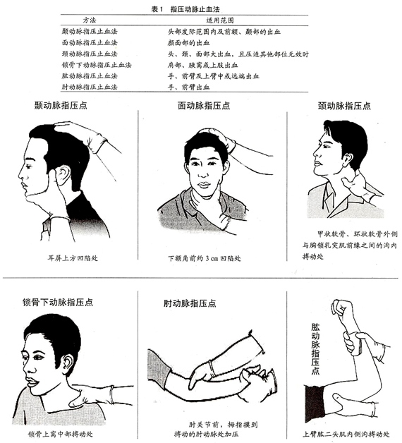
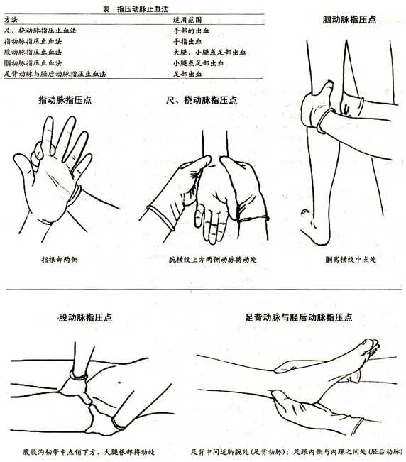
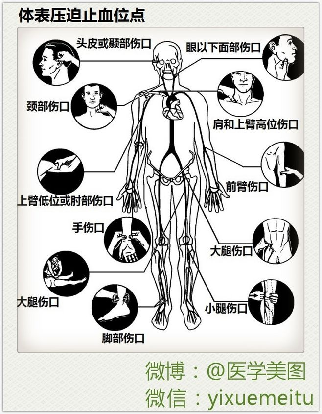

# 止血

## 手压止血

### 头面部止血

1. 头部止血：头顶、额部位、颞部血液来源是颞浅动脉；
2. 面部止血：侧面部血管是面动脉；
3. 头面颈部总动脉：头颈部出血急，不确定何部位出血，可压迫总动脉，但严禁两侧同时压迫，避免引起大脑缺血；

### 上肢止血

1. 手指部：指根部位两侧；
2. 手掌总动脉：尺、桡动脉（一掌从手背部位握住即可捏住两个动脉）；
3. 手臂部：肱动脉，上臂内侧中点（肱二头肌内侧沟）；
4. 肩部：锁骨下动脉，在锁骨上凹处；

### 下肢出血

1. 股动脉：腹股沟中点稍下方；
2. 脚部：足背动脉和内踝后的胫后动脉；

| 头面部                                    | 全身主要动脉                                    | 体表止血点                                  |
| ----------------------------------------- | ----------------------------------------------- | ------------------------------------------- |
|  |  |  |
